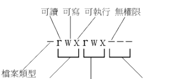
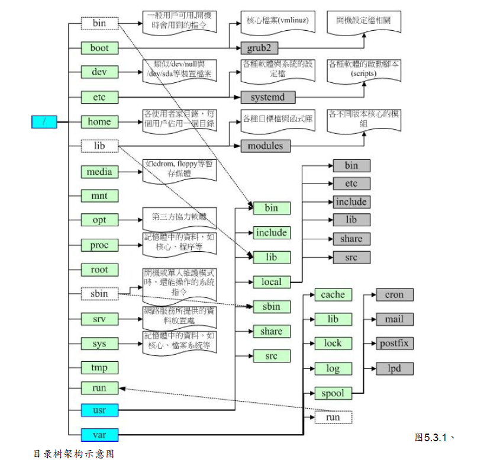

# 文件权限和目录

第一个字符代表这个文件是“目录、文件或链接文件等等”：
当为[ d ]则是目录，例如上表文件名为“.config”的那一行；
当为[ - ]则是文件，例如上表文件名为“initial-setup-ks.cfg”那一行；
若是[ l ]则表示为链接文件（link file）；
若是[ b ]则表示为设备文件里面的可供储存的周边设备（可随机存取设备）；
若是[ c ]则表示为设备文件里面的序列埠设备，例如键盘、鼠标（一次性读取设备）。

接下来的字符中，以三个为一组，且均为“rwx” 的三个参数的组合。其中，[ r ]代表可读（read）、[ w ]代表可写（write）、[ x ]代表可执行（execute）。 要注意的是，这三个权限的位置不会改变，如果没有权限，就会出现减号[ - ]而已。
第一组为“文件拥有者可具备的权限”，以“initial-setup-ks.cfg”那个文件为例， 该文件的拥有者可以读写，但不可执行；
第二组为“加入此群组之帐号的权限”；
第三组为“非本人且没有加入本群组之其他帐号的权限”。

##### 如何改变文件属性与权限

**chgrp** ：改变文件所属群组
**chown** ：改变文件拥有者
**chmod** ：改变文件的权限, SUID, SGID, SBIT等等的特性

**数字类型改变文件权限：**

r:4 > w:2 > x:1

举例：如果要将权限变成“ -rwxr-xr-- ”呢？那么权限的分数就成为 [4+2+1][4+0+1]
[4+0+0]=754 啰！所以你需要下达“ chmod 754 filename”。

可执行文件权限：chmod 755 test.sh

**符号类型改变文件权限**：

我们就可以借由u, g, o来代表三种身份的权限！此外， a 则代表 all 亦即全部的身份！那么读写的权限就可以写成r, w, x 啰！也就是可以使用下面的方式来看：

| chmod | u g o a | +（加入） -（除去） =（设置） | r w x | 文件或目录 |

举例： -rwxr-xr-x  ：  chmod u=rwx,go=rx .bashrc

​	    -rwxr-xr--    ：  chmod u=rwx,g=rx,o=r filename

如果我不知道原先的文件属性，而我只想要增加.bashrc这个文件的每个人均可写入的权限

chmod a+w .bashrc

而如果是要将权限去掉而不更动其他已存在的权限呢？例如要拿掉全部人的可执行权限

chmod a-x .bashrc

##### 权限对文件和目录的作用

| 元件 | 内容         | 叠代物件   | r            | w            | x                |
| :--- | ------------ | ---------- | ------------ | ------------ | ---------------- |
| 文件 | 详细数据data | 文件数据夹 | 读到文件内容 | 修改文件内容 | 执行文件内容     |
| 目录 | 文件名       | 可分类抽屉 | 读到文件名   | 修改文件名   | 进入该目录的权限 |

注意：要查看文件目录下的文件，此文件夹需要具有X权限。

##### Linux文件种类与扩展名

- 正规文件（regular file ）： 一个字符为 [ - ]，例如 [-rwxrwxrwx ]。依照文件的内容，又大略可以分为：
  - 纯文本文件（ASCII）： 举例，你可以下达“ cat~/.bashrc ”就可以看到该文件的内容。 
  - 二进制档（binary）： 举例，刚刚下达的指令cat就是一个binary file。
  - 数据格式文件（data）： 举例，我们的Linux在使用者登陆时，都会将登录的数据记录在 /var/log/wtmp那个文件内，该文件是一个data file，他能够通过last这个指令读出来！
- 目录（directory）： 就是目录啰～第一个属性为 [ d ]，例如 [drwxrwxrwx]。
- 链接文件（link）： 就是类似Windows系统下面的捷径啦！ 第一个属性为 [ l ]（英文L的小写），例如 [lrwxrwxrwx] ；
- 设备与设备文件（device）： 通常都集中在/dev这个目录之下！通常又分为两种：
  - 区块（block）设备文件 ：举例，硬盘与软盘等就是啦！ 第一个属性为[ b ]、
  - 字符（character）设备文件：键盘、鼠标等！这些设备的特色就是“一次性读取”的，第一个属性为 [ c ]。
  - 数据接口文件（sockets）： 这种类型的文件通常被用在网络上的数据承接了。第一个属性为 [ s ]
    数据输送档（FIFO, pipe）：他主要的目的在解决多个程序同时存取一个文件所造成的错误问题。 FIFO是first-in-first-out的缩写。第一个属性为[p] 。

##### Linux文件扩展名：

不像window中文件的扩展名具有实际作用，基本上，Linux的文件是没有所谓的“扩展名”的，扩展名只做表示作用，表示该文件是什么种类的。

##### Linux目录配置

Linux目录配置的依据--FHS（Filesystem Hierarchy Standard）

| 目录                                  | 应放置文件内容                                               |
| ------------------------------------- | ------------------------------------------------------------ |
| 第一部份： FHS要求必须要存在的目录 |                                                              |
| /bin                                  | 主要有：cat, chmod, chown, date, mv, mkdir, cp, bash等等常用的指令。 |
| /boot                                 | 这个目录主要在放置开机会使用到的文件。                       |
| /dev                                  | 任何设备与周边设备都是以文件的型态存在于这个目录当中。       |
| /etc                                  | 系统主要的配置文件几乎都放置在这个目录内，例如人员的帐号密码档、各种服务的启始档等等。FHS建议不要放置可可执行文件（binary）在这个目录。 |
| /lib                                  | 系统的函数库非常的多，而/lib放置的则是在开机时会用到的函数库， 以及在/bin或/sbin下面的指令会调用的函数库。 |
| /media                                | 这个/media下面放置的就是可移除的设备啦！ 包括软盘、光盘、DVD等等 |
| /mnt                                  | 如果你想要暂时挂载某些额外的设备，一般建议你可以放置到这个目录中。 |
| /opt                                  | 这个是给第三方协力软件放置的目录。如果你想要自行安装额外的软件那么也能够将你的软件安装到这里来。 不过，以前的Linux系统中，我们还是习惯放置在/usr/local目录下呢！ |
| /run                                  | 系统开机后所产生的各项信息。                                 |
| /srv                                  | srv可以视为“service”的缩写，是一些网络服务启动之后，这些服务所需要取用的数据目录。 |
| /tmp                                  | 正在执行的程序暂时放置文件的地方。                           |
| /usr                                  | 第二层 FHS 设置，后续介绍。                                  |
| /var                                  | 第二曾 FHS 设置，主要为放置变动性的数据，后续介绍。          |
| 第二部份：FHS建议可以存在的目录       |                                                              |
| /home                                 | 系统默认的使用者主文件夹（home directory）                   |
| /lib<qual>                            | 用来存放与 /lib 不同的格式的二进制函数库，例如支持 64 位的 /lib64 函数库等 |
| /root                                 | 系统管理员（root）的主文件夹。                               |

除了FHS定义的目录外，下面是几个在Linux当中也是非常重要的目录喔：

| 目录        | 应放置文件内容                                               |
| ----------- | ------------------------------------------------------------ |
| /lost+found | 这个目录是使用标准的ext2/ext3/ext4文件系统格式才会产生的一个目录，目的在于当文件系统发生错误时， 将一些遗失的片段放置到这个目录下。不过如果使用的是 xfs 文件系统的话，就不会存在这个目录了！ |
| /proc       | 这个目录本身是一个“虚拟文件系统（virtual filesystem）”。     |
| /sys        | 这个目录其实跟/proc非常类似，也是一个虚拟的文件系统，主要也是记录核心与系统硬件信息较相关的信息。 |

**/usr 的意义与内容：**

很多读者都会误会/usr为user的缩写，其实usr是Unix Software Resource的缩写， 也就
是“Unix操作系统软件资源”所放置的目录，而不是使用者的数据啦！

一般来说，/usr的次目录建议有下面这些：

| 目录                                   | 应放置文件内容                                               |
| -------------------------------------- | ------------------------------------------------------------ |
| 第一部份： FHS 要求必须要存在的目录 |                                                              |
| /usr/bin/                              | 所有一般用户能够使用的指令都放在这里！                       |
| /usr/lib/                              | 基本上，与 /lib 功能相同，所以 /lib 就是链接到此目录中的！   |
| /usr/local/                            | 系统管理员在本机自行安装自己下载的软件.                      |
| /usr/sbin/                             | 非系统正常运行所需要的系统指令。最常见的就是某些网络服务器软件
的服务指令（daemon）. |
| /usr/share/                            | 主要放置只读架构的数据文件，当然也包括共享文件。             |
| 第二部份： FHS 建议可以存在的目录  |                                                              |
| /usr/games/                            | 与游戏比较相关的数据放置处                                   |
| /usr/include/                          | c/c++等程序语言的文件开始（header）与包含档（include）放置处 |
| /usr/libexec/                          | 某些不被一般使用者惯用的可执行文件或脚本（script）等等       |
| /usr/lib<qual>/                        | 与 /lib<qual>/功能相同，因此目前 /lib<qual> 就是链接到此目录中 |
| /usr/src/                              | 一般源代码建议放置到这里，src有source的意思。                |

**/var 的意义与内容：**

如果/usr是安装时会占用较大硬盘容量的目录，那么/var就是在系统运行后才会渐渐占用硬盘
容量的目录。例如MySQL数据库的文件等等。常见的次目录有：

| 目录                                   | 应放置文件内容                                               |
| -------------------------------------- | ------------------------------------------------------------ |
| 第一部 份：FHS要求必须要存在的目录 |                                                              |
| /var/cache/                            | 应用程序本身运行过程中会产生的一些暂存盘；                   |
| /var/lib/                              | 程序本身执行的过程中，需要使用到的数据文件放置的目录。       |
| /var/lock/                             |                                                              |
| /var/log/                              | 这是登录文件放置的目录！里面比较重要的文件如/var/log/messages, /var/log/wtmp（记录登陆者的信息）等。 |
| /var/mail/                             | 放置个人电子邮件信箱的目录                                   |
| /var/run/                              | 某些程序或者是服务启动后，会将他们的PID放置在这个目录下喔！  |
| /var/spool/                            | 这个目录通常放置一些伫列数据，所谓的“伫列”就是排队等待其他程序使用的数据啦！ |

**目录树**:

**绝对路径与相对路径**

绝对路径：由根目录（/）开始写起的文件名或目录名称， 例如 /home/dmtsai/.bashrc；
相对路径：相对于目前路径的文件名写法。 例如 ./home/dmtsai 或 ../../home/dmtsai/ 等
等。反正开头不是 / 就属于相对路径的写法

. ：代表当前的目录，也可以使用 ./ 来表示；
.. ：代表上一层目录，也可以 ../ 来代表。