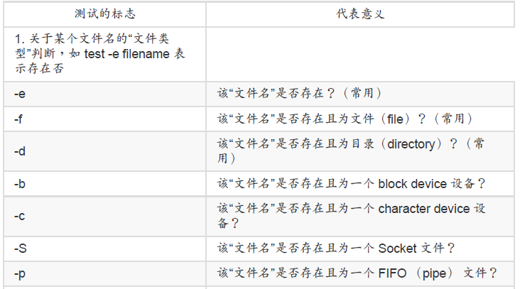
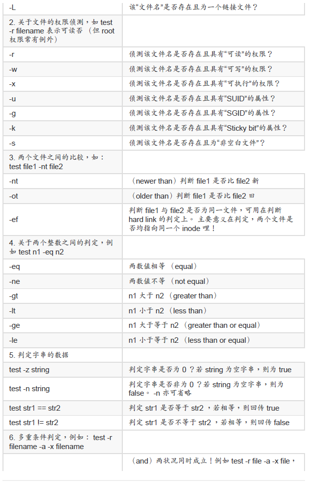
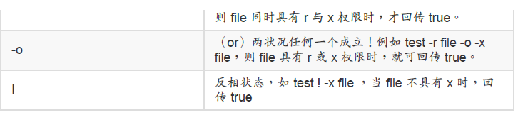

# 学习 Shell Scripts

#### 撰写第一支 script

```bash
[dmtsai@study ~]$ mkdir bin; cd bin
[dmtsai@study bin]$ vim hello.sh
#!/bin/bash

# Program:

# This program shows "Hello World!" in your screen.

# History:

# 2015/07/16 VBird First release

PATH=/bin:/sbin:/usr/bin:/usr/sbin:/usr/local/bin:/usr/local/sbin:~/bin
export PATH
echo -e "Hello World! \a \n"
exit 0
```

#### 简单范例

```bash
[dmtsai@study bin]$ vim create_3_filename.sh
#!/bin/bash
# Program:
# Program creates three files, which named by user's input and date command.
# History:
# 2015/07/16 VBird First release
PATH=/bin:/sbin:/usr/bin:/usr/sbin:/usr/local/bin:/usr/local/sbin:~/bin
export PATH
# 1\. 让使用者输入文件名称，并取得 fileuser 这个变量；
echo -e "I will use 'touch' command to create 3 files." # 纯粹显示信息
read -p "Please input your filename: " fileuser # 提示使用者输入
# 2\. 为了避免使用者随意按 Enter ，利用[变量功能](../Text/index.html#variable_other_re)分析文件名是否有设置？
filename=${fileuser:-"filename"} # 开始判断有否配置文件名
# 3\. 开始利用 date 指令来取得所需要的文件名了；
date1=$（date --date='2 days ago' +%Y%m%d） # 前两天的日期
date2=$（date --date='1 days ago' +%Y%m%d） # 前一天的日期
date3=$（date +%Y%m%d） # 今天的日期
file1=${filename}${date1} # 下面三行在配置文件名
file2=${filename}${date2}
file3=${filename}${date3}
# 4\. 将文件名创建吧！
touch "${file1}" # 下面三行在创建文件
touch "${file2}"
touch "${file3}"
```

 $（command） 取得变量

 touch  创建文件

##### 数值运算：简单的加减乘除

var=$（（运算内容））

```bash
[dmtsai@study bin]$ echo $（（ 13 % 3 ））
1
```

利用 source 来执行脚本：在父程序中执行
如果你使用 source 来执行指令那就不一样了！同样的脚本我们来执行看看：

```bash
[dmtsai@study bin]$ source showname.sh
Please input your first name: VBird
Please input your last name: Tsai
Your full name is: VBird Tsai
[dmtsai@study bin]$ echo ${firstname} ${lastname}
VBird Tsai &lt;==嘿嘿！有数据产生喔！
```

#### 善用判断式

利用 test 指令的测试功能







```bash
[dmtsai@study bin]$ vim file_perm.sh
#!/bin/bash

# Program:

# User input a filename, program will check the flowing:

# 1.） exist? 2.） file/directory? 3.） file permissions

# History:

# 2015/07/16 VBird First release

PATH=/bin:/sbin:/usr/bin:/usr/sbin:/usr/local/bin:/usr/local/sbin:~/bin
export PATH

# 1\. 让使用者输入文件名，并且判断使用者是否真的有输入字串？

echo -e "Please input a filename, I will check the filename's type and permission. \n\n"
read -p "Input a filename : " filename
test -z ${filename} && echo "You MUST input a filename." && exit 0

# 2\. 判断文件是否存在？若不存在则显示讯息并结束脚本

test ! -e ${filename} && echo "The filename '${filename}' DO NOT exist" && exit 0

# 3\. 开始判断文件类型与属性

test -f ${filename} && filetype="regulare file"
test -d ${filename} && filetype="directory"
test -r ${filename} && perm="readable"
test -w ${filename} && perm="${perm} writable"
test -x ${filename} && perm="${perm} executable"

# 4\. 开始输出信息！

echo "The filename: ${filename} is a ${filetype}"
echo "And the permissions for you are : ${perm}"
```

​	除了我们很喜欢使用的 test 之外，其实，我们还可以利用判断符号“ [ ] ”（就是中括号啦） 来
进行数据的判断呢！ 举例来说，如果我想要知道 ${HOME} 这个变量是否为空的，可以这样
做：

```bash
[dmtsai@study ~]$ [ -z "${HOME}" ] ; echo $?
```

​	使用中括号必须要特别注意，因为中括号用在很多地方，包括万用字符与正则表达式等等，
所以如果要在 bash 的语法当中使用中括号作为 shell 的判断式时，必须要注意中括号的两端
需要有空白字符来分隔喔！

#### Shell script 的默认变量（$0, $1...）

举例来说，如果你想要重新启动系统的网络，可以这样做：

```bash
[dmtsai@study ~]$ file /etc/init.d/network
/etc/init.d/network: Bourne-Again shell script, ASCII text executable

# 使用 file 来查询后，系统告知这个文件是个 bash 的可执行 script 喔！

[dmtsai@study ~]$ /etc/init.d/network restart
```

script 是怎么达成这个功能的呢？其实 script 针对参数已经有设置好一些变量名称了！对应如下：

```bash
/path/to/scriptname opt1 opt2 opt3 opt4
$0 $1 $2 $3 $4
```

执行的脚本文件名为 $0 这个变量，第一个接的参数就是 $1 啊～ 所以，只要我们在 script 里面善用 $1 的话，就可以很简单的立即下达某些指令功能了！除了这些数字的变量之外， 我们还有一些较为特殊的变量可以在 script 内使用来调用这些参数喔！
$# ：代表后接的参数“个数”，以上表为例这里显示为“ 4 ”；
$@ ：代表“ "$1" "$2" "$3" "$4" ”之意，每个变量是独立的（用双引号括起来）；
$* ：代表“ "$1<u>c</u>$2<u>c</u>$3<u>c</u>$4" ”，其中 <u>c</u> 为分隔字符，默认为空白键， 所以本例中代表“ "$1 $2 $3 $4" ”之意。

##### shift：造成参数变量号码偏移

shift 会移动变量，而且 shift 后面可以接数字，代表拿掉最前
面的几个参数的意思。

#### 条件判断式

- 单层、简单条件判断式

如果你只有一个判断式要进行，那么我们可以简单的这样看：

```bash
if [ 条件判断式 ]; then
当条件判断式成立时，可以进行的指令工作内容；
fi &lt;==将 if 反过来写，就成为 fi 啦！结束 if 之意！
```

- 多重、复杂条件判断式

```bash
# 多个条件判断 （if ... elif ... elif ... else） 分多种不同情况执行

if [ 条件判断式一 ]; then
当条件判断式一成立时，可以进行的指令工作内容；
elif [ 条件判断式二 ]; then
当条件判断式二成立时，可以进行的指令工作内容；
else
当条件判断式一与二均不成立时，可以进行的指令工作内容；
fi
```

利用 case ..... esac 判断

```bash
[dmtsai@study bin]$ vim show123.sh
#!/bin/bash

# Program:

# This script only accepts the flowing parameter: one, two or three.

# History:

# 2015/07/17 VBird First release

PATH=/bin:/sbin:/usr/bin:/usr/sbin:/usr/local/bin:/usr/local/sbin:~/bin
export PATH
echo "This program will print your selection !"

# read -p "Input your choice: " choice # 暂时取消，可以替换！

# case ${choice} in # 暂时取消，可以替换！

case ${1} in # 现在使用，可以用上面两行替换！
"one"）
echo "Your choice is ONE"
;;
"two"）
echo "Your choice is TWO"
;;
"three"）
echo "Your choice is THREE"
;;
*）
echo "Usage ${0} {one&#124;two&#124;three}"
;;
esac
```

利用 function 功能

```bash
[dmtsai@study bin]$ vim show123-2.sh
#!/bin/bash

# Program:

# Use function to repeat information.

# History:

# 2015/07/17 VBird First release

PATH=/bin:/sbin:/usr/bin:/usr/sbin:/usr/local/bin:/usr/local/sbin:~/bin
export PATH
function printit（）{
echo -n "Your choice is " # 加上 -n 可以不断行继续在同一行显示
}
echo "This program will print your selection !"
case ${1} in
"one"）
**printit**; echo ${1} &#124; tr 'a-z' 'A-Z' # 将参数做大小写转换！
;;
"two"）
**printit**; echo ${1} &#124; tr 'a-z' 'A-Z'
;;
"three"）
**printit**; echo ${1} &#124; tr 'a-z' 'A-Z'
;;
*）
echo "Usage ${0} {one&#124;two&#124;three}"
;;
esac
```

循环 （loop）

```bash
[dmtsai@study bin]$ vim yes_to_stop.sh
#!/bin/bash

# Program:

# Repeat question until user input correct answer.

# History:

# 2015/07/17 VBird First release

PATH=/bin:/sbin:/usr/bin:/usr/sbin:/usr/local/bin:/usr/local/sbin:~/bin
export PATH
while [ "${yn}" != "yes" -a "${yn}" != "YES" ]
do
read -p "Please input yes/YES to stop this program: " yn
done
echo "OK! you input the correct answer."
```

for...do...done （固定循环）

```bash
[dmtsai@study bin]$ vim show_animal.sh
#!/bin/bash

# Program:

# Using for .... loop to print 3 animals

# History:

# 2015/07/17 VBird First release

PATH=/bin:/sbin:/usr/bin:/usr/sbin:/usr/local/bin:/usr/local/sbin:~/bin
export PATH
for animal in dog cat elephant
do
echo "There are ${animal}s.... "
done
```

我们可使用 sh -x script.sh 来进行程序的 debug