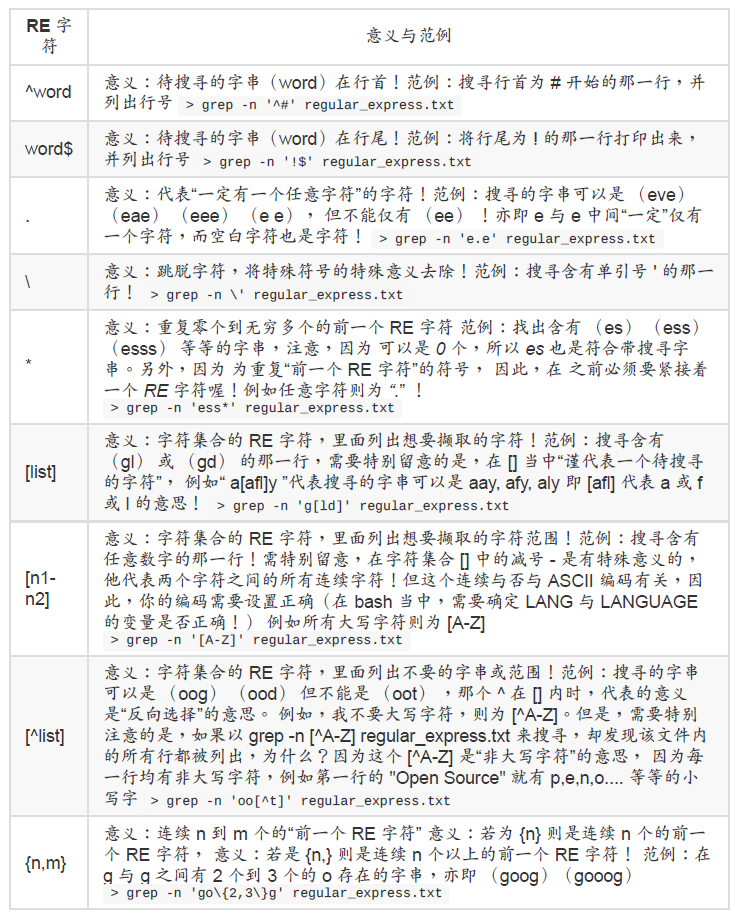
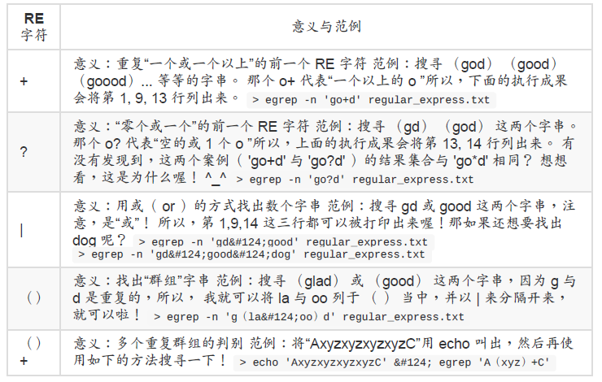

# 正则表达式与文件格式化处理

#### 基础正则表达式字符汇整 （characters）



#### sed 工具

​	sed 本身也是一个管线命令，可以分析 standard input 的啦！ 而且 sed 还可以将数据进行取代、删除、新增、撷取特定行等等的功能呢。

范例一：将 /etc/passwd 的内容列出并且打印行号，同时，请将第 2~5 行删除！

```cmd
[dmtsai@study ~]$ nl /etc/passwd &#124; sed '2,5d'
1 root:x:0:0:root:/root:/bin/bash
6 sync:x:5:0:sync:/sbin:/bin/sync
7 shutdown:x:6:0:shutdown:/sbin:/sbin/shutdown
```

#### 延伸正则表达式



#### 文件的格式化与相关处理

格式化打印： printf

```cmd
范例一：将刚刚上头数据的文件 （printf.txt） 内容仅列出姓名与成绩：（用 [tab] 分隔）
[dmtsai@study ~]$ printf '%s\t %s\t %s\t %s\t %s\t \n' $（cat printf.txt）
Name Chinese English Math Average
DmTsai 80 60 92 77.33
VBird 75 55 80 70.00
Ken 60 90 70 73.33
```

#### awk：好用的数据处理工具

awk 也是一个非常棒的数据处理工具！相较于 sed 常常作用于一整个行的处理， awk 则比较
倾向于一行当中分成数个“字段”来处理。因此，awk 相当的适合处理小型的数据数据处理呢！
awk 通常运行的模式是这样的：

```cmd
[dmtsai@study ~]$ awk '条件类型1{动作1} 条件类型2{动作2} ...' filename
```

若我想要取出帐号与登陆者的 IP ，且帐号与 IP 之间以 [tab] 隔开，则会变成这样：

```cmd
[dmtsai@study ~]$ last -n 5 | awk '{print $1 "\t" $3}'
dmtsai 192.168.1.100
dmtsai 192.168.1.100
dmtsai 192.168.1.100
dmtsai 192.168.1.100
dmtsai Fri
```

#### 文件比对工具

#### diff

```cmd
范例一：比对 passwd.old 与 passwd.new 的差异：
[dmtsai@study testpw]$ diff passwd.old passwd.new
4d3 &lt;==左边第四行被删除 （d） 掉了，基准是右边的第三行
&lt; adm:x:3:4:adm:/var/adm:/sbin/nologin &lt;==这边列出左边（&lt;）文件被删除的那一行内容
6c5 &lt;==左边文件的第六行被取代 （c） 成右边文件的第五行
sync:x:5:0:sync:/sbin:/bin/sync &lt;==左边（）文件第六行内容

&gt; no six line &lt;==右边（&gt;）文件第五行内容
```

#很聪明吧！用 diff 就把我们刚刚的处理给比对完毕了！

patch
patch 这个指令与 diff 可是有密不可分的关系啊！我们前面提到，diff 可以用来分辨两个版本
之间的差异， 举例来说，刚刚我们所创建的 passwd.old 及 passwd.new 之间就是两个不同版
本的文件。 那么，如果要“升级”呢？就是“将旧的文件升级成为新的文件”时，应该要怎么做
呢？ 其实也不难啦！就是“先比较先旧版本的差异，并将差异档制作成为补丁文件，再由补丁
文件更新旧文件”即可。