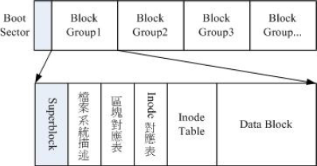

# Linux 磁盘与文件系统管理

​	磁盘分区表主要有两种格式，一种是限制较多的 MBR 分区表，一种是较新且限制较少的
GPT 分区表。
MBR 分区表中，第一个扇区最重要，里面有：（1）主要开机区（Master boot record,
MBR）及分区表（partition table）， 其中 MBR 占有 446 Bytes，而 partition table 则占
有 64 Bytes。
GPT 分区表除了分区数量扩充较多之外，支持的磁盘容量也可以超过 2TB。

#### 文件系统特性

​	文件系统通常会将这两部份的数据分别存放在不同的区块，权限与属性放置到 inode 中，至于实际数据则放置到 data block 区块中。 另外，还有一个超级区块 （superblock） 会记录整个文件系统的整体信息，包括inode 与 block 的总量、使用量、剩余量等。

- superblock：记录此 filesystem 的整体信息，包括inode/block的总量、使用量、剩余量，以及文件系统的格式与相关信息等。
- inode：记录文件的属性，一个文件占用一个inode，同时记录此文件的数据所在的 block号码。
- block：实际记录文件的内容，若文件太大时，会占用多个 block 。

#### Linux 的 EXT2 文件系统（inode）

Ext2 格式化后有点像下面这样：

每一个区块群组（block group）的六个主要内容说明如下：

- **data block （数据区块）**
  data block 是用来放置文件内容数据地方，在 Ext2 文件系统中所支持的 block 大小有 1K, 2K及 4K 三种而已。在格式化时 block 的大小就固定了，且每个 block 都有编号，以方便 inode的记录啦。

- **inode table （inode 表格）**

  inode 的内容在记录文件的属性以及该文件实际数据是放置在哪几号 block 内！ 基本上，inode 记录的文件数据至少有下面这些：
  该文件的存取模式（read/write/excute）；
  该文件的拥有者与群组（owner/group）；
  该文件的容量；
  该文件创建或状态改变的时间（ctime）；
  最近一次的读取时间（atime）；
  最近修改的时间（mtime）；
  定义文件特性的旗标（flag），如 SetUID...；
  该文件真正内容的指向 （pointer）；

- **Superblock （超级区块）**
  Superblock 是记录整个 filesystem 相关信息的地方， 没有 Superblock ，就没有这个filesystem 了。他记录的信息主要有：

  block 与 inode 的总量；
  未使用与已使用的 inode / block 数量；
  block 与 inode 的大小 （block 为 1, 2, 4K，inode 为 128Bytes 或 256Bytes）；
  filesystem 的挂载时间、最近一次写入数据的时间、最近一次检验磁盘 （fsck） 的时间
  等文件系统的相关信息；
  一个 valid bit 数值，若此文件系统已被挂载，则 valid bit 为 0 ，若未被挂载，则 valid bit
  为 1 。

- **Filesystem Description （文件系统描述说明）**
  这个区段可以描述每个 block group 的开始与结束的 block 号码，以及说明每个区段
  （superblock, bitmap, inodemap, data block） 分别介于哪一个 block 号码之间。这部份也能
  够用 dumpe2fs 来观察的。

- **block bitmap （区块对照表）**
  如果你想要新增文件时总会用到 block 吧！那你要使用哪个 block 来记录呢？当然是选择“空
  的 block ”来记录新文件的数据啰。 那你怎么知道哪个 block 是空的？这就得要通过 block
  bitmap 的辅助了。从 block bitmap 当中可以知道哪些 block 是空的，因此我们的系统就能够
  很快速的找到可使用的空间来处置文件啰。
  同样的，如果你删除某些文件时，那么那些文件原本占用的 block 号码就得要释放出来， 此
  时在 block bitmap 当中相对应到该 block 号码的标志就得要修改成为“未使用中”啰！这就是
  bitmap 的功能。

- **inode bitmap （inode 对照表）**
  这个其实与 block bitmap 是类似的功能，只是 block bitmap 记录的是使用与未使用的 block
  号码， 至于 inode bitmap 则是记录使用与未使用的 inode 号码啰！

  

#### dumpe2fs： 查询 Ext 家族 superblock 信息的指令

dumpe2fs /dev/vda5

#### EXT2/EXT3/EXT4 文件的存取与日志式文件系统的功能

日志式文件系统 （journal） 会多出一块记录区，随时记载文件系统的主要活动，可加快
系统复原时间；

#### 挂载点的意义 （mount point）

​	将文件系统与目录树结合的动作我们称为“挂载”。重点是：挂载点一定是目录，该目录为进入该文件系统的入口。因此并不是你有任何文件系统都能使用，必须要“挂载”到目录树的某个目录后，才能够使用该文件系统的。

#### 文件系统的简单操作

df：列出文件系统的整体磁盘使用量；
du：评估文件系统的磁盘使用量（常用在推估目录所占容量）

实体链接与符号链接： ln

**Hard Link （实体链接, 硬式链接或实际链接）**

假设我系统有个 /root/crontab 他是 /etc/crontab 的实体链接，也就是说这两个文件名链接到同一个 inode 。

**Symbolic Link （符号链接，亦即是捷径）**

这个 Symbolic Link 与 Windows 的捷径可以给他划上等号，由Symbolic link 所创建的文件为一个独立的新的文件，所以会占用掉 inode 与 block。

#### 磁盘的分区、格式化、检验与挂载

​	如果我们想要在系统里面新增一颗磁盘时，应该有哪些动作需要做的呢：
1. 对磁盘进行分区，以创建可用的 partition ；
2. 对该 partition 进行格式化 （format），以创建系统可用的 filesystem；
3. 若想要仔细一点，则可对刚刚创建好的 filesystem 进行检验；
4. 在 Linux 系统上，需要创建挂载点 （亦即是目录），并将他挂载上来；

##### 观察磁盘分区状态

lsblk 列出系统上的所有磁盘列表

blkid 列出设备的 UUID 等参数

parted 列出磁盘的分区表类型与分区信息

##### 磁盘分区： gdisk/fdisk

##### 磁盘格式化（创建文件系统）

XFS 文件系统 mkfs.xfs

XFS 文件系统 for RAID 性能优化 （Optional）

EXT4 文件系统 mkfs.ext4

其他文件系统 mkfs

##### 文件系统检验

xfs_repair 处理 XFS 文件系统

fsck.ext4 处理 EXT4 文件系统

##### 文件系统挂载与卸载

mount

- 单一文件系统不应该被重复挂载在不同的挂载点（目录）中；
- 单一目录不应该重复挂载多个文件系统；
- 要作为挂载点的目录，理论上应该都是空目录才是。

##### 设置开机挂载

开机挂载 /etc/fstab 及 /etc/mtab，其实 /etc/fstab （filesystem table） 就是将我们利用 mount 指令进行挂载时， 将所有的选项与参数写入到这个文件中就是了。

##### 内存交换空间（swap）之创建

使用实体分区创建swap

使用文件创建swap

##### 文件系统的特殊观察与操作