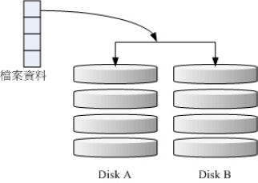
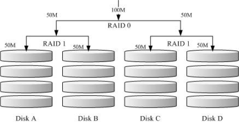
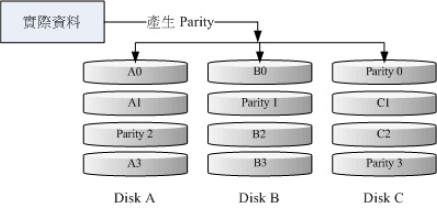
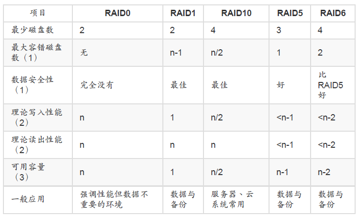

# 磁盘配额（Quota）与进阶文件系统管理

#### 磁盘配额 （Quota） 的应用与实作

​	Quota 可公平的分配系统上面的磁盘容量给使用者；分配的资源可以是磁盘容量
（block）或可创建文件数量（inode）；

**Quota 的限制可以有 soft/hard/grace time 等重要项目：**

- hard：表示使用者的用量绝对不会超过这个限制值，以上面的设置为例， 使用者所能使
  用的磁盘容量绝对不会超过 500MBytes ，若超过这个值则系统会锁住该用户的磁盘使用
  权；
- soft：表示使用者在低于 soft 限值时 （此例中为 400MBytes），可以正常使用磁盘，但
  若超过 soft 且低于 hard 的限值 （介于 400~500MBytes 之间时），每次使用者登陆系统
  时，系统会主动发出磁盘即将爆满的警告讯息， 且会给予一个宽限时间 （grace
  time）。不过，若使用者在宽限时间倒数期间就将容量再次降低于 soft 限值之下， 则宽
  限时间会停止。
- 会倒数计时的宽限时间 （grace time）：Quota 是针对整个 filesystem 进行限制，XFS 文件系统可以限制目录！

**Quota 的使用必须要核心与文件系统均支持。文件系统的参数必须含有 usrquota,**
**grpquota, prjquota** ：

- uquota/usrquota/quota：针对使用者帐号的设置
- gquota/grpquota：针对群组的设置
- pquota/prjquota：针对单一目录的设置，但是不可与 grpquota 同时存在！

Quota 的 xfs_quota 实作的指令有 report, print, limit, timer... 等指令；

#### 软件磁盘阵列 （Software RAID）

磁盘阵列 （RAID） 有硬件与软件之分，Linux 操作系统可支持软件磁盘阵列，通过mdadm 套件来达成。

磁盘阵列创建的考虑依据为“容量”、“性能”、“数据可靠性”等；

磁盘阵列所创建的等级常见有的 raid0, raid1, raid1+0, raid5 及 raid6

- RAID-0 （等量模式, stripe）：性能最佳


- RAID-1 （映射模式, mirror）：完整备份

  

  

- RAID 1+0，RAID 0+1

  RAID-0 的性能佳但是数据不安全，RAID-1 的数据安全但是性能不佳，那么能不能将这两者
  整合起来设置 RAID 呢？ 可以啊！那就是 RAID 1+0 或 RAID 0+1。所谓的 RAID 1+0 就是：
  （1）先让两颗磁盘组成 RAID 1，并且这样的设置共有两组； （2）将这两组 RAID 1 再组成
  一组 RAID 0。这就是 RAID 1+0 啰！反过来说，RAID 0+1 就是先组成 RAID-0 再组成 RAID-
  1 的意思。




- RAID 5：性能与数据备份的均衡考虑

  RAID-5 至少需要三颗以上的磁盘才能够组成这种类型的磁盘阵列。这种磁盘阵列的数据写入
  有点类似 RAID-0 ， 不过每个循环的写入过程中 （striping），在每颗磁盘还加入一个同位检
  查数据 （Parity） ，这个数据会记录其他磁盘的备份数据， 用于当有磁盘损毁时的救援。
  RAID-5 读写的情况有点像下面这样：

  

  ##### 磁盘阵列的优点

  说的口沫横飞，重点在哪里呢？其实你的系统如果需要磁盘阵列的话，其实重点在于：

  1. 数据安全与可靠性：指的并非网络信息安全，而是当硬件 （指磁盘） 损毁时，数据是否
      还能够安全的救援或使用之意；
  2. 读写性能：例如 RAID 0 可以加强读写性能，让你的系统 I/O 部分得以改善；
  3. 容量：可以让多颗磁盘组合起来，故单一文件系统可以有相当大的容量。




硬件磁盘阵列的设备文件名与 SCSI 相同，至于 software RAID 则为 /dev/md[0-9]

##### 以 mdadm 创建 RAID

```bash
[root@study ~]# mdadm --detail /dev/md0
[root@study ~]# mdadm --create /dev/md[0-9] --auto=yes --level=[015] --chunk=NK \
&gt; --raid-devices=N --spare-devices=N /dev/sdx /dev/hdx...
选项与参数：
--create ：为创建 RAID 的选项；
--auto=yes ：决定创建后面接的软件磁盘阵列设备，亦即 /dev/md0, /dev/md1...
--chunk=Nk ：决定这个设备的 chunk 大小，也可以当成 stripe 大小，一般是 64K 或 512K。
--raid-devices=N ：使用几个磁盘 （partition） 作为磁盘阵列的设备
--spare-devices=N ：使用几个磁盘作为备用 （spare） 设备
--level=[015] ：设置这组磁盘阵列的等级。支持很多，不过建议只要用 0, 1, 5 即可
--detail ：后面所接的那个磁盘阵列设备的详细信息
```

软件磁盘阵列的状态可借由 /proc/mdstat 文件来了解。

