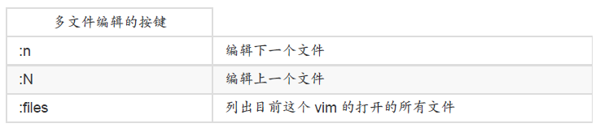

#### vi 的使用

一般指令模式 （command mode）

编辑模式 （insert mode）

命令行命令模式 （command-line mode）

- 第一部份：一般指令模式可用的按钮说明，光标移动、复制贴上、搜寻取代等

| 移动光标的方法                                               |                                                              |
| ------------------------------------------------------------ | ------------------------------------------------------------ |
| [Ctrl] + [f]                                                 | 屏幕“向下”移动一页，相当于 [Page Down]按键 （常用）          |
| [Ctrl] + [b]                                                 | 屏幕“向上”移动一页，相当于 [Page Up] 按键（常用）            |
| 0 或功能键[Home]                                             | 这是数字“ 0 ”：移动到这一列的最前面字符处（常用）            |
| $ 或功能键[End]                                              | 移动到这一列的最后面字符处（常用）                           |
| G                                                            | 移动到这个文件的最后一列（常用）                             |
| gg                                                           | 移动到这个文件的第一列，相当于 1G 啊！（常用）               |
| n<Enter>                                                     | n 为数字。光标向下移动 n 列（常用）                          |
| /word                                                        | 向光标之下寻找一个名称为 word 的字串。例如要在文件内搜寻 vbird 这个字串，就输入/vbird 即可！ （常用） |
| ?word                                                        | 向光标之上寻找一个字串名称为 word 的字串。                   |
| n                                                            | 这个 n 是英文按键。代表“重复前一个搜寻的动作”。举例来说， 如果刚刚我们执行 /vbird 去向下搜寻 vbird 这个字串，则按下n 后，会向下继续搜寻下一个名称为 vbird 的字串。如果是执行 ?vbird 的话，那么按下 n则会向上继续搜寻名称为 vbird 的字串！ |
| N                                                            | 这个 N 是英文按键。与 n 刚好相反，为“反向”进行前一个搜寻动作。 例如 /vbird 后，按下 N 则表示“向上”搜寻 vbird 。 |
| 使用 /word 配合 n 及 N 是非常有帮助的！可以让你重复的找到一些你搜寻的关键字！ |                                                              |
| :n1,n2s/word1/word2/g                                        | n1 与 n2 为数字。在第 n1 与 n2 列之间寻找word1 这个字串，并将该字串取代为 word2！举例来说，在 100 到 200 列之间搜寻 vbird并取代为 VBIRD则：“:100,200s/vbird/VBIRD/g”。（常用） |
| :1,$s/word1/word2/g                                          | 从第一列到最后一列寻找 word1 字串，并将该字串取代为 word2 ！（常用） |
| :1,$s/word1/word2/gc                                         | 从第一列到最后一列寻找 word1 字串，并将该字串取代为 word2 ！且在取代前显示提示字符给使用者确认 （confirm） 是否需要取代！（常用） |
| 删除、复制与贴上                                             |                                                              |
| x, X                                                         | 在一列字当中，x 为向后删除一个字符 （相当于 [del] 按键）， X 为向前删除一个字符（相当于 [backspace] 亦即是倒退键） （常用） |
| dd                                                           | 删除光标所在的那一整列（常用                                 |
| ndd                                                          | n 为数字。删除光标所在的向下 n 列，例如20dd 则是删除 20 列 （常用） |
| yy                                                           | 复制光标所在的那一列（常用）                                 |
| u                                                            | 复原前一个动作。（常用）                                     |
| [Ctrl]+r                                                     | 重做上一个动作。（常用）                                     |
| 这个 u 与 [Ctrl]+r 是很常用的指令！一个是复原，另一个则是重做一次～ 利用这两个功能按键，你的编辑，嘿嘿！很快乐的啦！ |                                                              |
| .                                                            | 不要怀疑！这就是小数点！意思是重复前一个动作的意思。 如果你想要重复删除、重复贴上等等动作，按下小数点“.”就好了！ （常用） |
|                                                              |                                                              |

- 第二部份：一般指令模式切换到编辑模式的可用的按钮说明

| 进入插入或取代的编辑模式                                     |                                                              |
| ------------------------------------------------------------ | ------------------------------------------------------------ |
| i, I                                                         | 进入插入模式（Insert mode）：i为“从目前光标所在处插入”， I为“在目前所在列的第一个非空白字符处开始插入”。 （常用） |
| a, A                                                         | 进入插入模式（Insert mode）：a为“从目前光标所在的下一个字符
处开始插入”， A 为“从光标所在列的最后一个字符处开始插入”。（常用） |
| o, O                                                         | 进入插入模式（Insert mode）：这是英文字母 o 的大小写。o为“在目前光标所在的下一列处插入新的一列”； O 为在目前光标所在处的上一列插入新的一列！（常
用） |
| r, R                                                         | 进入取代模式（Replacemode）：r 只会取代光标所在的那一个字符一次；R会一直取代光标所在的文字，直到按下 ESC 为止；（常用） |
| 上面这些按键中，在 vi 画面的左下角处会出现“--INSERT--”或“--REPLACE--”的字样。 由名称就知道该动作了吧！！特别注意的是，我们上面也提过
了，你想要在文件里面输入字符时， 一定要在左下角处看到 INSERT 或 REPLACE 才能输入喔！ |                                                              |
| [Esc]                                                        | 退出编辑模式，回到一般指令模式中（常用）                     |

- 第三部份：一般指令模式切换到命令行界面的可用按钮说明

| 命令行界面的储存、离开等
指令                                 |                                                           |
| ------------------------------------------------------------ | --------------------------------------------------------- |
| :w                                                           | 将编辑的数据写入硬盘文件中（常用）                        |
| :q                                                           | 离开 vi （常用）                                          |
| :q!                                                          | 若曾修改过文件，又不想储存，使用 ! 为强制离开不储存盘案。 |
| 注意一下啊，那个惊叹号（!） 在 vi 当中，常常具有“强制”的意思～ |                                                           |
| :wq                                                          | 储存后离开，若为 :wq! 则为强制储存后离开 （常用）         |
|                                                              |                                                           |

##### 区块选择（Visual Block）

##### 多文件编辑

##### 多窗口功能

