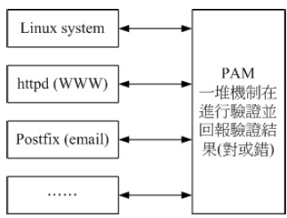

#### Linux 的帐号与群组

​	使用者的帐号/群组与 UID/GID 的对应，参考 /etc/passwd 及 /etc/group 两个文件。

##### 账号

------

##### /etc/passwd 文件结构

​	以冒号隔开，共分为七个字段，分别是“帐号名称、密码、UID、GID、全名、主文件夹、shell”。

```bash
[root@study ~]# head -n 4 /etc/passwd
root:x:0:0:root:/root:/bin/bash &lt;==等一下做为下面说明用
bin:x:1:1:bin:/bin:/sbin/nologin
daemon:x:2:2:daemon:/sbin:/sbin/nologin
adm:x:3:4:adm:/var/adm:/sbin/nologin
```

​	UID 只有 0 与非为 0 两种，非为 0 则为一般帐号。一般帐号又分为系统帐号 （1~999）及可登陆者帐号 （大于 1000）

#####  /etc/shadow 文件结构

​	该文件权限为仅有 root 可以更动。该文件分为九个字段，内容为“ 帐号名称、加密密码、密码更动日期、密码最小可变动日期、密码最大需变动日期、密码过期前警告日数、密码失效天数、 帐号失效日、保留未使用。

```cmd
[root@study ~]# head -n 4 /etc/shadow
root:$6$wtbCCce/PxMeE5wm$KE2IfSJr.YLP7Rcai6oa/T7KFhO...:16559:0:99999:7::: &lt;==下面说明用
bin:*:16372:0:99999:7:::
daemon:*:16372:0:99999:7:::
adm:*:16372:0:99999:7:::
```

##### 群组

------

##### /etc/group 文件结构

```cmd
[root@study ~]# head -n 4 /etc/group
root:x:0:
bin:x:1:
daemon:x:2:
sys:x:3:
```

共分为四栏，每一字段意义：群组名称、群组密码、GID、此群组支持的帐号名称。

使用者可以支持多个群组，其中在新建文件时会影响新文件群组者，为有效群组。而写
入 /etc/passwd 的第四个字段者， 称为初始群组。

##### 新增与移除使用者

​	与使用者创建、更改参数、删除有关的指令为：useradd, usermod, userdel等，密码创建
则为 passwd；

useradd 指令作用参考的文件有： /etc/default/useradd, /etc/login.defs, /etc/skel/ 等等。

观察使用者详细的密码参数，可以使用“ chage -l 帐号 ”来处理。

使用者自行修改参数的指令有： chsh, chfn 等，观察指令则有： id, finger 等。

##### 新增与移除群组

与群组创建、修改、删除有关的指令为：groupadd, groupmod, groupdel 等；

群组的观察与有效群组的切换分别为：groups 及 newgrp 指令；

##### 主机的细部权限规划：ACL 的使用

​	ACL 是 Access Control List 的缩写，主要的目的是在提供传统的 owner,group,others 的
read,write,execute 权限之外的细部权限设置。

​	ACL 的功能需要文件系统有支持，CentOS 7 默认的 XFS 确实有支持 ACL 功能！

​	ACL 可进行单一个人或群组的权限管理，但 ACL 的启动需要有文件系统的支持。

​	ACL 的设置可使用 setfacl ，查阅则使用 getfacl 。

##### 使用者身份切换

身份切换可使用 su ，亦可使用 sudo ，但使用 sudo 者，必须先以 visudo 设置可使用的
指令；

##### PAM 模块简介

​	PAM 可以说是一套应用程序接口 （Application Programming Interface, API），他提供了一
连串的验证机制，只要使用者将验证阶段的需求告知 PAM 后， PAM 就能够回报使用者验证
的结果 （成功或失败）。

​	PAM 模块可进行某些程序的验证程序！与 PAM 模块有关的配置文件位于 /etc/pam.d/ 及
/etc/security/。



##### 查询使用者：

系统上面帐号登陆情况的查询，可使用 w, who, last, lastlog 等；

##### 使用者对谈：

线上与使用者交谈可使用 write, wall，离线状态下可使用 mail 传送邮件！