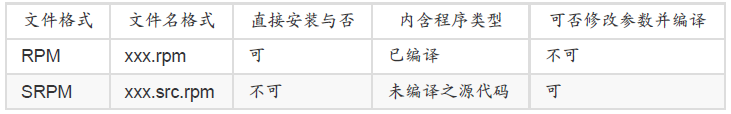

##### Linux 界的两大主流: RPM 与 DPKG

| distribution   | 代表软件管理机制 | 使用指令      | 线上升级机制（指令） |
| -------------- | ---------------- | ------------- | -------------------- |
| Red Hat/Fedora | RPM              | rpm, rpmbuild | YUM （yum）          |
| Debian/Ubuntu  | DPKG             | dpkg          | APT （apt-get）      |


##### 什么是 RPM 与 SRPM



##### RPM 安装 （install）

```cmd
[root@study ~]# rpm -i /mnt/Packages/rp-pppoe-3.11-5.el7.x86_64.rpm
```

##### RPM 升级与更新 （upgrade/freshen）

使用 RPM 来升级真是太简单了！就以 -Uvh 或 -Fvh 来升级即可，而 -Uvh 与 -Fvh 可以用的
选项与参数，跟 install 是一样的。不过， -U 与 -F 的意义还是不太一样的，基本的差别是这
样的：
-Uvh
后面接的软件即使没有安装过，则系统将予以直接安装； 若后面接的软件有安装
过旧版，则系统自动更新至新版；
-Fvh
如果后面接的软件并未安装到你的 Linux 系统上，则该软件不会被安装；亦即只
有已安装至你 Linux 系统内的软件会被“升级”！

##### RPM 查询 （query）

rpm -qa

##### RPM 反安装与重建数据库 （erase/rebuilddb）

移除的选项很简单，就通过 -e 即可移除。不过，很常发生软件属性相依导致无法移除某些软
件的问题！ 我们以下面的例子来说明：
```cmd
# 1\. 找出与 pam 有关的软件名称，并尝试移除 pam 这个软件：

[root@study ~]# rpm -qa &#124; grep pam
fprintd-pam-0.5.0-4.0.el7_0.x86_64
pam-1.1.8-12.el7.x86_64
gnome-keyring-pam-3.8.2-10.el7.x86_64
pam-devel-1.1.8-12.el7.x86_64
pam_krb5-2.4.8-4.el7.x86_64
[root@study ~]# rpm -e pam
error: Failed dependencies: &lt;==这里提到的是相依性的问题
libpam.so.0（）（64bit） is needed by （installed） systemd-libs-208-20.el7.x86_64
libpam.so.0（）（64bit） is needed by （installed） libpwquality-1.2.3-4.el7.x86_64
....（以下省略）....

# 2\. 若仅移除 pam-devel 这个之前范例安装上的软件呢？

[root@study ~]# rpm -e pam-devel &lt;==不会出现任何讯息！
[root@study ~]# rpm -q pam-devel
package pam-devel is not installed
```

#### 利用 yum 进行查询、安装、升级与移除功能

- 查询功能：yum [list|info|search|provides|whatprovides] 参数
- 安装/升级功能：yum [install|update] 软件
- 移除功能：yum [remove] 软件

#### 管理的抉择：RPM 还是 Tarball

- 优先选择原厂的 RPM 功能
- 用 Tarball 测试新版软件