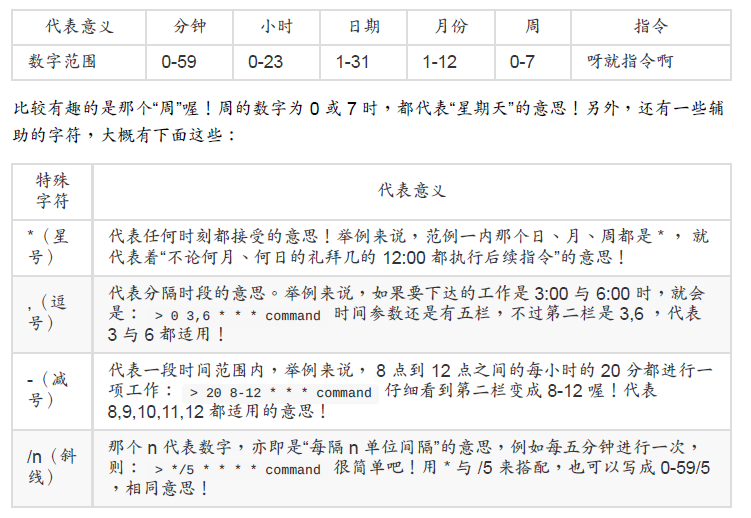

#### Linux 工作调度的种类： at, cron

- at ：at 是个可以处理仅执行一次就结束调度的指令，不过要执行 at 时， 必须要有 atd 这个服务 （第十七章） 的支持才行。
- crontab ：crontab 这个指令所设置的工作将会循环的一直进行下去！ 可循环的时间为分钟、小时、每周、每月或每年等。crontab 除了可以使用指令执行外，亦可编辑/etc/crontab 来支持。

##### 仅执行一次的工作调度

```bash
范例一：再过五分钟后，将 /root/.bashrc 寄给 root 自己
[root@study ~]# at now + 5 minutes &lt;==记得单位要加 s 喔！
at&gt; /bin/mail -s "testing at job" root &lt; /root/.bashrc
at&gt; &lt;EOT&gt; &lt;==这里输入 [ctrl] + d 就会出现 &lt;EOF&gt; 的字样！代表结束！
job 2 at Thu Jul 30 19:35:00 2015
# 上面这行信息在说明，第 2 个 at 工作将在 2015/07/30 的 19:35 进行！
# 而执行 at 会进入所谓的 at shell 环境，让你下达多重指令等待运行！
范例二：将上述的第 2 项工作内容列出来查阅
[root@study ~]# at -c 2
#!/bin/sh &lt;==就是通过 bash shell 的啦！
# atrun uid=0 gid=0
# mail root 0
umask 22
....（中间省略许多的环境变量项目）....
cd /etc/cron\.d &#124;&#124; {
echo 'Execution directory inaccessible' &gt;&2
exit 1
} ${SHELL:-/bin/sh} &
lt;&lt; '
marcinDELIMITER410efc26'
/bin/mail -s "testing at job" root &lt; /root/.bashrc # 这一行最重要！
marcinDELIMITER410efc26
# 你可以看到指令执行的目录 （/root），还有多个环境变量与实际的指令内容啦！
范例三：由于机房预计于 2015/08/05 停电，我想要在 2015/08/04 23:00 关机？
[root@study ~]# at 23:00 2015-08-04
at&gt; /bin/sync
at&gt; /bin/sync
at&gt; /sbin/shutdown -h now
at&gt; &lt;EOT&gt;
job 3 at Tue Aug 4 23:00:00 2015
# 您瞧瞧！ at 还可以在一个工作内输入多个指令呢！不错吧！
```

##### 循环执行的例行性工作调度

crontab 的语法:



例题：假若你的女朋友生日是 5 月 2 日，你想要在 5 月 1 日的 23:59 发一封信给他，这封信
的内容已经写在 /home/dmtsai/lover.txt 内了，该如何进行？答：直接下达 crontab -e 之后，
编辑成为：

```bash
59 23 1 5 * mail kiki &lt; /home/dmtsai/lover.txt
```

例题：假如每五分钟需要执行 /home/dmtsai/test.sh 一次，又该如何？答：同样使用 crontab
-e 进入编辑：

```
*/5 * * * * /home/dmtsai/test.sh
```

真的是很简单吧！呵呵！那么，该如何查询使用者目前的 crontab 内容呢？我们可以这样来看
看：

```bash
[dmtsai@study ~]$ crontab -l
0 12 * * * mail -s "at 12:00" dmtsai &lt; /home/dmtsai/.bashrc
59 23 1 5 * mail kiki &lt; /home/dmtsai/lover.txt
*/5 * * * * /home/dmtsai/test.sh
30 16 * * 5 mail friend@his.server.name &lt; /home/dmtsai/friend.txt
# 注意，若仅想要移除一项工作而已的话，必须要用 crontab -e 去编辑～
# 如果想要全部的工作都移除，才使用 crontab -r 喔！
[dmtsai@study ~]$ crontab -r
[dmtsai@study ~]$ crontab -l
no crontab for dmtsai
```

系统的配置文件： /etc/crontab, /etc/cron.d/*

##### 可唤醒停机期间的工作任务

​	anacron 并不是用来取代 crontab 的，anacron 存在的目的就在于我们上头提到的，在处理非
24 小时一直启动的 Linux 系统的 crontab 的执行！ 以及因为某些原因导致的超过时间而没有
被执行的调度工作。

​	由于 anacron 默认会以一天、七天、一个月为期去侦测系统未进行的 crontab 任务，因此对
于某些特殊的使用环境非常有帮助。 举例来说，如果你的 Linux 主机是放在公司给同仁使用
的，因为周末假日大家都不在所以也没有必要打开， 因此你的 Linux 是周末都会关机两天
的。但是 crontab 大多在每天的凌晨以及周日的早上进行各项任务， 偏偏你又关机了，此时
系统很多 crontab 的任务就无法进行。 anacron 刚好可以解决这个问题！

接下来我们看一下 anacron 的配置文件： /etc/anacrontab 的内容好了:

```bash
[root@study ~]# cat /etc/anacrontab
SHELL=/bin/sh
PATH=/sbin:/bin:/usr/sbin:/usr/bin
MAILTO=root
RANDOM_DELAY=45 # 随机给予最大延迟时间，单位是分钟
START_HOURS_RANGE=3-22 # 延迟多少个小时内应该要执行的任务时间
1 5 cron.daily nice run-parts /etc/cron.daily
7 25 cron.weekly nice run-parts /etc/cron.weekly
@monthly 45 cron.monthly nice run-parts /etc/cron.monthly
天数 延迟时间 工作名称定义 实际要进行的指令串
# 天数单位为天；延迟时间单位为分钟；工作名称定义可自订，指令串则通常与 crontab 的设置相同！
[root@study ~]# more /var/spool/anacron/*
::::::::::::::
/var/spool/anacron/cron.daily
::::::::::::::
20150731
::::::::::::::
/var/spool/anacron/cron.monthly
::::::::::::::
20150703
::::::::::::::
/var/spool/anacron/cron.weekly
::::::::::::::
20150727
# 上面则是三个工作名称的时间记录文件以及记录的时间戳记
```

我们拿 /etc/cron.daily/ 那一行的设置来说明好了。那四个字段的意义分别是：

- 天数：anacron 执行当下与时间戳记 （/var/spool/anacron/ 内的时间纪录档） 相差的天数，若超过此天数，就准备开始执行，若没有超过此天数，则不予执行后续的指令。
- 延迟时间：若确定超过天数导致要执行调度工作了，那么请延迟执行的时间，因为担心立即启动会有其他资源冲突的问题吧！
- 工作名称定义：这个没啥意义，就只是会在 /var/log/cron 里头记载该项任务的名称这样！通常与后续的目录资源名称相同即可。
- 实际要进行的指令串：有没有跟 0hourly 很像啊！没错！相同的作法啊！通过 run-parts来处理的！

根据上面的配置文件内容，我们大概知道 anacron 的执行流程应该是这样的 （以 cron.daily为例）：

1. 由 /etc/anacrontab 分析到 cron.daily 这项工作名称的天数为 1 天；
2. 由 /var/spool/anacron/cron.daily 取出最近一次执行 anacron 的时间戳记；
3. 由上个步骤与目前的时间比较，若差异天数为 1 天以上 （含 1 天），就准备进行指令；
4. 若准备进行指令，根据 /etc/anacrontab 的设置，将延迟 5 分钟 + 3 小时 （看START_HOURS_RANGE 的设置）；
5. 延迟时间过后，开始执行后续指令，亦即“ run-parts /etc/cron.daily ”这串指令；
6. 执行完毕后， anacron 程序结束。如此一来，放置在 /etc/cron.daily/ 内的任务就会在一天后一定会被执行的！因为 anacron 是每个小时被执行一次嘛！