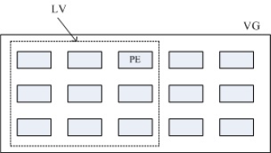

#### 逻辑卷轴管理员 （Logical Volume Manager）

Physical Volume, PV, 实体卷轴

Volume Group, VG, 卷轴群组

Physical Extent, PE, 实体范围区块

Logical Volume, LV, 逻辑卷轴

VG、LV 与 PE 的关系有点像下图:

LVM 强调的是“弹性的变化文件系统的容量”；
与 LVM 有关的元件有： PV/VG/PE/LV 等元件，可以被格式化者为 LV
新的 LVM 拥有 LVM thin volume 的功能，能够动态调整磁盘的使用率！
LVM 拥有快照功能，快照可以记录 LV 的数据内容，并与原有的 LV 共享未更动的数据，
备份与还原就变的很简单；
XFS 通过 xfs_growfs 指令，可以弹性的调整文件系统的大小