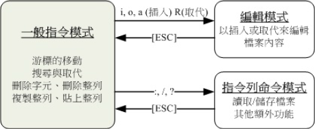
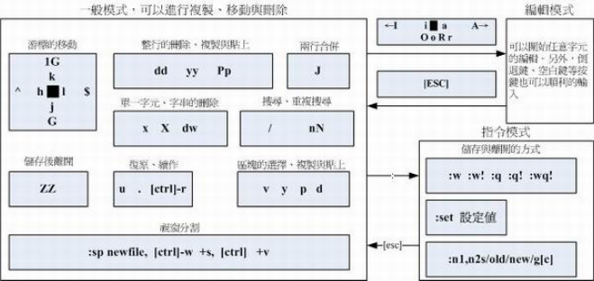

# 文件与文件系统的压缩,打包与备份

#### Linux 系统常见的压缩指令

​	Linux上常见的压缩指令就是 gzip, bzip2 以及最新的 xz

​	压缩文件的扩展名大多是：“.gz, .bz2, .xz, .tar, .tar.gz, .tar.bz2, *.tar.xz”

##### 打包指令： tar

​	tar 可以用来进行文件打包，并可支持 gzip, bzip2, xz 的压缩。

-c: 建立压缩档案
-x：解压
-t：查看内容
-r：向压缩归档文件末尾追加文件
-u：更新原压缩包中的文件

​	这五个是独立的命令，压缩解压都要用到其中一个，可以和别的命令连用但只能用其中一个。下面的参数是根据需要在压缩或解压档案时可选的。

-z：有gzip属性的
-j：有bz2属性的
-Z：有compress属性的
-v：显示所有过程
-O：将文件解开到标准输出

​	下面的参数-f是必须的

-f: 使用档案名字，切记，这个参数是最后一个参数，后面只能接档案名。

tar -czf jpg.tar.gz *.jpg   //将目录里所有jpg文件打包成jpg.tar后，并且将其用gzip压缩，生成一个gzip压缩过的包，命名为jpg.tar.gz

tar -xzvf file.tar.gz //解压tar.gz

##### XFS 文件系统的备份与还原

XFS 文件系统备份 xfsdump

XFS 文件系统还原 xfsrestore

要创建光盘烧录数据时，可通过 mkisofs 指令来创建；
可通过 wodim 来写入 CD 或 DVD 烧录机
dd 可备份完整的 partition 或 disk ，因为 dd 可读取磁盘的 sector 表面数据
cpio 为相当优秀的备份指令，不过必须要搭配类似 find 指令来读入欲备份的文件名数
据，方可进行备份动作。

##### vi 的使用

#### 按键说明

##### 第一部份：一般指令模式可用的按钮说明，光标移动、复制贴上、搜寻取代等

| 移动光标的方法                                               |                                                              |
| ------------------------------------------------------------ | ------------------------------------------------------------ |
| [Ctrl] + [f]                                                 | 屏幕“向下”移动一页，相当于 [Page Down]按键 （常用）          |
| [Ctrl] + [b]                                                 | 屏幕“向上”移动一页，相当于 [Page Up] 按键（常用）            |
| 0 或功能键[Home]                                             | 这是数字“ 0 ”：移动到这一列的最前面字符处（常用）            |
| $ 或功能键[End]                                              | 移动到这一列的最后面字符处（常用）                           |
| G                                                            | 移动到这个文件的最后一列（常用）                             |
| gg                                                           | 移动到这个文件的第一列，相当于 1G 啊！（常用）               |
| n<Enter>                                                     | n 为数字。光标向下移动 n 列（常用）                          |
| **搜寻与取代**                                               |                                                              |
| /word                                                        | 向光标之下寻找一个名称为 word 的字串。例如要在文件内搜寻 vbird 这个字串，就输入/vbird 即可！ （常用） |
| 使用 /word 配合 n 及 N 是非常有帮助的！可以让你重复的找到一些你搜寻的关键字！ |                                                              |
| :n1,n2s/word1/word2/g                                        | n1 与 n2 为数字。在第 n1 与 n2 列之间寻找word1 这个字串，并将该字串取代为 word2！举例来说，在 100 到 200 列之间搜寻 vbird并取代为 VBIRD则：“:100,200s/vbird/VBIRD/g”。（常用） |
| **删除、复制与贴上**                                         |                                                              |
| x, X                                                         | 在一列字当中，x 为向后删除一个字符 （相当于 [del] 按键）， X 为向前删除一个字符（相当于 [backspace] 亦即是倒退键） （常用） |
| dd                                                           | 删除光标所在的那一整列（常用）                               |
| ndd                                                          | n 为数字。删除光标所在的向下 n 列，例如20dd 则是删除 20 列 （常用） |
| yy                                                           | 复制光标所在的那一列（常用）                                 |
| nyy                                                          | n 为数字。复制光标所在的向下 n 列，例如20yy 则是复制 20 列（常用） |
| p, P                                                         | p 为将已复制的数据在光标下一列贴上，P 则为贴在光标上一列！ 举例来说，我目前光标在第 20 列，且已经复制了 10 列数据。则按下 p 后， 那 10 列数据会贴在原本的 20 列之后，亦即由 21 列开始贴。但如果是按下 P呢？ 那么原本的第 20 列会被推到变成 30列。 （常用） |
| u                                                            | 复原前一个动作。（常用）                                     |
| [Ctrl]+r                                                     | 重做上一个动作。（常用）                                     |
| .                                                            | 不要怀疑！这就是小数点！意思是重复前一个动作的意思。 如果你想要重复删除、重复贴上等等动作，按下小数点“.”就好了！ （常用） |
|                                                              |                                                              |

##### 第二部份：一般指令模式切换到编辑模式的可用的按钮说明

| 进入插入或取代的编辑模式 |                                                              |
| ------------------------ | ------------------------------------------------------------ |
| i, I                     | 进入插入模式（Insert mode）：i为“从目前光标所在处插入”， I为“在目前所在列的第一个非空白字符处开始插入”。 （常用） |
| a, A                     | 进入插入模式（Insert mode）：a为“从目前光标所在的下一个字符处开始插入”， A 为“从光标所在列的最后一个字符处开始插入”。（常用） |
| o, O                     | 进入插入模式（Insert mode）：这是英文字母 o 的大小写。o为“在目前光标所在的下一列处插入新的一列”； O 为在目前光标所在处的上一列插入新的一列！（常用） |
| r, R                     | 进入取代模式（Replacemode）：r 只会取代光标所在的那一个字符一次；R会一直取代光标所在的文字，直到按下 ESC 为止；（常用） |
| [Esc]                    | 退出编辑模式，回到一般指令模式中（常用）                     |

##### 第三部份：一般指令模式切换到命令行界面的可用按钮说明

| 命令行界面的储存、离开等指令 |                                                              |
| ---------------------------- | ------------------------------------------------------------ |
| :w                           | 将编辑的数据写入硬盘文件中（常用）                           |
| :w!                          | 若文件属性为“只读”时，强制写入该文件。不过，到底能不能写入， 还是跟你对该文件的文件权限有关啊！ |
| :q                           | 离开 vi （常用）                                             |
| :q!                          | 若曾修改过文件，又不想储存，使用 ! 为强制离开不储存盘案。    |
| :wq                          | 储存后离开，若为 :wq! 则为强制储存后离开 （常用）            |
| vim 环境的变更               |                                                              |
| :set nu 显示行号             | 设置之后，会在每一列的字首显示该列的行号                     |
| :set nonu                    | 与 set nu 相反，为取消行号！                                 |
|                              |                                                              |

#### vim 的额外功能

| 区块选择的按键意义 |                                        |
| ------------------ | -------------------------------------- |
| v                  | 字符选择，会将光标经过的地方反白选择！ |
| V                  | 列选择，会将光标经过的列反白选择！     |
| [Ctrl]+v           | 区块选择，可以用长方形的方式选择数据   |
| y                  | 将反白的地方复制起来                   |
| d                  | 将反白的地方删除掉                     |
| p                  | 将刚刚复制的区块，在光标所在处贴上！   |
|                    |                                        |
|                    |                                        |
|                    |                                        |

##### 多文件编辑

| 多文件编辑的按键 |                                   |
| ---------------- | --------------------------------- |
| :n               | 编辑下一个文件                    |
| :N               | 编辑上一个文件                    |
| :files           | 列出目前这个 vim 的打开的所有文件 |

##### 多窗口功能

| 多窗口情况下的按键功能     |                                                              |
| -------------------------- | ------------------------------------------------------------ |
| :sp [filename]             | 打开一个新窗口，如果有加 filename， 表示在新窗口打开一个新文件，否则表示两个窗口为同一个文件内容（同步显示）。 |
| [ctrl]+w+ j
 [ctrl]+w+↓ | 按键的按法是：先按下 [ctrl] 不放， 再按下 w 后放开所有的按键，然后再按下 j （或向下方向键），则光标可移动到下方的窗口。 |
| [ctrl]+w+ k
 [ctrl]+w+↑ | 同上，不过光标移动到上面的窗口。                             |
| [ctrl]+w+q                 | 其实就是 :q 结束离开啦！ 举例来说，如果我想要结束下方的窗口，那么利用 [ctrl]+w+↓ 移动到下方窗口后，按下 :q 即可离开， 也可以按下[ctrl]+w+q 啊！ |

##### vim 常用指令示意图

#### 中文编码的问题

​	因为中文编码有 big5 与 utf8 两种，如果你的文件是使用 big5 编码制作的，但在 vim 的终端接口中你使用的是万国码（utf8）， 由于编码的不同，你的中文文件内容当然就是一堆乱码了！怎么办？这时你得要考虑许多东西啦！有这些：

1. 你的 Linux 系统默认支持的语系数据：这与 /etc/locale.conf 有关；
2. 你的终端接口 （bash） 的语系： 这与 LANG, LC_ALL 这几个变量有关；
3. 你的文件原本的编码；
4. 打开终端机的软件，例如在 GNOME 下面的窗口接口。

​	事实上最重要的是上头的第三与第四点，只要这两点的编码一致，你就能够正确的看到与编辑你的中文文件。 否则就会看到一堆乱码啦！

可以使用 iconv 进行文件语系编码的转换。

使用 dos2unix 及 unix2dos 可以变更文件每一列的行尾断行字符。

vim 的环境设置可以写入在 ~/.vimrc 文件中；

