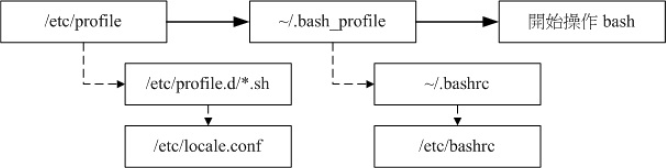
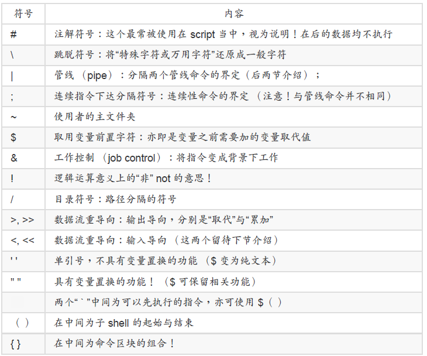

# 认识与学习BASH

#### 认识 BASH 这个 Shell


##### Bash shell 的功能

- 命令编修能力 （history）：

  ​	只要在命令行按“上下键”就可以找到前/后一个输入的指令，这么多的指令记录在哪里呢？在你的主文件夹内的 .bash_history 啦。

- 命令与文件补全功能： （[tab] 按键的好处）

- 命令别名设置功能： （alias）

  alias lm='ls -al'

- 程序化脚本： （shell scripts）

查询指令是否为 Bash shell 的内置命令： type

范例一：查询一下 ls 这个指令是否为 bash 内置？

```cmd
[dmtsai@study ~]$ type ls
```


#### Shell 的变量功能

变量的取用与设置：echo, 变量设置规则, unset

echo $PATH

设置变量:

```cmd
[dmtsai@study ~]$ echo ${myname}
&lt;==这里并没有任何数据～因为这个变量尚未被设置！是空的！
[dmtsai@study ~]$ myname=VBird
[dmtsai@study ~]$ echo ${myname}
VBird &lt;==出现了！因为这个变量已经被设置了
```

- 变量与变量内容以一个等号“=”来链接，如下所示： “myname=VBird”
- 等号两边不能直接接空白字符，如下所示为错误： “myname = VBird”或“myname=VBird
  Tsai”
- 变量名称只能是英文字母与数字，但是开头字符不能是数字，如下为错误：
  “2myname=VBird”
- 若该变量为扩增变量内容时，则可用 "$变量名称" 或 ${变量} 累加内容，如下所示：
  “PATH="$PATH":/home/bin”或“PATH=${PATH}:/home/bin”
- 若该变量需要在其他子程序执行，则需要以 export 来使变量变成环境变量： “export
  PATH”
- 取消变量的方法为使用 unset ：“unset 变量名称”例如取消 myname 的设置： “unset
  myname”

：如何进入到您目前核心的模块目录？

```cmd
[dmtsai@study ~]$ cd /lib/modules/$（uname -r）/kernel # 以此例较佳！
```

其实上面的指令可以说是作了两次动作，亦即是：
1. 先进行反单引号内的动作“uname -r”并得到核心版本为 3.10.0-229.el7.x86_64
2. 将上述的结果带入原指令，故得指令为：“cd /lib/modules/3.10.0-229.el7.x86_64/kernel/”

#### 环境变量的功能

用 env 观察环境变量与常见环境变量说明

用 set 观察所有变量 （含环境变量与自订变量）

影响显示结果的语系变量 （locale）

#### 变量键盘读取、阵列与宣告： read, array, declare

- read

```cmd
范例一：让使用者由键盘输入一内容，将该内容变成名为 atest 的变量
[dmtsai@study ~]$ read atest
This is a test &lt;==此时光标会等待你输入！请输入左侧文字看看
[dmtsai@study ~]$ echo ${atest}
This is a test &lt;==你刚刚输入的数据已经变成一个变量内容！
```

- declare / typeset

范例一：让变量 sum 进行 100+300+50 的加总结果

​	declare 或 typeset 是一样的功能，就是在“宣告变量的类型”。如果使用 declare 后面并没有接任何参数，那么 bash 就会主动的将所有的变量名称与内容通通叫出来，就好像使用 set 一样啦！

```cmd
[dmtsai@study ~]$ sum=100+300+50
[dmtsai@study ~]$ echo ${sum}
100+300+50 &lt;==咦！怎么没有帮我计算加总？因为这是文字体态的变量属性啊！
[dmtsai@study ~]$ declare -i sum=100+300+50
[dmtsai@study ~]$ echo ${sum}
450
```

- 阵列 （array） 变量类型

范例：设置上面提到的 var[1] ～ var[3] 的变量。

```cmd
[dmtsai@study ~]$ var[1]="small min"
[dmtsai@study ~]$ var[2]="big min"
[dmtsai@study ~]$ var[3]="nice min"
[dmtsai@study ~]$ echo "${var[1]}, ${var[2]}, ${var[3]}"
small min, big min, nice min
```

与文件系统及程序的限制关系： ulimit

#### 变量内容的删除、取代与替换

范例一：先让小写的 path 自订变量设置的与 PATH 内容相同

```cmd
[dmtsai@study ~]$ path=${PATH}
[dmtsai@study ~]$ echo ${path}
/usr/local/bin:/usr/bin:/usr/local/sbin:/usr/sbin:/home/dmtsai/.local/bin:/home/dmtsai/bin
```

范例二：假设我不喜欢 local/bin，所以要将前 1 个目录删除掉，如何显示？

```cmd
[dmtsai@study ~]$ echo ${path#/*local/bin:}
/usr/bin:/usr/local/sbin:/usr/sbin:/home/dmtsai/.local/bin:/home/dmtsai/bin
```


范例六：将 path 的变量内容内的 sbin 取代成大写 SBIN：

```cmd
[dmtsai@study ~]$ echo ${path/sbin/SBIN}
/usr/local/bin:/usr/bin:/usr/local/SBIN:/usr/sbin:/home/dmtsai/.local/bin:/home/dmtsai/bin
```

#这个部分就容易理解的多了！关键字在于那两个斜线，两斜线中间的是旧字串
#后面的是新字串，所以结果就会出现如上述的特殊字体部分啰！

```cmd
[dmtsai@study ~]$ echo ${path//sbin/SBIN}
/usr/local/bin:/usr/bin:/usr/local/SBIN:/usr/SBIN:/home/dmtsai/.local/bin:/home/dmtsai/bin
```

#如果是两条斜线，那么就变成所有符合的内容都会被取代喔！

我们将这部份作个总结说明一下：

| 变量设置方式                                | 说明                                                         |
| ------------------------------------------- | ------------------------------------------------------------ |
| ${变量#关键  字}
${变量##关键字}             | 若变量内容从头开始的数据符合“关键字”，则将符合的最短数据删除若变量内容从头开始的数据符合“关键字”，则将符合的最长数据删除 |
| ${变量%关键    字}
${变量%%关键字}           | 若变量内容从尾向前的数据符合“关键字”，则将符合的最短数据删除 若变量内容从尾向前的数据符合“关键字”，则将符合的最长数据删除 |
| ${变量/旧字串/新字串}
${变量//旧字串/新字串} | 若变量内容符合“旧字串”则“第一个旧字串会被新字串取代” 若变量内容符合“旧字串”则“全部的旧字串会被新字串取代” |

#### Bash Shell 的操作环境：

bash 的环境配置文件



source ：读入环境配置文件的指令

##### 万用字符与特殊符号

| 符号 | 意义                                                         |
| ---- | ------------------------------------------------------------ |
| *    | 代表“ 0 个到无穷多个”任意字符                                |
| ?    | 代表“一定有一个”任意字符                                     |
| [ ]  | 同样代表“一定有一个在括号内”的字符（非任意字符）。例如 [abcd] 代表“一定有一个字符， 可能是 a, b, c, d 这四个任何一个 |
| [ -] | 若有减号在中括号内时，代表“在编码顺序内的所有字符”。例如 [0-9] 代表 0 到 9 之间的所有数字，因为数字的语系编码是连续的！ |
| [^]  | 若中括号内的第一个字符为指数符号 （^） ，那表示“反向选择”，例如 [^abc] 代表一定有一个字符，只要是非 a, b, c 的其他字符就接受的意思。 |

除了万用字符之外，bash 环境中的特殊符号有哪些呢？下面我们先汇整一下：



#### 数据流重导向

1. 标准输入　　（stdin） ：代码为 0 ，使用 < 或 << ；

2. 标准输出　　（stdout）：代码为 1 ，使用 > 或 >> ；

3. 标准错误输出（stderr）：代码为 2 ，使用 2> 或 2>> ；
    为了理解 stdout 与 stderr ，我们先来进行一个范例的练习：
    范例一：观察你的系统根目录 （/） 下各目录的文件名、权限与属性，并记录下来

  ```cmd
  [dmtsai@study ~]$ ll / ==此时屏幕会显示出文件名信息
  [dmtsai@study ~]$ ll / > ~/rootfile ==屏幕并无任何信息
  [dmtsai@study ~]$ ll ~/rootfile ==有个新文件被创建了！
  -rw-rw-r--. 1 dmtsai dmtsai 1078 Jul 9 18:51 /home/dmtsai/rootfile
  ```

1> ：以覆盖的方法将“正确的数据”输出到指定的文件或设备上；
1>>：以累加的方法将“正确的数据”输出到指定的文件或设备上；
2> ：以覆盖的方法将“错误的数据”输出到指定的文件或设备上；
2>>：以累加的方法将“错误的数据”输出到指定的文件或设备上；

范例五：将指令的数据全部写入名为 list 的文件中

```cmd
[dmtsai@study ~]$ find /home -name .bashrc > list 2> list  ==错误
[dmtsai@study ~]$ find /home -name .bashrc > list 2>&1  ==正确
[dmtsai@study ~]$ find /home -name .bashrc &> list  ==正确
```

standard input ： < 与 <<
了解了 stderr 与 stdout 后，那么那个 < 又是什么呀？呵呵！以最简单的说法来说， 那就
是“将原本需要由键盘输入的数据，改由文件内容来取代”的意思。 我们先由下面的 cat 指令操
作来了解一下什么叫做“键盘输入”吧！

范例六：利用 cat 指令来创建一个文件的简单流程

```cmd
[dmtsai@study ~]$ cat < catfile
testing
cat file test
< ==这里按下 [ctrl]+d 来离开
[dmtsai@study ~]$ cat catfile
testing
cat file test
```

##### 命令执行的判断依据： ; , &&, ||

- cmd ; cmd （不考虑指令相关性的连续指令下达）

​       在某些时候，我们希望可以一次执行多个指令，例如在关机的时候我希望可以先执行两次sync 同步化写入磁盘后才 shutdown 计算机，那么可以怎么作呢？这样做呀：

[root@study ~]# sync; sync; shutdown -h now

在某些时候，我们希望可以一次执行多个指令，例如在关机的时候我希望可以先执行两次
sync 同步化写入磁盘后才 shutdown 计算机，那么可以怎么作呢？这样做呀：
[root@study ~]# sync; sync; shutdown -h now

$? （指令回传值） 与 && 或 ||

cmd1&&cmd2

若 cmd1 执行完毕且正确执行（$?=0），则开始执行 cmd2。 2. 若 cmd1
执行完毕且为错误 （$?≠0），则 cmd2 不执行。

cmd1 ||cmd2

若 cmd1 执行完毕且正确执行（$?=0），则 cmd2 不执行。 2. 若 cmd1 执
行完毕且为错误 （$?≠0），则开始执行 cmd2。

范例一：使用 ls 查阅目录 /tmp/abc 是否存在，若存在则用 touch 创建 /tmp/abc/hehe

```cmd
[dmtsai@study ~]$ ls /tmp/abc && touch /tmp/abc/hehe
ls: cannot access /tmp/abc: No such file or directory
```

#ls 很干脆的说明找不到该目录，但并没有 touch 的错误，表示 touch 并没有执行

#### 管线命令 （pipe）

##### 撷取命令： cut, grep

范例一：将 PATH 变量取出，我要找出第五个路径。

```cmd
[dmtsai@study ~]$ echo ${PATH}
/usr/local/bin:/usr/bin:/usr/local/sbin:/usr/sbin:/home/dmtsai/.local/bin:/home/dmtsai/bin
[dmtsai@study ~]$ echo ${PATH} | cut -d ':' -f 5
#如同上面的数字显示，我们是以“ : ”作为分隔，因此会出现 /home/dmtsai/.local/bin
#那么如果想要列出第 3 与第 5 呢？，就是这样：
[dmtsai@study ~]$ echo ${PATH} | cut -d ':' -f 3,5
```

```cmd
范例一：将 last 当中，有出现 root 的那一行就取出来；
[dmtsai@study ~]$ last|grep 'root'
范例二：与范例一相反，只要没有 root 的就取出！
[dmtsai@study ~]$ last | grep -v 'root'
```

**排序命令： sort, wc, uniq**

```cmd
范例一：个人帐号都记录在 /etc/passwd 下，请将帐号进行排序。
[dmtsai@study ~]$ cat /etc/passwd | sort

范例一：使用 last 将帐号列出，仅取出帐号栏，进行排序后仅取出一位；
[dmtsai@study ~]$ last | cut -d ' ' -f1 | sort| uniq

范例一：那个 /etc/man_db.conf 里面到底有多少相关字、行、字符数？
[dmtsai@study ~]$ cat /etc/man_db.conf | wc
131 723 5171

#输出的三个数字中，分别代表： “行、字数、字符数”
```

**双向重导向： tee**

```cmd
[dmtsai@study ~]$ last | tee last.list | cut -d " " -f1
```

#这个范例可以让我们将 last 的输出存一份到 last.list 文件中；

**字符转换命令： tr, col, join, paste, expand**

​	tr 可以用来删除一段讯息当中的文字，或者是进行文字讯息的替换！

范例一：将 last 输出的讯息中，所有的小写变成大写字符：

```cmd
[dmtsai@study ~]$ last | tr '[a-z]' '[A-Z]'
```

#事实上，没有加上单引号也是可以执行的，如：“ last &#124; tr [a-z] [A-Z] ”

​	join 看字面上的意义 （加入/参加） 就可以知道，他是在处理两个文件之间的数据， 而且，
主要是在处理“两个文件当中，有 "相同数据" 的那一行，才将他加在一起”的意思。

​	这个 paste 就要比 join 简单多了！相对于 join 必须要比对两个文件的数据相关性， paste 就
直接“将两行贴在一起，且中间以 [tab] 键隔开”

​	expand 这玩意儿就是在将 [tab] 按键转成空白键啦。

分区命令： split

范例一：我的 /etc/services 有六百多K，若想要分成 300K 一个文件时？

```cmd
[dmtsai@study ~]$ cd / | split -b 300k /etc/services services
[dmtsai@study tmp]$ ll -k services*
-rw-rw-r--. 1 dmtsai dmtsai 307200 Jul 9 22:52 servicesaa
-rw-rw-r--. 1 dmtsai dmtsai 307200 Jul 9 22:52 servicesab
-rw-rw-r--. 1 dmtsai dmtsai 55893 Jul 9 22:52 servicesac
```

参数代换： xargs


关于减号 - 的用途

管线命令在 bash 的连续的处理程序中是相当重要的！另外，在 log file 的分析当中也是相当
重要的一环， 所以请特别留意！另外，在管线命令当中，常常会使用到前一个指令的 stdout
作为这次的 stdin ， 某些指令需要用到文件名称 （例如 tar） 来进行处理时，该 stdin 与
stdout 可以利用减号 "-" 来替代， 举例来说：

```cmd
[root@study ~]# mkdir /tmp/homeback
[root@study ~]# tar -cvf - /home | tar -xvf - -C /tmp/homeback
```

上面这个例子是说：“我将 /home 里面的文件给他打包，但打包的数据不是纪录到文件，而是
传送到 stdout； 经过管线后，将 tar -cvf - /home 传送给后面的 tar -xvf - ”。后面的这个 - 则
是取用前一个指令的 stdout， 因此，我们就不需要使用 filename 了！这是很常见的例子喔！
注意注意！