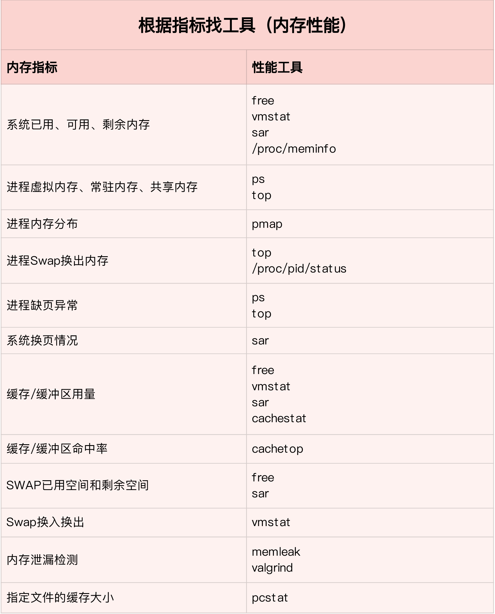

查看内存工具

free、top、ps、vmstat

top 输出界面的顶端，也显示了系统整体的内存使用情况，这些数据跟 free 类似，我就不再重复解释。我们接着看下面的内容，跟内存相关的几列数据，比如 VIRT、RES、SHR 以及 %MEM 等。

这些数据，包含了进程最重要的几个内存使用情况，我们挨个来看。

- VIRT 是进程虚拟内存的大小，只要是进程申请过的内存，即便还没有真正分配物理内存，也会计算在内。
- RES 是常驻内存的大小，也就是进程实际使用的物理内存大小，但不包括 Swap 和共享内存。
- SHR 是共享内存的大小，比如与其他进程共同使用的共享内存、加载的动态链接库以及程序的代码段等。
- %MEM 是进程使用物理内存占系统总内存的百分比。

除了要认识这些基本信息，在查看 top 输出时，你还要注意两点。

第一，虚拟内存通常并不会全部分配物理内存。从上面的输出，你可以发现每个进程的虚拟内存都比常驻内存大得多。

第二，共享内存 SHR 并不一定是共享的，比方说，程序的代码段、非共享的动态链接库，也都算在 SHR 里。当然，SHR 也包括了进程间真正共享的内存。所以在计算多个进程的内存使用时，不要把所有进程的 SHR 直接相加得出结果。

查看由于out fo memory 被系统杀死的进程

dmesg -T | grep -i "Out of memory"

按VmSwap使用量对进程排序，输出进程名称、进程ID以及SWAP用量

$ for file in /proc/*/status ; do awk '/VmSwap|Name|^Pid/{printf $2 " " $3}END{ print ""}' $file; done | sort -k 3 -n -r | head

常见的优化思路有这么几种。

1. 最好禁止 Swap。如果必须开启Swap，降低swappiness的值，减少内存回收时Swap的使用倾向。
2. 减少内存的动态分配。比如，可以使用内存池、大页（HugePage）等。
3. 尽量使用缓存和缓冲区来访问数据。比如，可以使用堆栈明确声明内存空间，来存储需要缓存的数据；或者用Redis 这类的外部缓存组件，优化数据的访问。
4. 使用cgroups等方式限制进程的内存使用情况。这样，可以确保系统内存不会被异常进程耗尽。
5. 通过 /proc/pid/oom_adj ，调整核心应用的oom_score。这样，可以保证即使内存紧张，核心应用也不会被OOM杀死。