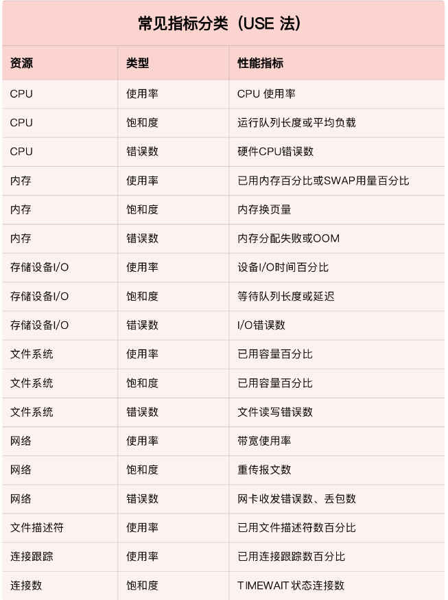

如果你在 Docker 容器中运行 Java 应用，一定要确保，在设置容器资源限制的同时，配置好
JVM 的资源选项（比如堆内存等）。

动态追踪

在 Linux 系统中，常见的动态追踪方法包括 ftrace、perf、eBPF 以及 SystemTap 等。

##### 54 | 套路篇：应用监控的一般思路

USE（Utilization Saturation and Errors）法。
USE 法把系统资源的性能指标，简化成了三个类别，即使用率、饱和度以及错误数。

日志监控

对日志监控来说，最经典的方法，就是使用 ELK 技术栈，即使用 Elasticsearch、Logstash 和Kibana 这三个组件的组合。

##### 56 | 套路篇：优化性能问题的一般方法

**CPU 优化**

CPU 性能优化的核心，在于排除所有不必要的工作、充分利用 CPU 缓存并减少进程调度对性能的影响。

- 第一种，把进程绑定到一个或者多个 CPU 上，充分利用 CPU 缓存的本地性，并减少进程间的相互影响。
- 第二种，为中断处理程序开启多 CPU 负载均衡，以便在发生大量中断时，可以充分利用多CPU 的优势分摊负载。
- 第三种，使用 Cgroups 等方法，为进程设置资源限制，避免个别进程消耗过多的 CPU。同时，为核心应用程序设置更高的优先级，减少低优先级任务的影响。

**内存优化**

- 第一种，除非有必要，Swap 应该禁止掉。这样就可以避免 Swap 的额外 I/O ，带来内存访问变慢的问题。
- 第二种，使用 Cgroups 等方法，为进程设置内存限制。这样就可以避免个别进程消耗过多内存，而影响了其他进程。对于核心应用，还应该降低 oom_score，避免被 OOM 杀死。
- 第三种，使用大页、内存池等方法，减少内存的动态分配，从而减少缺页异常。

**磁盘和文件系统 I/O 优化**

- 第一种，也是最简单的方法，通过 SSD 替代 HDD、或者使用 RAID 等方法，提升 I/O 性能。
- 第二种，针对磁盘和应用程序 I/O 模式的特征，选择最适合的 I/O 调度算法。比如，SSD 和虚拟机中的磁盘，通常用的是 noop 调度算法；而数据库应用，更推荐使用 deadline 算法。
- 第三，优化文件系统和磁盘的缓存、缓冲区，比如优化脏页的刷新频率、脏页限额，以及内核回收目录项缓存和索引节点缓存的倾向等等。

**网络优化**

首先，从内核资源和网络协议的角度来说，我们可以对内核选项进行优化，比如：

- 你可以增大套接字缓冲区、连接跟踪表、最大半连接数、最大文件描述符数、本地端口范围等内核资源配额；
- 也可以减少 TIMEOUT 超时时间、SYN+ACK 重传数、Keepalive 探测时间等异常处理参数；
- 还可以开启端口复用、反向地址校验，并调整 MTU 大小等降低内核的负担。

**应用程序优化**

- 第一，从 CPU 使用的角度来说，简化代码、优化算法、异步处理以及编译器优化等，都是常用的降低 CPU 使用率的方法，这样可以利用有限的 CPU 处理更多的请求。
- 第二，从数据访问的角度来说，使用缓存、写时复制、增加 I/O 尺寸等，都是常用的减少磁盘I/O 的方法，这样可以获得更快的数据处理速度。
- 第三，从内存管理的角度来说，使用大页、内存池等方法，可以预先分配内存，减少内存的动态分配，从而更好地内存访问性能。
- 第四，从网络的角度来说，使用 I/O 多路复用、长连接代替短连接、DNS 缓存等方法，可以优化网络 I/O 并减少网络请求数，从而减少网络延时带来的性能问题。
- 第五，从进程的工作模型来说，异步处理、多线程或多进程等，可以充分利用每一个 CPU 的处理能力，从而提高应用程序的吞吐能力。
- 除此之外，你还可以使用消息队列、CDN、负载均衡等各种方法，来优化应用程序的架构，将原来单机要承担的任务，调度到多台服务器中并行处理。这样也往往能获得更好的整体性能。

