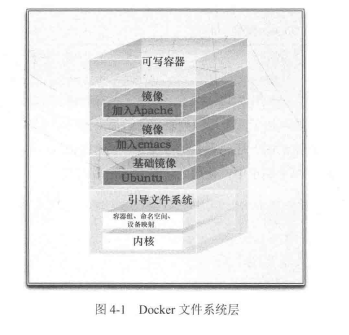

#####  docker简介

容器经常被认为是精进的技术，因为容器需要的开销有限，和传统的虚拟化和半虚拟化相比，容器运行不需要模拟层和管理层，而是使用操作系统的系统调用接口。这降低了运行单个容器所需要的开销，也使得宿主机中可运行更多的容器。
docker简介：Docker是一个能够把开发的应用程序自动部署到容器的开源引擎。
docker组件：
Docker客户端和服务器，也成为Docker引擎。
Docker镜像
Registry
Docker容器

##### 

**Docker镜像**
镜像是构建Docker世界的基石。用户基于镜像构建自己的容器。镜像也是Docker生命周期的“构建”部分。镜像是基于联合文件系统一种层式的结构。由一系列指令一步步构建出来。也可以把镜像当做容器的源代码。镜像体积很小，易于分享，存储和更新。

**Registry**
Docker用Registry保存用户构建的镜像。

##### Docker入门

##### 运行第一个容器

docker run -i -t unubtu /bin/bash
首先我们告诉Docker执行docker run命令，并指定了-i -t 两个命令行参数。-i标志保证容器中的stdin是开启的，尽管我们没有附着到容器中。持久的标准输入是交互式shell的“半边天”，-t标志则是另外“半边天”，他告诉Docker为什么要创建容器分配一个伪tty终端。这样，新创建的容器才能够提供一个交互式shell。
unubtu是镜像的名字，当容器创建完毕后，Docker就会执行容器中的/bin/bash命令。这时就可以看到容器内的shell了。

##### 使用第一个容器

hostname 检查容器主机名
cat /etc/hosts 检查容器的/etc/hosts文件
ip a  检查容器的接口
ps -aux 检查容器的进程
在第一个容器中安装软件包
apt-get update && apt-get install vim
当所有工作都结束时，输入exit，就回到宿主机的命令行提示符了。

docker ps -a查看当前系统的容器列表

docker run --name  给容器命名

重新启动已经停止运行的容器
docker start

附着到容器上
docker attach 
沿用docker run 时命令时指定的参数来运行。

创建守护式容器
docker run -d
获取守护式容器的日子
docker logs container_name

Docker日志驱动
docker run --log-driver
查看容器的进程
docker top 
查看一个或多个容器的统计信息
docker stats
在容器内部运行进程
docker exec
停止守护式容器
docker stop
自动启动容器
docker run --restart=always

docker inspect来获取更多容器信息
删除容器 
docker rm

##### 使用Docker 镜像和仓库

列出镜像
docker images
拉取镜像
docker pull images
查找进行
docker search puppet

构建镜像的两种方式：
使用docker commit命令
使用docker bulid命令和Dockerfile 文件

##### Dockerfile 指令

1 **CMD**  会被docker run 命令覆盖              
CMD["/bin/bash"]
2 ENTRYPOINT命令
不会被docker run 命令覆盖
3 **WORKDIR**
 用来在从镜像创建一个新容器时，在容器内部设置一个工作目录，ENTRYPOINT命令和CMD命令指定的程序会在这个目录下执行
 WORKDIR /opt/webapp/db
 4 **ENV**
 用来在镜像构建过程中设置环境变量。
 ENV RVM_PATH /home/rvm/
 这个新的额环境变量可以在后续的任何RUN指令中使用，这就如同在指令前面指定了环境变量前缀一样
 运行时环境变量
 docker run -e
 5 **USER** 
 用来指定给镜像会以什么用的用户去运行
 6 **VOLUME**
 用来向基于镜像创建的容器添加卷。一个卷时可以存在于一个或者多个容器内的特定的目录，这个目录可以绕过联合文件系统，并提供如下恭喜数据或者对数据进行持久化的功能。

1.  卷可以在容器间恭喜和重用。
2.  一个容器可以不是必须和其他容器共享卷。
3.  对卷的修改时立即生效的。
4.  对卷的修改不会对更新镜像产生影响。
5.  卷会一直存在知道没有任何容器再使用它。

VOLUME["/opt/project"]
这条指令将会为基于此镜像创建的任何容器创建一个名为/opt/project的挂载点。通过 VOLUME 指令创建的挂载点，无法指定主机上对应的目录，是自动生成的
7 **ADD**
用来讲构建环境下的文件和目录复制到镜像中。
ADD software.lic /opt/application/software.lic
8 **COPY**
COPY指令非常类似于ADD,它们根本的不同事COPY只关心在构建上下文中复制本地文件，而不会去做文件提取和解压
9 **LABEL**
用于为Docker镜像添加元数据。元数据以键值对的形式展现。
LABEL version="1.0"
docker inspect可以查看
10 **STOPSIGNAL**
用来设置停止容器时发送什么系统调用信号给容器。如9 ,SIGLILL。
11 **ARG**
用来定义可以在docker buid命令运行时传递给构建运行时的变量，我们只需在构建时使用--build-arg标志即可
ARG build
ARG webapp_user=user
docker buid --bulid-arg build=123 -t 

##### 12 ONBUILD

ONBUILD指令能为镜像添加触发器。当一个镜像被用作其他镜像的基础镜像时(比如用户的镜像需要从某未准备好的位置添加源代码)，该镜像中的触发器将会被执行。我们可认为这些命令时紧跟在FROM之后指定的。
ONBUILD ADD . /APP/SRC
ONBUID RUN cd /app/src && make

将镜像推送到Docker hub
docker push jamtur01/static_web
删除镜像
docker rmi

##### 运行自己的Docker Registry

docker 网络连接的几种方式
Docker 的内部网络。
Docker Networking以及docker network命令。
Docker链接。

##### Docker Networking 

docker network create app 
这里用docker network命令创建了一个桥接网络，命名为app，这个命令返回新创建的网络的网络id。
可以使用docker network ls 命令累出当前系统中的所有网络
在docker网络中创建redis容器
docker run -d --net=app --name db jamtur01/redis
docker network inspect app
检查容器的端口映射情况
docker port webapp 4567

将已有容器连接到Docker网络
docker network connect app db2
从网络中断开一个容器
docker network disconnect app db2

#####  使用Docker构建服务

docker run --volumes-from
--volumes-from把指定容器里的所有卷都加入新创建的容器
读取redis主日志
docker run -ti --rm --volumes-from redis_primary \ubuntu cat /var/log/redis/redis-server.log

