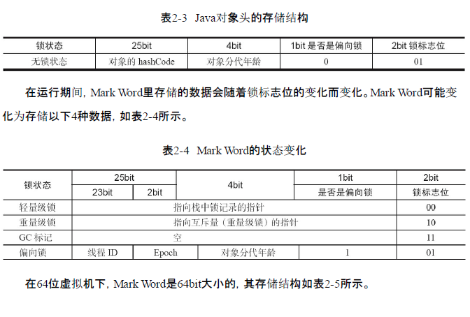
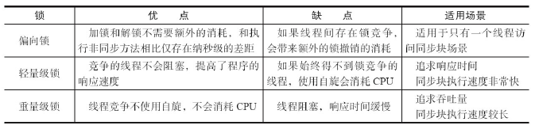

Java代码在编译后会变成Java字节码，字节码被类加载器加载到JVM里，JVM执行字节
码，最终需要转化为汇编指令在CPU上执行，Java中所使用的并发机制依赖于JVM的实现和
CPU的指令。

##### volatile定义与实现原理

Java编程语言允许线程访问共享变量，为了确保共享变量能被准确和一致地更新，线程应该确保通过排他锁单独获得这个变量。Java语言提供了volatile，在某些情况下比锁要更加方便。如果一个字段被声明成volatile，Java线程内存模型确保所有线程看到这个变量的值是一致的。
volatile不会引起线程上下文的切换和调度。
有volatile变量修饰的共享变量进行写操作的时候会多出第二行汇编代码：

```c
0x01a3de1d: movb $0×0,0×1104800(%esi);0x01a3de24: lock addl $0×0,(%esp);
```

Lock前缀指令会引起处理器缓存回写到内存。
一个处理器的缓存回写到内存会导致其他处理器的缓存无效。

Lock前缀指令会引起处理器缓存回写到内存。
一个处理器的缓存回写到内存会导致其他处理器的缓存无效。

##### synchronized的实现原理与应用

Java中的每一个对象都可以作为锁。具体表现为以下3种形式。

- 对于普通同步方法，锁是当前实例对象。
- 对于静态同步方法，锁是当前类的Class对象。
- 对于同步方法块，锁是Synchonized括号里配置的对象。

当一个线程试图访问同步代码块时，它首先必须得到锁，退出或抛出异常时必须释放锁。
从JVM规范中可以看到Synchonized在JVM里的实现原理，JVM基于进入和退出Monitor对象来实现方法同步和代码块同步。代码块同步是使用monitorenter和monitorexit指令实现的。

**Java对象头**
synchronized用的锁是存在Java对象头里的。



##### **锁的升级与对比**

偏向锁--轻量级锁--重量级锁



##### Java如何实现原子操作

使用循环CAS实现原子操作，CAS实现原子操作的三大问题

1. ABA问题
   解决思路就是使用版本号。在变量前面追加上版本号，每次变量更新的时候把版本号加1，那么A→B→A就会变成1A→2B→3A。从Java 1.5开始，JDK的Atomic包里提供了一个类AtomicStampedReference来解决ABA问题。
2. 循环时间长开销大。
3. 只能保证一个共享变量的原子操作。
   从Java 1.5开始，JDK提供了AtomicReference类来保证引用对象之间的原子性，就可以把多个变量放在一个对象里来进行CAS操作。

**使用锁机制实现原子操作**
锁机制保证了只有获得锁的线程才能够操作锁定的内存区域。JVM内部实现了很多种锁机制，有偏向锁、轻量级锁和互斥锁。有意思的是除了偏向锁，JVM实现锁的方式都用了循环CAS，即当一个线程想进入同步块的时候使用循环CAS的方式来获取锁，当它退出同步块的时候使用循环CAS释放锁。