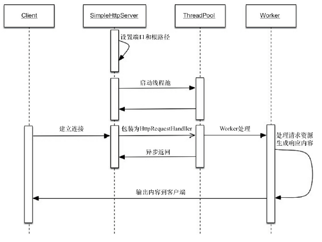

##### 管道输入/输出流

​	管道输入/输出流和普通的文件输入/输出流或者网络输入/输出流不同之处在于，它主要
用于线程之间的数据传输，而传输的媒介为内存。
​	管道输入/输出流主要包括了如下4种具体实现：PipedOutputStream、PipedInputStream、
PipedReader和PipedWriter，前两种面向字节，而后两种面向字符。

```java
 public class Piped {
        public static void main(String[] args) throws Exception {
            PipedWriter out = new PipedWriter();
            PipedReader in = new PipedReader();
// 将输出流和输入流进行连接，否则在使用时会抛出IOException
            out.connect(in);
            Thread printThread = new Thread(new Print(in), "PrintThread");
            printThread.start();
            int receive = 0;
            try {
                while ((receive = System.in.read()) != -1) {
                    out.write(receive);
                }
            } finally {
                out.close();
            }
        }
        static class Print implements Runnable {
            private PipedReader in;
            public Print(PipedReader in) {
                this.in = in;
            }
            public void run() {
                int receive = 0;
                try {
                    while ((receive = in.read()) != -1) {
                        System.out.print((char) receive);
                    }
                } catch (IOException ex) {
                }
            }
        }
    }
```

运行该示例，输入一组字符串，可以看到被printThread进行了原样输出。
Repeat my words.
Repeat my words.
对于Piped类型的流，必须先要进行绑定，也就是调用connect()方法，如果没有将输入/输
出流绑定起来，对于该流的访问将会抛出异常。

##### Thread.join()的使用

​	如果一个线程A执行了thread.join()语句，其含义是：当前线程A等待thread线程终止之后才
从thread.join()返回。

##### ThreadLocal的使用

​	ThreadLocal，即线程变量，是一个以ThreadLocal对象为键、任意对象为值的存储结构。这
个结构被附带在线程上，也就是说一个线程可以根据一个ThreadLocal对象查询到绑定在这个
线程上的一个值。

​	构建了一个常用的Profiler类，它具有begin()和end()两个方法，而end()方法返回从begin()方法调用开始到end()方法被调用时的时间差，单位是毫秒。

```java
public class Profiler {
    // 第一次get()方法调用时会进行初始化（如果set方法没有调用），每个线程会调用一次
    private static final ThreadLocal<Long> TIME_THREADLOCAL = new ThreadLocal<Long>() {
        protected Long initialValue() {
            return System.currentTimeMillis();
        }
    };
    public static final void begin() {
        TIME_THREADLOCAL.set(System.currentTimeMillis());
    }
    public static final long end() {
        return System.currentTimeMillis() - TIME_THREADLOCAL.get();
    }
    public static void main(String[] args) throws Exception {
        Profiler.begin();
        TimeUnit.SECONDS.sleep(1);
        System.out.println("Cost: " + Profiler.end() + " mills");
    }
}
```

#### 线程应用实例

##### 等待超时模式

```java
    // 对当前对象加锁
    public synchronized Object get(long mills) throws InterruptedException {
        long future = System.currentTimeMillis() + mills;
        long remaining = mills;
// 当超时大于0并且result返回值不满足要求
        while ((result == null) && remaining > 0) {
            wait(remaining);
            remaining = future - System.currentTimeMillis();
        }
        return result;
    }
```

​	可以看出，等待超时模式就是在等待/通知范式基础上增加了超时控制，这使得该模式相
比原有范式更具有灵活性，因为即使方法执行时间过长，也不会“永久”阻塞调用者，而是会按
照调用者的要求“按时”返回。

##### 一个简单的数据库连接池示例

```java
  public class ConnectionPool {
        private LinkedList<Connection> pool = new LinkedList<Connection>();
        public ConnectionPool(int initialSize) {
            if (initialSize > 0) {
                for (int i = 0; i < initialSize; i++) {
                    pool.addLast(ConnectionDriver.createConnection());
                }
            }
        }
        public void releaseConnection(Connection connection) {
            if (connection != null) {
                synchronized (pool) {
// 连接释放后需要进行通知，这样其他消费者能够感知到连接池中已经归还了一个连接
                    pool.addLast(connection);
                    pool.notifyAll();
                }
            }
        }
        // 在mills内无法获取到连接，将会返回null
        public Connection fetchConnection(long mills) throws InterruptedException {
            synchronized (pool) {
// 完全超时
                if (mills <= 0) {
                    while (pool.isEmpty()) {
                        pool.wait();
                    }
                    return pool.removeFirst();
                } else {
                    long future = System.currentTimeMillis() + mills;
                    long remaining = mills;
                    while (pool.isEmpty() && remaining > 0) {
                        pool.wait(remaining);
                        remaining = future - System.currentTimeMillis();
                    }
                    Connection result = null;
                    if (!pool.isEmpty()) {
                        result = pool.removeFirst();
                    }
                    return result;
                }
            }
        }
```

```java
  public class ConnectionDriver {
        static class ConnectionHandler implements InvocationHandler {
            public Object invoke(Object proxy, Method method, Object[] args) throws Throwable if (method.getName().equals("commit")) {
                TimeUnit.MILLISECONDS.sleep(100);
            }
return null;
        }
    }
    // 创建一个Connection的代理，在commit时休眠100毫秒
    public static final Connection createConnection() {
        return (Connection) Proxy.newProxyInstance(ConnectionDriver.class.getClassLoader(),
                new Class<>[] { Connection.class }, new ConnectionHandler());
    }
}
```

```java
   public class ConnectionPoolTest {
        static ConnectionPool pool = new ConnectionPool(10);
        // 保证所有ConnectionRunner能够同时开始
        static CountDownLatch start = new CountDownLatch(1);
        // main线程将会等待所有ConnectionRunner结束后才能继续执行
        static CountDownLatch end;
        public static void main(String[] args) throws Exception {
// 线程数量，可以修改线程数量进行观察
            int threadCount = 10;
            end = new CountDownLatch(threadCount);
            int count = 20;
            AtomicInteger got = new AtomicInteger();
            AtomicInteger notGot = new AtomicInteger();
            for (int i = 0; i < threadCount; i++) {
                Thread thread = new Thread(new ConnetionRunner(count, got, notGot),
                        "ConnectionRunnerThread");
                thread.start();
            }
            start.countDown();
            end.await();
            System.out.println("total invoke: " + (threadCount * count));
            System.out.println("got connection: " + got);
            System.out.println("not got connection " + notGot);
        }
        static class ConnetionRunner implements Runnable {
            int count;
            AtomicInteger got;
            AtomicInteger notGot;
            public ConnetionRunner(int count, AtomicInteger got, AtomicInteger notGot) {
                this.count = count;
                this.got = got;
                this.notGot = notGot;
            }
            public void run() {
                try {
                    start.await();
                } catch (Exception ex) {
                }
                while (count > 0) {
                    try {
// 从线程池中获取连接，如果1000ms内无法获取到，将会返回null
// 分别统计连接获取的数量got和未获取到的数量notGot
                        Connection connection = pool.fetchConnection(1000);
                        if (connection != null) {
                            try {
                                connection.createStatement();
                                connection.commit();
                            } finally {
                                pool.releaseConnection(connection);
                                got.incrementAndGet();
                            }
                        } else {
                            notGot.incrementAndGet();
                        }
                    } catch (Exception ex) {
                    } finally {
                        count--;
                    }
                }
                end.countDown();
            }
        }
    }
```

​	上述示例中使用了CountDownLatch来确保ConnectionRunnerThread能够同时开始执行，并
且在全部结束之后，才使main线程从等待状态中返回。当前设定的场景是10个线程同时运行
获取连接池（10个连接）中的连接，通过调节线程数量来观察未获取到连接的情况。线程数、总
获取次数、获取到的数量、未获取到的数量以及未获取到的比率，

##### 线程池技术及其示例

```java
public interface ThreadPool<Job extends Runnable> {
    // 执行一个Job，这个Job需要实现Runnable
    void execute(Job job);
    // 关闭线程池
    void shutdown();
    // 增加工作者线程
    void addWorkers(int num);
    // 减少工作者线程
    void removeWorker(int num);
    // 得到正在等待执行的任务数量
    int getJobSize();
}
```

```java
  public class DefaultThreadPool<Job extends Runnable> implements ThreadPool<Job> {
        // 线程池最大限制数
        private static final int MAX_WORKER_NUMBERS = 10;
        // 线程池默认的数量
        private static final int DEFAULT_WORKER_NUMBERS = 5;
        // 线程池最小的数量
        private static final int MIN_WORKER_NUMBERS = 1;
        // 这是一个工作列表，将会向里面插入工作
        private final LinkedList<Job> jobs = new LinkedList<Job>();
        // 工作者列表
        private final List<Worker> workers = Collections.synchronizedList(new
                ArrayList<Worker>());
        // 工作者线程的数量
        private int workerNum = DEFAULT_WORKER_NUMBERS;
        // 线程编号生成
        private AtomicLong threadNum = new AtomicLong();
        public DefaultThreadPool() {
            initializeWokers(DEFAULT_WORKER_NUMBERS);
        }
        public DefaultThreadPool(int num) {
            workerNum = num > MAX_WORKER_NUMBERS MAX_WORKER_NUMBERS : num < MIN_WORKER_
            NUMBERS MIN_WORKER_NUMBERS : num;
            initializeWokers(workerNum);
        }
        public void execute(Job job) {
            if (job != null) {
// 添加一个工作，然后进行通知
                synchronized (jobs) {
                    jobs.addLast(job);
                    jobs.notify();
                }
            }
        }
        public void shutdown() {
            for (Worker worker : workers) {
                worker.shutdown();
            }
        }
        public void addWorkers(int num) {
            synchronized (jobs) {
// 限制新增的Worker数量不能超过最大值
                if (num + this.workerNum > MAX_WORKER_NUMBERS) {
                    num = MAX_WORKER_NUMBERS - this.workerNum;
                }
                initializeWokers(num);
                this.workerNum += num;
            }
        }
        public void removeWorker(int num) {
            synchronized (jobs) {
                if (num >= this.workerNum) {
                    throw new IllegalArgumentException("beyond workNum");
                }
// 按照给定的数量停止Worker
                int count = 0;
                while (count < num) {
                    Worker worker = workers.get(count)
                    if (workers.remove(worker)) {
                        worker.shutdown();
                        count++;
                    }
                }
                this.workerNum -= count;
            }
        }
        public int getJobSize() {
            return jobs.size();
        }
        // 初始化线程工作者
        private void initializeWokers(int num) {
            for (int i = 0; i < num; i++) {
                Worker worker = new Worker();
                workers.add(worker);
                Thread thread = new Thread(worker, "ThreadPool-Worker-" + threadNum.
                        incrementAndGet());
                thread.start();
            }
        }
        // 工作者，负责消费任务
        class Worker implements Runnable {
            // 是否工作
            private volatile boolean running = true;
            public void run() {
                while (running) {
                    Job job = null;
                    synchronized (jobs) {
// 如果工作者列表是空的，那么就wait
                        while (jobs.isEmpty()) {
                            try {
                                jobs.wait();
                            } catch (InterruptedException ex) {
// 感知到外部对WorkerThread的中断操作，返回
                                Thread.currentThread().interrupt();
                                return;
                            }
                        }
// 取出一个Job
                        job = jobs.removeFirst();
                    }
                    if (job != null) {
                        try {
                            job.run();
                        } catch (Exception ex) {
// 忽略Job执行中的Exception
                        }
                    }
                }
            }
            public void shutdown() {
                running = false;
            }
        }
    }
```

​	从线程池的实现可以看到，当客户端调用execute(Job)方法时，会不断地向任务列表jobs中
添加Job，而每个工作者线程会不断地从jobs上取出一个Job进行执行，当jobs为空时，工作者线
程进入等待状态。
​	添加一个Job后，对工作队列jobs调用了其notify()方法，而不是notifyAll()方法，因为能够
确定有工作者线程被唤醒，这时使用notify()方法将会比notifyAll()方法获得更小的开销（避免
将等待队列中的线程全部移动到阻塞队列中）。
​	可以看到，线程池的本质就是使用了一个线程安全的工作队列连接工作者线程和客户端
线程，客户端线程将任务放入工作队列后便返回，而工作者线程则不断地从工作队列上取出
工作并执行。当工作队列为空时，所有的工作者线程均等待在工作队列上，当有客户端提交了
一个任务之后会通知任意一个工作者线程，随着大量的任务被提交，更多的工作者线程会被
唤醒。

##### 一个基于线程池技术的简单Web服务器

```java
   public class SimpleHttpServer {
        // 处理HttpRequest的线程池
        static ThreadPool<HttpRequestHandler> threadPool = new DefaultThreadPool
                <HttpRequestHandler>(1);
        // SimpleHttpServer的根路径
        static String basePath;
        static ServerSocket serverSocket;
        // 服务监听端口
        static int port = 8080;
        public static void setPort(int port) {
            if (port > 0) {
                SimpleHttpServer.port = port;
            }
        }
        public static void setBasePath(String basePath) {
            if (basePath != null && new File(basePath).exists() && new File(basePath).
                    isDirectory()) {
                SimpleHttpServer.basePath = basePath;
            }
        }
        // 启动SimpleHttpServer
        public static void start() throws Exception {
            serverSocket = new ServerSocket(port);
            Socket socket = null;
            while ((socket = serverSocket.accept()) != null) {
// 接收一个客户端Socket，生成一个HttpRequestHandler，放入线程池执行
                threadPool.execute(new HttpRequestHandler(socket));
            }
            serverSocket.close();
        }
        static class HttpRequestHandler implements Runnable {
            private Socket socket;
            public HttpRequestHandler(Socket socket) {
                this.socket = socket;
            }
            @Override
            public void run() {
                String line = null;
                BufferedReader br = null;
                BufferedReader reader = null;
                PrintWriter out = null;
                InputStream in = null;
                try {
                    reader = new BufferedReader(new InputStreamReader(socket.getInputStream()));
                    String header = reader.readLine();
// 由相对路径计算出绝对路径
                    String filePath = basePath + header.split(" ")[1];
                    out = new PrintWriter(socket.getOutputStream());
// 如果请求资源的后缀为jpg或者ico，则读取资源并输出
                    if (filePath.endsWith("jpg") || filePath.endsWith("ico")) {
                        in = new FileInputStream(filePath);
                        ByteArrayOutputStream baos = new ByteArrayOutputStream();
                        int i = 0;
                        while ((i = in.read()) != -1) {
                            baos.write(i);
                        }
                        byte[] array = baos.toByteArray();
                        out.println("HTTP/1.1 200 OK");
                        out.println(javaperformance.Servere.Server: Molly");
                        out.println("Content-Type: image/jpeg");
                        out.println("Content-Length: " + array.length);
                        out.println("");
                        socket.getOutputStream().write(array, 0, array.length);
                    } else {
                        br = new BufferedReader(new InputStreamReader(new
                                FileInputStream(filePath)));
                        out = new PrintWriter(socket.getOutputStream());
                        out.println("HTTP/1.1 200 OK");
                    javaperformance.Server("javaperformance.Server: Molly");
                        out.println("Content-Type: text/html; charset=UTF-8");
                        out.println("");
                        while ((line = br.readLine()) != null) {
                            out.println(line);
                        }
                    }
                    out.flush();
                } catch (Exception ex) {
                    out.println("HTTP/1.1 500");
                    out.println("");
                    out.flush();
                } finally {
                    close(br, in, reader, out, socket);
                }
            }
        }
        // 关闭流或者Socket
        private static void close(Closeable... closeables) {
            if (closeables != null) {
                for (Closeable closeable : closeables) {
                    try {
                        closeable.close();
                    } catch (Exception ex) {
                    }
                }
            }
        }
    }
```

SimpleHttpServer在建立了与客户端的连接之后，并不会处理客户端的请求，
而是将其包装成HttpRequestHandler并交由线程池处理。在线程池中的Worker处理客户端请求
的同时，SimpleHttpServer能够继续完成后续客户端连接的建立，不会阻塞后续客户端的请求。

SimpleHttpServer的时序图

