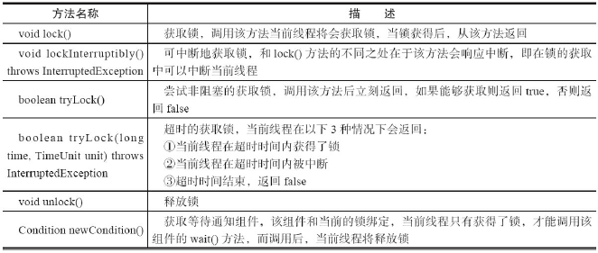
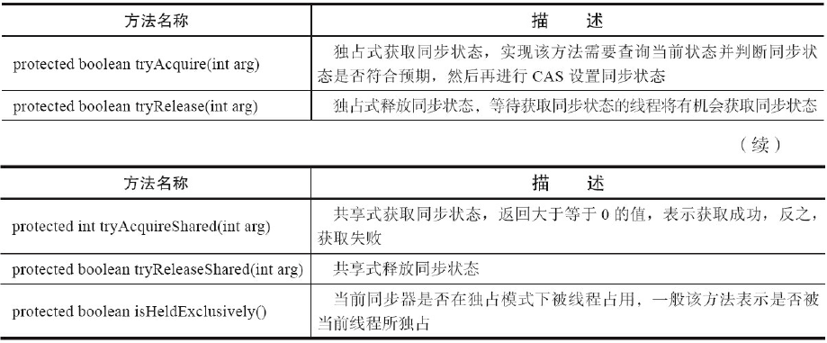
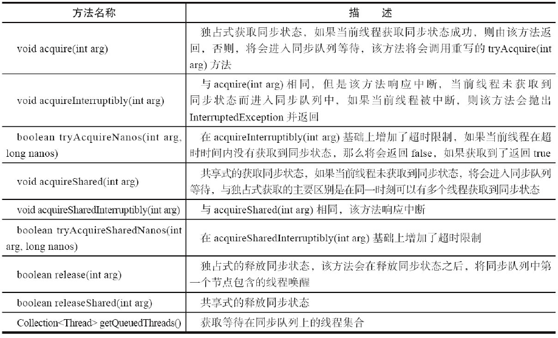
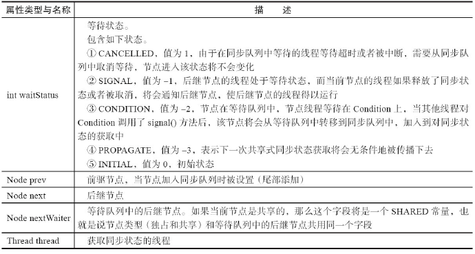

##### Lock接口

​	Java SE 5之后，并发包中新增了Lock接口（以及相关实现类）用来实现锁功能，它提供了与synchronized关键字类似的同步功能，只是在使用时需要显式地获取和释放锁。虽然它缺少了（通过synchronized块或者方法所提供的）隐式获取释放锁的便捷性，但是却拥有了锁获取与释放的可操作性、可中断的获取锁以及超时获取锁等多种synchronized关键字所不具备的同步特性。

Lock使用方式：

```java
Lock lock = new ReentrantLock();
lock.lock();
try {
    } finally {
        lock.unlock();
    }
```

Lock的API



##### 队列同步器

​	队列同步器AbstractQueuedSynchronizer（以下简称同步器），是用来构建锁或者其他同步组
件的基础框架，它使用了一个int成员变量表示同步状态，通过内置的FIFO队列来完成资源获
取线程的排队工作，并发包的作者（Doug Lea）期望它能够成为实现大部分同步需求的基础。

​	同步器的主要使用方式是继承，子类通过继承同步器并实现它的抽象方法来管理同步状
态，在抽象方法的实现过程中免不了要对同步状态进行更改，这时就需要使用同步器提供的3
个方法（getState()、setState(int newState)和compareAndSetState(int expect,int update)）来进行操
作，因为它们能够保证状态的改变是安全的。子类推荐被定义为自定义同步组件的静态内部
类，同步器自身没有实现任何同步接口，它仅仅是定义了若干同步状态获取和释放的方法来
供自定义同步组件使用，同步器既可以支持独占式地获取同步状态，也可以支持共享式地获
取同步状态，这样就可以方便实现不同类型的同步组件（ReentrantLock、
ReentrantReadWriteLock和CountDownLatch等）。

**队列同步器的接口与示例**

同步器的设计是基于模板方法模式的，重写同步器指定的方法时，需要使用同步器提供的如下3个方法来访问或修改同步状态。
·getState()：获取当前同步状态。
·setState(int newState)：设置当前同步状态。
·compareAndSetState(int expect,int update)：使用CAS设置当前状态，该方法能够保证状态
设置的原子性。

同步器可重写的方法：



同步器提供的模板方法：



​	同步器提供的模板方法基本上分为3类：

- 独占式获取与释放同步状态。
- 共享式获取与释放。
- 同步状态和查询同步队列中的等待线程情况。

自定义同步组件将使用同步器提供的模板方法来实现自己的同步语义。

下面通过一个独占锁的示例来深入了解一下同步器的工作原理。

```java
class Mutex implements Lock {
    // 静态内部类，自定义同步器
    private static class Sync extends AbstractQueuedSynchronizer {
        // 是否处于占用状态
        protected boolean isHeldExclusively() {
            return getState() == 1;
        }
        // 当状态为0的时候获取锁
        public boolean tryAcquire(int acquires) {
            if (compareAndSetState(0, 1)) {
                setExclusiveOwnerThread(Thread.currentThread());
                return true;
            }
            return false;
        }
        // 释放锁，将状态设置为0
        protected boolean tryRelease(int releases) {
            if (getState() == 0) throw new
                    IllegalMonitorStateException();
            setExclusiveOwnerThread(null);
            setState(0);
            return true;
        }
        // 返回一个Condition，每个condition都包含了一个condition队列
        Condition newCondition() { return new ConditionObject(); }
    }
    // 仅需要将操作代理到Sync上即可
    private final Sync sync = new Sync();
    public void lock() { sync.acquire(1); }
    public boolean tryLock() { return sync.tryAcquire(1); }
    public void unlock() { sync.release(1); }
    public Condition newCondition() { return sync.newCondition(); }
    public boolean isLocked() { return sync.isHeldExclusively(); }
    public boolean hasQueuedThreads() { return sync.hasQueuedThreads(); }
    public void lockInterruptibly() throws InterruptedException {
        sync.acquireInterruptibly(1);
    }
    public boolean tryLock(long timeout, TimeUnit unit) throws InterruptedException {
        return sync.tryAcquireNanos(1, unit.toNanos(timeout));
    }
}
```

​	上述示例中，独占锁Mutex是一个自定义同步组件，它在同一时刻只允许一个线程占有
锁。Mutex中定义了一个静态内部类，该内部类继承了同步器并实现了独占式获取和释放同步
状态。在tryAcquire(int acquires)方法中，如果经过CAS设置成功（同步状态设置为1），则代表获
取了同步状态，而在tryRelease(int releases)方法中只是将同步状态重置为0。用户使用Mutex时
并不会直接和内部同步器的实现打交道，而是调用Mutex提供的方法，在Mutex的实现中，以获
取锁的lock()方法为例，只需要在方法实现中调用同步器的模板方法acquire(int args)即可，当
前线程调用该方法获取同步状态失败后会被加入到同步队列中等待，这样就大大降低了实现
一个可靠自定义同步组件的门槛。

##### 队列同步器的实现分析

##### 1.同步队列

​	同步器依赖内部的同步队列（一个FIFO双向队列）来完成同步状态的管理，当前线程获取
同步状态失败时，同步器会将当前线程以及等待状态等信息构造成为一个节点（Node）并将其
加入同步队列，同时会阻塞当前线程，当同步状态释放时，会把首节点中的线程唤醒，使其再
次尝试获取同步状态。
​	同步队列中的节点（Node）用来保存获取同步状态失败的线程引用、等待状态以及前驱和
后继节点，节点的属性类型与名称



##### 2.独占式同步状态获取与释放

同步器的acquire方法

```java
public final void acquire(int arg) {
    if (!tryAcquire(arg) &&
            acquireQueued(addWaiter(Node.EXCLUSIVE), arg))
        selfInterrupt();
}
```

​	其主要逻辑是：首先调用自定义同步器实现的tryAcquire(int arg)方法，该方法
保证线程安全的获取同步状态，如果同步状态获取失败，则构造同步节点（独占式
Node.EXCLUSIVE，同一时刻只能有一个线程成功获取同步状态）并通过addWaiter(Node node)
方法将该节点加入到同步队列的尾部，最后调用acquireQueued(Node node,int arg)方法，使得该
节点以“死循环”的方式获取同步状态。如果获取不到则阻塞节点中的线程，而被阻塞线程的
唤醒主要依靠前驱节点的出队或阻塞线程被中断来实现。

```java
  private Node addWaiter(Node mode) {
        Node node = new Node(Thread.currentThread(), mode);
// 快速尝试在尾部添加
        Node pred = tail;
        if (pred != null) {
            node.prev = pred;
            if (compareAndSetTail(pred, node)) {
                pred.next = node;
                return node;
            }
        }
        enq(node);
        return node;
    } private Node enq(final Node node) {
    for (;;) {
        Node t = tail;
        if (t == null) { // Must initialize
            if (compareAndSetHead(new Node()))
                tail = head;
        } else {
            node.prev = t;
            if (compareAndSetTail(t, node)) {
                t.next = node;
                return t;
            }
        }
    }
}
```

可以看出，enq(final Node node)方法将并发添加节点的请求通过CAS变得“串行化”了。

```java
final boolean acquireQueued(final Node node, int arg) {
    boolean failed = true;
    try {
        boolean interrupted = false;
        for (;;) {
            final Node p = node.predecessor();
            if (p == head && tryAcquire(arg)) {
                setHead(node);
                p.next = null; // help GC
                failed = false;
                return interrupted;
            }
            if (shouldParkAfterFailedAcquire(p, node) &&
                    parkAndCheckInterrupt())
                interrupted = true;
        }
    } finally {
        if (failed)
            cancelAcquire(node);
    }
}
```

​	在acquireQueued(final Node node,int arg)方法中，当前线程在“死循环”中尝试获取同步状
态，而只有前驱节点是头节点才能够尝试获取同步状态，这是为什么？原因有两个，如下。
​	第一，头节点是成功获取到同步状态的节点，而头节点的线程释放了同步状态之后，将会
唤醒其后继节点，后继节点的线程被唤醒后需要检查自己的前驱节点是否是头节点。
​	第二，维护同步队列的FIFO原则.

​	当前线程获取同步状态并执行了相应逻辑之后，就需要释放同步状态，使得后续节点能
够继续获取同步状态。通过调用同步器的release(int arg)方法可以释放同步状态，该方法在释
放了同步状态之后，会唤醒其后继节点（进而使后继节点重新尝试获取同步状态）。

```java
public final boolean release(int arg) {
    if (tryRelease(arg)) {
        Node h = head;
        if (h != null && h.waitStatus != 0)
            unparkSuccessor(h);
        return true;
    }
    return false;
}
```

该方法执行时，会唤醒头节点的后继节点线程，unparkSuccessor(Node node)方法使用
LockSupport唤醒处于等待状态的线程。

​	分析了独占式同步状态获取和释放过程后，适当做个总结：在获取同步状态时，同步器维
护一个同步队列，获取状态失败的线程都会被加入到队列中并在队列中进行自旋；移出队列
（或停止自旋）的条件是前驱节点为头节点且成功获取了同步状态。在释放同步状态时，同步
器调用tryRelease(int arg)方法释放同步状态，然后唤醒头节点的后继节点。

##### 共享式同步状态获取与释放

通过调用同步器的acquireShared(int arg)方法可以共享式地获取同步状态

```java
  public final void acquireShared(int arg) {
        if (tryAcquireShared(arg) < 0)
            doAcquireShared(arg);
    } private void doAcquireShared(int arg) {
    final Node node = addWaiter(Node.SHARED);
    boolean failed = true;
    try {
        boolean interrupted = false;
        for (;;) {
            final Node p = node.predecessor();
            if (p == head) {
                int r = tryAcquireShared(arg);
                if (r >= 0) {
                    setHeadAndPropagate(node, r);
                    p.next = null;
                    if (interrupted)
                        selfInterrupt();
                    failed = false;
                    return;
                }
            }
            if (shouldParkAfterFailedAcquire(p, node) &&
                    parkAndCheckInterrupt())
                interrupted = true;
        }
    } finally {
        if (failed)
            cancelAcquire(node);
    }
}
```

​	在acquireShared(int arg)方法中，同步器调用tryAcquireShared(int arg)方法尝试获取同步状
态，tryAcquireShared(int arg)方法返回值为int类型，当返回值大于等于0时，表示能够获取到同
步状态。因此，在共享式获取的自旋过程中，成功获取到同步状态并退出自旋的条件就是
tryAcquireShared(int arg)方法返回值大于等于0。可以看到，在doAcquireShared(int arg)方法的自
旋过程中，如果当前节点的前驱为头节点时，尝试获取同步状态，如果返回值大于等于0，表示
该次获取同步状态成功并从自旋过程中退出。
与独占式一样，共享式获取也需要释放同步状态，通过调用releaseShared(int arg)方法可以
释放同步状态

```java
public final boolean releaseShared(int arg) {
    if (tryReleaseShared(arg)) {
        doReleaseShared();
        return true;
    }
    return false;
}
```

##### 独占式超时获取同步状态

通过调用同步器的doAcquireNanos(int arg,long nanosTimeout)方法可以超时获取同步状
态，即在指定的时间段内获取同步状态，如果获取到同步状态则返回true，否则，返回false。

```java
 private boolean doAcquireNanos(int arg, long nanosTimeout)
            throws InterruptedException {
        long lastTime = System.nanoTime();
        final Node node = addWaiter(Node.EXCLUSIVE);
        boolean failed = true;
        try {
            for (;;) {
                final Node p = node.predecessor();
                if (p == head && tryAcquire(arg)) {
                    setHead(node);
                    p.next = null; // help GC
                    failed = false;
                    return true;
                }
                if (nanosTimeout <= 0)
                    return false;
                if (shouldParkAfterFailedAcquire(p, node)
                        && nanosTimeout > spinForTimeoutThreshold)
                    LockSupport.parkNanos(this, nanosTimeout);
                long now = System.nanoTime();
//计算时间，当前时间now减去睡眠之前的时间lastTime得到已经睡眠
//的时间delta，然后被原有超时时间nanosTimeout减去，得到了
//还应该睡眠的时间
                nanosTimeout -= now - lastTime;
                lastTime = now;
                if (Thread.interrupted())
                    throw new InterruptedException();
            }
        } finally {
            if (failed)
                cancelAcquire(node);
        }
    }
```

​	该方法在自旋过程中，当节点的前驱节点为头节点时尝试获取同步状态，如果获取成功
则从该方法返回，这个过程和独占式同步获取的过程类似，但是在同步状态获取失败的处理
上有所不同。如果当前线程获取同步状态失败，则判断是否超时（nanosTimeout小于等于0表示
已经超时），如果没有超时，重新计算超时间隔nanosTimeout，然后使当前线程等待
nanosTimeout纳秒（当已到设置的超时时间，该线程会从LockSupport.parkNanos(Object
blocker,long nanos)方法返回）。
如果nanosTimeout小于等于spinForTimeoutThreshold（1000纳秒）时，将不会使该线程进行
超时等待，而是进入快速的自旋过程。原因在于，非常短的超时等待无法做到十分精确，如果
这时再进行超时等待，相反会让nanosTimeout的超时从整体上表现得反而不精确。因此，在超
时非常短的场景下，同步器会进入无条件的快速自旋。

##### 自定义同步组件——TwinsLock

通过编写一个自定义同步组件来加深对同步器的理解。

```java
public class TwinsLock implements Lock {
    private final Sync sync = new Sync(2);
    private static final class Sync extends AbstractQueuedSynchronizer {
        Sync(int count) {
            if (count <= 0) {
                throw new IllegalArgumentException("count must large
                        than zero.");
            }
            setState(count);
        }
        public int tryAcquireShared(int reduceCount) {
            for (;;) {
                int current = getState();
                int newCount = current - reduceCount;
                if (newCount < 0 || compareAndSetState(current,
                        newCount)) {
                    return newCount;
                }
            }
        }
        public boolean tryReleaseShared(int returnCount) {
            for (;;) {
                int current = getState();
                int newCount = current + returnCount;
                if (compareAndSetState(current, newCount)) {
                    return true;
                }
            }
        }
    }
    public void lock() {
        sync.acquireShared(1);
    }
    public void unlock() {
        sync.releaseShared(1);
    }
// 其他接口方法略
}
```

​	在上述示例中，TwinsLock实现了Lock接口，提供了面向使用者的接口，使用者调用lock()
方法获取锁，随后调用unlock()方法释放锁，而同一时刻只能有两个线程同时获取到锁。
TwinsLock同时包含了一个自定义同步器Sync，而该同步器面向线程访问和同步状态控制。以
共享式获取同步状态为例：同步器会先计算出获取后的同步状态，然后通过CAS确保状态的正
确设置，当tryAcquireShared(int reduceCount)方法返回值大于等于0时，当前线程才获取同步状
态，对于上层的TwinsLock而言，则表示当前线程获得了锁。
同步器作为一个桥梁，连接线程访问以及同步状态控制等底层技术与不同并发组件（比如
Lock、CountDownLatch等）的接口语义。

​	下面编写一个测试来验证TwinsLock是否能按照预期工作。在测试用例中，定义了工作者
线程Worker，该线程在执行过程中获取锁，当获取锁之后使当前线程睡眠1秒（并不释放锁），
随后打印当前线程名称，最后再次睡眠1秒并释放锁，

```java
public class TwinsLockTest {
    @Test
    public void test() {
        final Lock lock = new TwinsLock();
        class Worker extends Thread {
            public void run() {
                while (true) {
                    lock.lock();
                    try {
                        SleepUtils.second(1);
                        System.out.println(Thread.currentThread().getName());
                        SleepUtils.second(1);
                    } finally {
                        lock.unlock();
                    }
                }
            }
        }
// 启动10个线程
        for (int i = 0; i < 10; i++) {
            Worker w = new Worker();
            w.setDaemon(true);
            w.start();
        }
// 每隔1秒换行
        for (int i = 0; i < 10; i++) {
            SleepUtils.second(1);
            System.out.println();
        }
    }
}
```

​	运行该测试用例，可以看到线程名称成对输出，也就是在同一时刻只有两个线程能够获
取到锁，这表明TwinsLock可以按照预期正确工作。