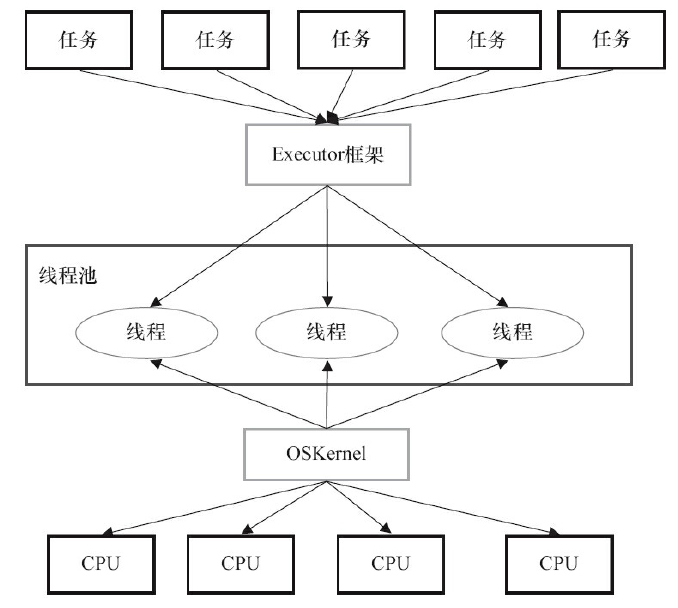
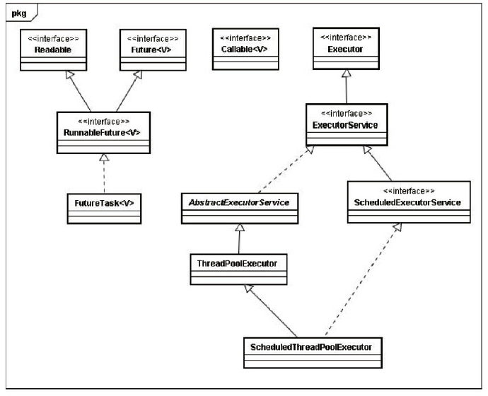
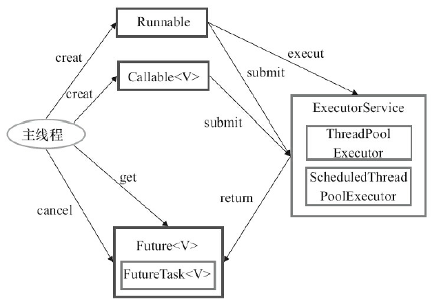
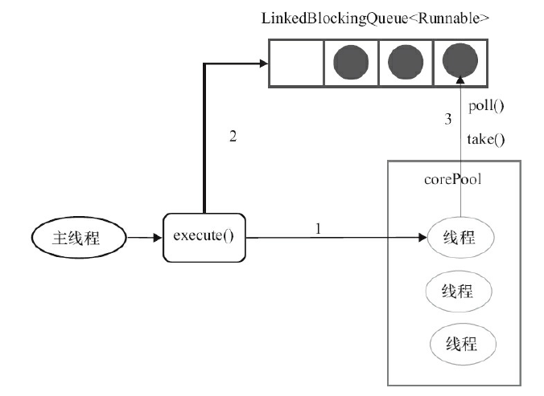
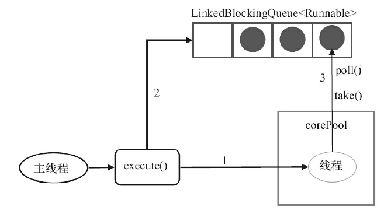
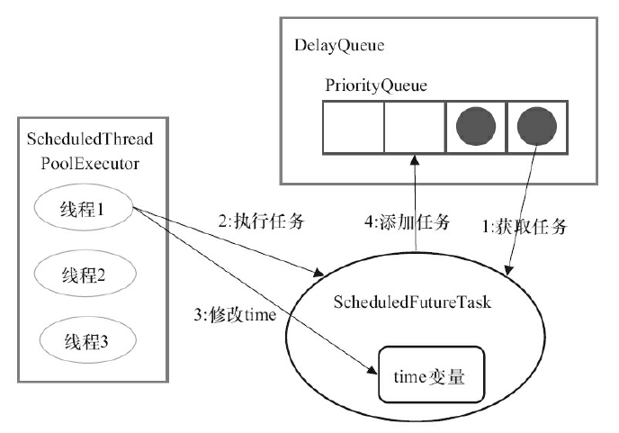
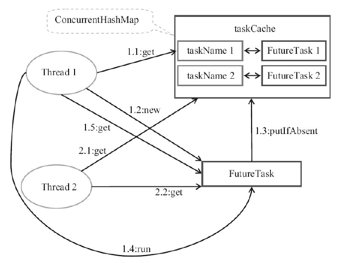
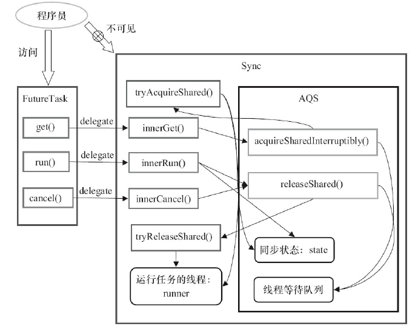

	在Java中，使用线程来异步执行任务。Java线程的创建与销毁需要一定的开销，如果我们
​	为每一个任务创建一个新线程来执行，这些线程的创建与销毁将消耗大量的计算资源。同时，
为每一个任务创建一个新线程来执行，这种策略可能会使处于高负荷状态的应用最终崩溃。
Java的线程既是工作单元，也是执行机制。从JDK 5开始，把工作单元与执行机制分离开
来。工作单元包括Runnable和Callable，而执行机制由Executor框架提供。

Executor框架的两级调度模型

​	在HotSpot VM的线程模型中，Java线程（java.lang.Thread）被一对一映射为本地操作系统线
程。Java线程启动时会创建一个本地操作系统线程；当该Java线程终止时，这个操作系统线程
也会被回收。操作系统会调度所有线程并将它们分配给可用的CPU。
在上层，Java多线程程序通常把应用分解为若干个任务，然后使用用户级的调度器
（Executor框架）将这些任务映射为固定数量的线程；在底层，操作系统内核将这些线程映射到
硬件处理器上。这种两级调度模型的示意图如图



从图中可以看出，应用程序通过Executor框架控制上层的调度；而下层的调度由操作系统
内核控制，下层的调度不受应用程序的控制。

Executor框架主要由3大部分组成如下。
- 任务。包括被执行任务需要实现的接口：Runnable接口或Callable接口。
- 任务的执行。包括任务执行机制的核心接口Executor，以及继承自Executor的ExecutorService接口。Executor框架有两个关键类实现了ExecutorService接口（ThreadPoolExecutor和ScheduledThreadPoolExecutor）。
- 异步计算的结果。包括接口Future和实现Future接口的FutureTask类。

Executor框架包含的主要的类与接口如图



下面是这些类和接口的简介。
·**Executor**是一个接口，它是Executor框架的基础，它将任务的提交与任务的执行分离开
来。
·**ThreadPoolExecutor**是线程池的核心实现类，用来执行被提交的任务。
·**ScheduledThreadPoolExecutor**是一个实现类，可以在给定的延迟后运行命令，或者定期执
行命令。ScheduledThreadPoolExecutor比Timer更灵活，功能更强大。
·**Future**接口和实现Future接口的**FutureTask**类，代表异步计算的结果。
·**Runnable**接口和**Callable**接口的实现类，都可以被ThreadPoolExecutor或Scheduled-
ThreadPoolExecutor执行。

Executor框架的使用示意图如图：



​	主线程首先要创建实现Runnable或者Callable接口的任务对象。工具类Executors可以把一
个Runnable对象封装为一个Callable对象（Executors.callable（Runnable task）或
Executors.callable（Runnable task，Object resule））。

​	然后可以把Runnable对象直接交给ExecutorService执行（ExecutorService.execute（Runnable
command））；或者也可以把Runnable对象或Callable对象提交给ExecutorService执行（Executor-
Service.submit（Runnable task）或ExecutorService.submit（Callable<T>task））。

​	如果执行ExecutorService.submit（…），ExecutorService将返回一个实现Future接口的对象
（到目前为止的JDK中，返回的是FutureTask对象）。由于FutureTask实现了Runnable，程序员也可
以创建FutureTask，然后直接交给ExecutorService执行。

​	最后，主线程可以执行FutureTask.get()方法来等待任务执行完成。主线程也可以执行
FutureTask.cancel（boolean mayInterruptIfRunning）来取消此任务的执行。

##### Executor框架的成员

​	本节将介绍Executor框架的主要成员：ThreadPoolExecutor、ScheduledThreadPoolExecutor、
Future接口、Runnable接口、Callable接口和Executors。
**（1）ThreadPoolExecutor**
ThreadPoolExecutor通常使用工厂类Executors来创建。Executors可以创建3种类型：

**FixedThreadPool**：使用固定线程数。

**SingleThreadExecutor**：使用单个线程。

**CachedThreadPool**:大小无界的线程池，适用于执行很多的短期异步任务的小程序，或者
是负载较轻的服务器。

（2）**ScheduledThreadPoolExecutor**

ScheduledThreadPoolExecutor通常使用工厂类Executors来创建。Executors可以创建2种类
型的ScheduledThreadPoolExecutor，如下。

ScheduledThreadPoolExecutor:包含若干个线程。

SingleThreadScheduledExecutor:只包含一个线程。

**（3）Future接口**

​	Future接口和实现Future接口的FutureTask类用来表示异步计算的结果。当我们把Runnable
接口或Callable接口的实现类提交（submit）给ThreadPoolExecutor或
ScheduledThreadPoolExecutor时，ThreadPoolExecutor或ScheduledThreadPoolExecutor会向我们
返回一个FutureTask对象。

**（4）Runnable接口和Callable接口**

​	Runnable接口和Callable接口的实现类，都可以被ThreadPoolExecutor或Scheduled-
ThreadPoolExecutor执行。它们之间的区别是Runnable不会返回结果，而Callable可以返回结
果。
​	除了可以自己创建实现Callable接口的对象外，还可以使用工厂类Executors来把一个
Runnable包装成一个Callable。

```java
public static Callable<Object> callable(Runnable task)
```

##### ThreadPoolExecutor详解

​	Executor框架最核心的类是ThreadPoolExecutor，它是线程池的实现类，主要由下列4个组
件构成。
·**corePool**：核心线程池的大小。
·**maximumPool**：最大线程池的大小。
·**BlockingQueue**：用来暂时保存任务的工作队列。
·**RejectedExecutionHandler**：当ThreadPoolExecutor已经关闭或ThreadPoolExecutor已经饱和
时（达到了最大线程池大小且工作队列已满），execute()方法将要调用的Handler。
​	通过Executor框架的工具类Executors，可以创建3种类型的ThreadPoolExecutor。
·**FixedThreadPool**。
·**SingleThreadExecutor**。
·**CachedThreadPool**。
下面将分别介绍这3种ThreadPoolExecutor。

**SingleThreadExecutor详解**

##### FixedThreadPool详解

**FixedThreadPool**被称为可重用固定线程数的线程池。下面是FixedThreadPool的源代码实
现。

```java
public static ExecutorService newFixedThreadPool(int nThreads) {
	return new ThreadPoolExecutor(nThreads, nThreads,
                                  0L, TimeUnit.MILLISECONDS,
								  new LinkedBlockingQueue<Runnable>());
}
```

FixedThreadPool的corePoolSize和maximumPoolSize都被设置为创建FixedThreadPool时指
定的参数nThreads。
当线程池中的线程数大于corePoolSize时，keepAliveTime为多余的空闲线程等待新任务的
最长时间，超过这个时间后多余的线程将被终止。这里把keepAliveTime设置为0L，意味着多余
的空闲线程会被立即终止。
FixedThreadPool的execute()方法的运行示意图如图所示。



1）如果当前运行的线程数少于corePoolSize，则创建新线程来执行任务。
2）在线程池完成预热之后（当前运行的线程数等于corePoolSize），将任务加入
LinkedBlockingQueue。
3）线程执行完1中的任务后，会在循环中反复从LinkedBlockingQueue获取任务来执行。
FixedThreadPool使用无界队列LinkedBlockingQueue作为线程池的工作队列（队列的容量为
Integer.MAX_VALUE）。

使用无界队列作为工作队列会对线程池带来如下影响。
1）当线程池中的线程数达到corePoolSize后，新任务将在无界队列中等待，因此线程池中
的线程数不会超过corePoolSize。
2）由于1，使用无界队列时maximumPoolSize将是一个无效参数。
3）由于1和2，使用无界队列时keepAliveTime将是一个无效参数。
4）由于使用无界队列，运行中的FixedThreadPool（未执行方法shutdown()或
shutdownNow()）不会拒绝任务（不会调用RejectedExecutionHandler.rejectedExecution方法）。

**SingleThreadExecutor详解**

​	SingleThreadExecutor是使用单个worker线程的Executor。下面是SingleThreadExecutor的源
代码实现。

SingleThreadExecutor的corePoolSize和maximumPoolSize被设置为1。其他参数与
FixedThreadPool相同。SingleThreadExecutor使用无界队列LinkedBlockingQueue作为线程池的工
作队列（队列的容量为Integer.MAX_VALUE）。SingleThreadExecutor使用无界队列作为工作队列
对线程池带来的影响与FixedThreadPool相同，这里就不赘述了。
SingleThreadExecutor的运行示意图如图所示。



1）如果当前运行的线程数少于corePoolSize（即线程池中无运行的线程），则创建一个新线
程来执行任务。
2）在线程池完成预热之后（当前线程池中有一个运行的线程），将任务加入Linked-
BlockingQueue。
3）线程执行完1中的任务后，会在一个无限循环中反复从LinkedBlockingQueue获取任务来
执行。

##### CachedThreadPool详解

​	CachedThreadPool是一个会根据需要创建新线程的线程池。下面是创建CachedThread-
Pool的源代码。

```java
public static ExecutorService newCachedThreadPool() {
    return new ThreadPoolExecutor(0, Integer.MAX_VALUE,
    60L, TimeUnit.SECONDS,
    new SynchronousQueue<Runnable>());
}
```

​	CachedThreadPool的corePoolSize被设置为0，即corePool为空；maximumPoolSize被设置为Integer.MAX_VALUE，即maximumPool是无界的。这里把keepAliveTime设置为60L，意味着
CachedThreadPool中的空闲线程等待新任务的最长时间为60秒，空闲线程超过60秒后将会被
终止。
​	FixedThreadPool和SingleThreadExecutor使用无界队列LinkedBlockingQueue作为线程池的
工作队列。CachedThreadPool使用没有容量的SynchronousQueue作为线程池的工作队列，但
CachedThreadPool的maximumPool是无界的。这意味着，如果主线程提交任务的速度高于
maximumPool中线程处理任务的速度时，CachedThreadPool会不断创建新线程。极端情况下，
CachedThreadPool会因为创建过多线程而耗尽CPU和内存资源。

CachedThreadPool的execute()方法的执行示意图如图


1）首先执行SynchronousQueue.offer（Runnable task）。如果当前maximumPool中有空闲线程
正在执行SynchronousQueue.poll（keepAliveTime，TimeUnit.NANOSECONDS），那么主线程执行
offer操作与空闲线程执行的poll操作配对成功，主线程把任务交给空闲线程执行，execute()方
法执行完成；否则执行下面的步骤2）。

2）当初始maximumPool为空，或者maximumPool中当前没有空闲线程时，将没有线程执行
SynchronousQueue.poll（keepAliveTime，TimeUnit.NANOSECONDS）。这种情况下，步骤1）将失
败。此时CachedThreadPool会创建一个新线程执行任务，execute()方法执行完成。

3）在步骤2）中新创建的线程将任务执行完后，会执行
SynchronousQueue.poll（keepAliveTime，TimeUnit.NANOSECONDS）。这个poll操作会让空闲线
程最多在SynchronousQueue中等待60秒钟。如果60秒钟内主线程提交了一个新任务（主线程执
行步骤1）），那么这个空闲线程将执行主线程提交的新任务；否则，这个空闲线程将终止。由于
空闲60秒的空闲线程会被终止，因此长时间保持空闲的CachedThreadPool不会使用任何资源。
前面提到过，**SynchronousQueue是一个没有容量的阻塞队列。每个插入操作必须等待另一**
**个线程的对应移除操作，反之亦然**。CachedThreadPool使用SynchronousQueue，把主线程提交的
任务传递给空闲线程执行。

##### ScheduledThreadPoolExecutor详解

​	ScheduledThreadPoolExecutor继承自ThreadPoolExecutor。它主要用来在给定的延迟之后运
行任务，或者定期执行任务。ScheduledThreadPoolExecutor的功能与Timer类似，但
ScheduledThreadPoolExecutor功能更强大、更灵活。Timer对应的是单个后台线程，而
ScheduledThreadPoolExecutor可以在构造函数中指定多个对应的后台线程数。

​	ScheduledThreadPoolExecutor会把待调度的任务（ScheduledFutureTask）放到一个DelayQueue中。
ScheduledFutureTask主要包含3个成员变量，如下。

- long型成员变量time，表示这个任务将要被执行的具体时间。
- long型成员变量sequenceNumber，表示这个任务被添加到ScheduledThreadPoolExecutor中
  的序号。
- long型成员变量period，表示任务执行的间隔周期。

​	DelayQueue封装了一个PriorityQueue，这个PriorityQueue会对队列中的Scheduled-
FutureTask进行排序。排序时，time小的排在前面（时间早的任务将被先执行）。如果两个
ScheduledFutureTask的time相同，就比较sequenceNumber，sequenceNumber小的排在前面（也就
是说，如果两个任务的执行时间相同，那么先提交的任务将被先执行）。



下面是对这4个步骤的说明。
1）线程1从DelayQueue中获取已到期的ScheduledFutureTask（DelayQueue.take()）。到期任务
是指ScheduledFutureTask的time大于等于当前时间。
2）线程1执行这个ScheduledFutureTask。
3）线程1修改ScheduledFutureTask的time变量为下次将要被执行的时间。
4）线程1把这个修改time之后的ScheduledFutureTask放回DelayQueue中（Delay-
Queue.add()）。

##### FutureTask详解

FutureTask的使用

可以把FutureTask交给Executor执行；也可以通过ExecutorService.submit（…）方法返回一个
FutureTask，然后执行FutureTask.get()方法或FutureTask.cancel（…）方法。除此以外，还可以单独
使用FutureTask。
当一个线程需要等待另一个线程把某个任务执行完后它才能继续执行，此时可以使用
FutureTask。假设有多个线程执行若干任务，每个任务最多只能被执行一次。当多个线程试图
同时执行同一个任务时，只允许一个线程执行任务，其他线程需要等待这个任务执行完后才
能继续执行。下面是对应的示例代码。

```java
private final ConcurrentMap<Object, Future<String>> taskCache =
        new ConcurrentHashMap<Object, Future<String>>();
private String executionTask(final String taskName)
        throws ExecutionException, InterruptedException {
    while (true) {
        Future<String> future = taskCache.get(taskName);　　 // 1.1,2.1
        if (future == null) {
            Callable<String> task = new Callable<String>() {
                public String call() throws InterruptedException {
                    return taskName;
                }
            };
            FutureTask<String> futureTask = new FutureTask<String>(task);
            future = taskCache.putIfAbsent(taskName, futureTask);　 // 1.3
            if (future == null) {
                future = futureTask;
                futureTask.run();　　　　　　　　 // 1.4执行任务
            }
        }
        try {
            return future.get();　　　　　　 // 1.5,2.2
        }
            catch (CancellationException e) {
            taskCache.remove(taskName, future);
        }
    }
}
```

上述代码的执行示意图如图



当两个线程试图同时执行同一个任务时，如果Thread 1执行1.3后Thread 2执行2.1，那么接
下来Thread 2将在2.2等待，直到Thread 1执行完1.4后Thread 2才能从2.2（FutureTask.get()）返回。

##### FutureTask的实现

​	FutureTask的实现基于AbstractQueuedSynchronizer（以下简称为AQS）。java.util.concurrent中
的很多可阻塞类（比如ReentrantLock）都是基于AQS来实现的。AQS是一个同步框架，它提供通
用机制来原子性管理同步状态、阻塞和唤醒线程，以及维护被阻塞线程的队列。JDK 6中AQS
被广泛使用，基于AQS实现的同步器包括：ReentrantLock、Semaphore、ReentrantReadWriteLock、
CountDownLatch和FutureTask。

​	每一个基于AQS实现的同步器都会包含两种类型的操作，如下。

- 至少一个acquire操作。这个操作阻塞调用线程，除非/直到AQS的状态允许这个线程继续
  执行。FutureTask的acquire操作为get()/get（long timeout，TimeUnit unit）方法调用。
- 至少一个release操作。这个操作改变AQS的状态，改变后的状态可允许一个或多个阻塞
  线程被解除阻塞。FutureTask的release操作包括run()方法和cancel（…）方法。

​	基于“复合优先于继承”的原则，FutureTask声明了一个内部私有的继承于AQS的子类
Sync，对FutureTask所有公有方法的调用都会委托给这个内部子类。

​	AQS被作为“模板方法模式”的基础类提供给FutureTask的内部子类Sync，这个内部子类只
需要实现状态检查和状态更新的方法即可，这些方法将控制FutureTask的获取和释放操作。具
体来说，Sync实现了AQS的tryAcquireShared（int）方法和tryReleaseShared（int）方法，Sync通过这
两个方法来检查和更新同步状态。

FutureTask的设计示意图：



如图所示，Sync是FutureTask的内部私有类，它继承自AQS。创建FutureTask时会创建内部
私有的成员对象Sync，FutureTask所有的的公有方法都直接委托给了内部私有的Sync。
FutureTask.get()方法会调用AQS.acquireSharedInterruptibly（int arg）方法，这个方法的执行
过程如下。

1）调用AQS.acquireSharedInterruptibly（int arg）方法，这个方法首先会回调在子类Sync中实
现的tryAcquireShared()方法来判断acquire操作是否可以成功。acquire操作可以成功的条件为：
state为执行完成状态RAN或已取消状态CANCELLED，且runner不为null。

2）如果成功则get()方法立即返回。如果失败则到线程等待队列中去等待其他线程执行
release操作。

3）当其他线程执行release操作（比如FutureTask.run()或FutureTask.cancel（…））唤醒当前线
程后，当前线程再次执行tryAcquireShared()将返回正值1，当前线程将离开线程等待队列并唤
醒它的后继线程（这里会产生级联唤醒的效果，后面会介绍）。

4）最后返回计算的结果或抛出异常。

FutureTask.run()的执行过程如下。

1）执行在构造函数中指定的任务（Callable.call()）。

2）以原子方式来更新同步状态（调用AQS.compareAndSetState（int expect，int update），设置
state为执行完成状态RAN）。如果这个原子操作成功，就设置代表计算结果的变量result的值为
Callable.call()的返回值，然后调用AQS.releaseShared（int arg）。

3）AQS.releaseShared（int arg）首先会回调在子类Sync中实现的tryReleaseShared（arg）来执
行release操作（设置运行任务的线程runner为null，然会返回true）；AQS.releaseShared（int arg），
然后唤醒线程等待队列中的第一个线程。

4）调用FutureTask.done()。
当执行FutureTask.get()方法时，如果FutureTask不是处于执行完成状态RAN或已取消状态
CANCELLED，当前执行线程将到AQS的线程等待队列中等待。当
某个线程执行FutureTask.run()方法或FutureTask.cancel（...）方法时，会唤醒线程等待队列的第一
个线程