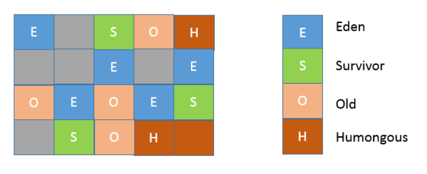

##### 第18讲  如何避免死锁？

1. 尽量避免使用多个锁，并且只有需要时才持有锁。
2. 尽量设计好锁的获取顺序。
3. 使用带超时的方法，为程序带来更多可控性。
   类似 Object.wait(…) 或者 CountDownLatch.await(…)。
4. 通过静态代码分析（如 FindBugs）。


##### 第20讲  并发包中的ConcurrentLinkedQueue和LinkedBlockingQueue有什么区别？

java.util.concurrent 包提供的容器（Queue、List、Set）、Map，从命名上可以大概区分为 Concurrent、CopyOnWrite和 Blocking* 等三类，


##### 21讲  Java 并发类库提供的线程池有哪几种？ 分别有什么特点？

Executors 目前提供了 5 种不同的线程池创建配置：

newCachedThreadPool()

newFixedThreadPool(int nThreads)，

newSingleThreadExecutor()，

newScheduledThreadPool(int corePoolSize)，

newWorkStealingPool(int parallelism)，


##### 第22讲 AtomicInteger底层实现原理是什么？如何在自己的产品代码中应用CAS操作？

基于 CAS（compare-and-swap）技术

```java
public final boolean compareAndSet(int expectedValue, int newValue)
```

原子修改类成员变量 AtomicIntegerFieldUpdater, AtomicLongFieldUpdater和AtomicReferenceFieldUpdater

Variable Handle API

ReentrantLock 源码实现

AQS源码

```java
public final void acquire(int arg) {
	if (!tryAcquire(arg) &&
		acquireQueued(addWaiter(Node.EXCLUSIVE), arg))
		selfInterrupt();
}
```

tryAcquire(int acquires)由ReentrantLock 自己实现。

当前线程会被包装成为一个排他模式的节点（EXCLUSIVE），通过 addWaiter 方法添加到队列
中。

##### 第23讲 请介绍类加载过程，什么是双亲委派模型？

加载

链接

1. 验证（Verification）
2. 准备（Preparation）
3. 解析（Resolution）

初始化

##### 第24讲 | 有哪些方法可以在运行时动态生成一个Java类？

Java Compiler API

利用 Java 字节码操纵工具和类库来实现，比如在专栏第 6 讲中提到的ASM、Javassist、cglib

类加载过程中，字节码转换成类

```java
protected final Class<?> defineClass(String name, byte[] b, int off, int len,
ProtectionDomain protectionDomain)
protected final Class<?> defineClass(String name, java.nio.ByteBuffer b,
ProtectionDomain protectionDomain)
```

Java 动态代理 

实现InvocationHandler,通过 Proxy 类，调用其 newProxyInstance 方法，生成一个实现了相应基础接口的代理类实例

##### 第25讲 | 谈谈JVM内存区域的划分，哪些区域可能发生OutOfMemoryError?

1 程序计数器（PC，Program Counter Register）。线程独有

2 Java 虚拟机栈（Java Virtual Machine Stack）线程独有

内部保存一个个的栈帧（Stack Frame），对应着一次次的 Java 方法调用。栈帧中存储着局部变量表、操作数（operand）栈、动态链接、方法正常退出或者异常退出的定义等。

3 堆（Heap） 线程共享

4 方法区（Method Area）线程共享

存储所谓的元（Meta）数据，例如类结构信息，以及对应的运行时常量池、字段、方法代码等。运行时常量池（Run-Time Constant Pool），Java 的常量池可以存放各种常量信息，不管是编译期生成的各种字面量，还是需要在运行时决定的符号引用。

5 本地方法栈（Native Method Stack）。线程独有

##### 第26讲 | 如何监控和诊断JVM堆内和堆外内存使用？

可以使用综合性的图形化工具，如 JConsole、VisualVM。

命令行工具进行运行时查询，如 jstat 和 jmap 等

**JVM 参数**

最大堆体积  -Xmx value

初始的最小堆体积  -Xms value

老年代和新生代的比例  -XX:NewRatio=value

默认情况下，这个数值是 3，意味着老年代是新生代的 3 倍大。

-XX:SurvivorRatio=value

Eden 和 Survivor 的大小是按照比例设置的，如果 SurvivorRatio 是 8，那么 Survivor 区域就是 Eden 的 1/8 大小，也就是新生代的 1/10，因为YoungGen=Eden + 2*Survivor

**JVM 堆外内存到底包括什么？**

依赖 NMT 特性对 JVM 进行分析

Java 类元数据 ：Class

Thread

CodeCache，JIT compiler 存储编译热点方法等信息的地方，

Compiler : JIT开销

##### 第27讲 | Java常见的垃圾收集器有哪些？

清除算法

复制算法 常用于新生代

标记整理 Mark-Compact 常用于老年代

标记清除 Mark-Sweep 常用于老年代

##### 可达性分析： GC Roots

方法区无用元数据的回收：

初始化类加载器加载的类型是不会进行类卸载（unload）的；而普通的类型的卸载，往往是要求相应自定义类加载器本身被回收。

##### 垃圾收集过程的理解

第一，Java 应用不断创建对象，通常都是分配在 Eden 区域，当其空间占用达到一定阈值时，触发 minor GC。仍然被引用的对象存活下来，被复制到 JVM 选择的 Survivor 区域，而没有被引用的对象则被回收。

第二，再次达到 Minor GC 触发条件，这时候，另外一个 Survivor 区域则会成为 to 区域，Eden 区域的存活对象和 From 区域对象，都会被复制到 to 区域，并且存活的年龄计数会被加 1。

第三， 类似第二步的过程会发生很多次，直到有对象年龄计数达到阈值，这时候就会发生所谓的（Promotion）过程，超过阈值的对象会被晋升到老年代。这个阈值是可以通过参数指定：

-XX:MaxTenuringThreshold=N

第四，老年代清理。标记整理 Mark-Compact，标记清除 Mark-Sweep ，老年代 GC 叫作 Major GC，将对整个堆进行的清理叫作 Full GC

##### 第28讲 | 谈谈你的GC调优思路?

从性能的角度看，通常关注三个方面，内存占用（footprint）、延时（latency）和吞吐量（throughput）

从内存区域的角度，G1 同样存在着年代的概念，但是与我前面介绍的内存结构很不一样，其内
部是类似棋盘状的一个个 region 组成。



G1 会将超过 region 50% 大小的对象（在应用中，通常是 byte 或 char 数组）归类为 Humongous 对象，并放置在相应的 region 中。

Remembered Set，它通常约占用 Heap 大小的 20% 或更高

打开 GC 日志：

-XX:+PrintGCDetails
-XX:+PrintGCDateStamps

更多参考G1调优参考：[G1 调优指南](https://docs.oracle.com/javase/9/gctuning/garbage-first-garbage-collector-tuning.htm#JSGCT-GUID-90E30ACA-8040-432E-B3A0-1E0440AB556A)

##### 第29讲 | Java内存模型中的happen-before是什么？

Happen-before 关系，是 Java 内存模型中保证多线程操作可见性的机制。