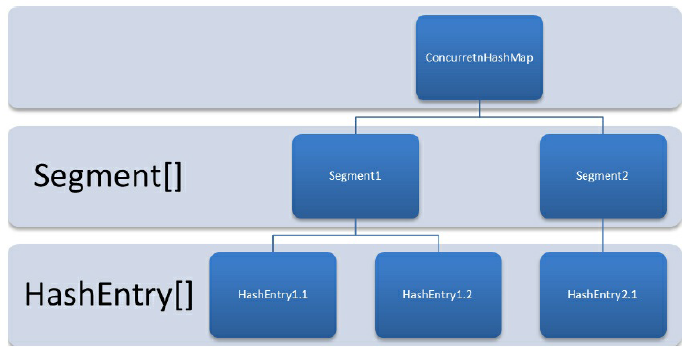
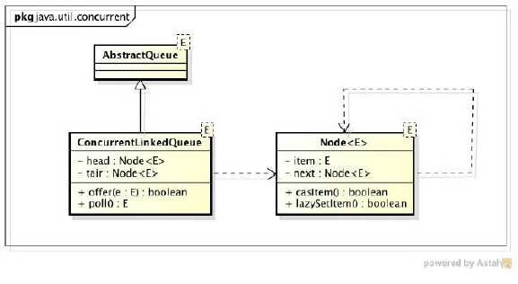
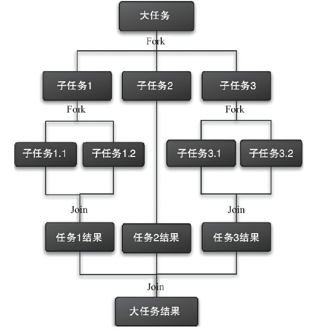

##### ConcurrentHashMap的实现原理与使用

**线程不安全的HashMap**

​	在多线程环境下，使用HashMap进行put操作会引起死循环，导致CPU利用率接近100%，所
以在并发情况下不能使用HashMap。例如，执行以下代码会引起死循环。

```java
 final HashMap<String, String> map = new HashMap<String, String>(2);
    Thread t = new Thread(new Runnable() {
        @Override
        public void run() {
            for (int i = 0; i < 10000; i++) {
                new Thread(new Runnable() {
                    @Override
                    public void run() {
                        map.put(UUID.randomUUID().toString(), "");
                    }
                }, "ftf" + i).start();
            }
        }
    }, "ftf");
t.start();
t.join();
```

**ConcurrentHashMap的结构**

​	ConcurrentHashMap是由Segment数组结构和HashEntry数组结构组成。Segment是一种可重
入锁（ReentrantLock），在ConcurrentHashMap里扮演锁的角色；HashEntry则用于存储键值对数
据。一个ConcurrentHashMap里包含一个Segment数组。Segment的结构和HashMap类似，是一种
数组和链表结构。一个Segment里包含一个HashEntry数组，每个HashEntry是一个链表结构的元
素，每个Segment守护着一个HashEntry数组里的元素，当对HashEntry数组的数据进行修改时，
必须首先获得与它对应的Segment锁



**ConcurrentHashMap的初始化**

​	ConcurrentHashMap初始化方法是通过initialCapacity、loadFactor和concurrencyLevel等几个
参数来初始化segment数组、段偏移量segmentShift、段掩码segmentMask和每个segment里的
HashEntry数组来实现的。

**ConcurrentHashMap的操作**

**get操作**

​	Segment的get操作实现非常简单和高效。先经过一次再散列，然后使用这个散列值通过散
列运算定位到Segment，再通过散列算法定位到元素，

```java
public V get(Object key) {
    int hash = hash(key.hashCode());
    return segmentFor(hash).get(key, hash);
}
```

**put操作**
	由于put方法里需要对共享变量进行写入操作，所以为了线程安全，在操作共享变量时必
须加锁。put方法首先定位到Segment，然后在Segment里进行插入操作。插入操作需要经历两个
步骤，第一步判断是否需要对Segment里的HashEntry数组进行扩容，第二步定位添加元素的位
置，然后将其放在HashEntry数组里。
（1）是否需要扩容
	在插入元素前会先判断Segment里的HashEntry数组是否超过容量（threshold），如果超过阈
值，则对数组进行扩容。值得一提的是，Segment的扩容判断比HashMap更恰当，因为HashMap
是在插入元素后判断元素是否已经到达容量的，如果到达了就进行扩容，但是很有可能扩容
之后没有新元素插入，这时HashMap就进行了一次无效的扩容。
（2）如何扩容
	在扩容的时候，首先会创建一个容量是原来容量两倍的数组，然后将原数组里的元素进
行再散列后插入到新的数组里。为了高效，ConcurrentHashMap不会对整个容器进行扩容，而只
对某个segment进行扩容。

**size操作**

​	如果要统计整个ConcurrentHashMap里元素的大小，就必须统计所有Segment里元素的大小
后求和。Segment里的全局变量count是一个volatile变量，那么在多线程场景下，是不是直接把
所有Segment的count相加就可以得到整个ConcurrentHashMap大小了呢？不是的，虽然相加时
可以获取每个Segment的count的最新值，但是可能累加前使用的count发生了变化，那么统计结
果就不准了。所以，最安全的做法是在统计size的时候把所有Segment的put、remove和clean方法
全部锁住，但是这种做法显然非常低效。
因为在累加count操作过程中，之前累加过的count发生变化的几率非常小，所以
ConcurrentHashMap的做法是先尝试2次通过不锁住Segment的方式来统计各个Segment大小，如
果统计的过程中，容器的count发生了变化，则再采用加锁的方式来统计所有Segment的大小。
那么ConcurrentHashMap是如何判断在统计的时候容器是否发生了变化呢？使用modCount
变量，在put、remove和clean方法里操作元素前都会将变量modCount进行加1，那么在统计size
前后比较modCount是否发生变化，从而得知容器的大小是否发生变化。

##### ConcurrentLinkedQueue

​	ConcurrentLinkedQueue是一个基于链接节点的无界线程安全队列，它采用先进先出的规
则对节点进行排序，当我们添加一个元素的时候，它会添加到队列的尾部；当我们获取一个元
素时，它会返回队列头部的元素。它采用了“wait-free”算法（即CAS算法）来实现，该算法在
Michael&Scott算法上进行了一些修改。

ConcurrentLinkedQueue的结构



​	ConcurrentLinkedQueue由head节点和tail节点组成，每个节点（Node）由节点元素（item）和
指向下一个节点（next）的引用组成，节点与节点之间就是通过这个next关联起来，从而组成一
张链表结构的队列。默认情况下head节点存储的元素为空，tail节点等于head节点。

```java
private transient volatile Node<E> tail = head;
```

##### Java中的阻塞队列

​	阻塞队列（BlockingQueue）是一个支持两个附加操作的队列。这两个附加的操作支持阻塞
的插入和移除方法。
1）支持阻塞的插入方法：意思是当队列满时，队列会阻塞插入元素的线程，直到队列不
满。
2）支持阻塞的移除方法：意思是在队列为空时，获取元素的线程会等待队列变为非空。
​	阻塞队列常用于生产者和消费者的场景，生产者是向队列里添加元素的线程，消费者是
从队列里取元素的线程。阻塞队列就是生产者用来存放元素、消费者用来获取元素的容器。

JDK 7提供了7个阻塞队列，如下。
·ArrayBlockingQueue：一个由数组结构组成的有界阻塞队列。
·LinkedBlockingQueue：一个由链表结构组成的有界阻塞队列。
·PriorityBlockingQueue：一个支持优先级排序的无界阻塞队列。
·DelayQueue：一个使用优先级队列实现的无界阻塞队列。
·SynchronousQueue：一个不存储元素的阻塞队列。
·LinkedTransferQueue：一个由链表结构组成的无界阻塞队列。
·LinkedBlockingDeque：一个由链表结构组成的双向阻塞队列。

##### 阻塞队列的实现原理

​	使用通知模式实现。所谓通知模式，就是当生产者往满的队列里添加元素时会阻塞住生
产者，当消费者消费了一个队列中的元素后，会通知生产者当前队列可用。通过查看JDK源码
发现ArrayBlockingQueue使用了Condition来实现，代码如下。

```java
  private final Condition notFull;
    private final Condition notEmpty;
    public ArrayBlockingQueue(int capacity, boolean fair) {
// 省略其他代码
        notEmpty = lock.newCondition();
        notFull = lock.newCondition();
    }
    public void put(E e) throws InterruptedException {
        checkNotNull(e);
        final ReentrantLock lock = this.lock;
        lock.lockInterruptibly();
        try {
            while (count == items.length)
                notFull.await();
            insert(e);
        } finally {
            lock.unlock();
        }
    } public E
    take() throws InterruptedException {
        final ReentrantLock lock = this.lock;
        lock.lockInterruptibly();
        try {
            while (count == 0)
                notEmpty.await();
            return extract();
        } finally {
            lock.unlock();
        }
    } private void insert(E
                                  x) {
        items[putIndex] = x;
        putIndex = inc(putIndex);
        ++count;
        notEmpty.
```

​	当往队列里插入一个元素时，如果队列不可用，那么阻塞生产者主要通过
LockSupport.park（this）来实现。

##### Fork/Join框架

​	Fork/Join框架是Java 7提供的一个用于并行执行任务的框架，是一个把大任务分割成若干
个小任务，最终汇总每个小任务结果后得到大任务结果的框架。



工作窃取算法

​	工作窃取（work-stealing）算法是指某个线程从其他队列里窃取任务来执行。那么，为什么
需要使用工作窃取算法呢？假如我们需要做一个比较大的任务，可以把这个任务分割为若干
互不依赖的子任务，为了减少线程间的竞争，把这些子任务分别放到不同的队列里，并为每个
队列创建一个单独的线程来执行队列里的任务，线程和队列一一对应。比如A线程负责处理A
队列里的任务。但是，有的线程会先把自己队列里的任务干完，而其他线程对应的队列里还有
任务等待处理。干完活的线程与其等着，不如去帮其他线程干活，于是它就去其他线程的队列
里窃取一个任务来执行。而在这时它们会访问同一个队列，所以为了减少窃取任务线程和被
窃取任务线程之间的竞争，通常会使用双端队列，被窃取任务线程永远从双端队列的头部拿
任务执行，而窃取任务的线程永远从双端队列的尾部拿任务执行。

Fork/Join框架的设计

步骤1　分割任务。

步骤2　执行任务并合并结果。

Fork/Join使用两个类来完成以上两件事情。
①ForkJoinTask：我们要使用ForkJoin框架，必须首先创建一个ForkJoin任务。它提供在任务
中执行fork()和join()操作的机制。通常情况下，我们不需要直接继承ForkJoinTask类，只需要继
承它的子类，Fork/Join框架提供了以下两个子类。
·RecursiveAction：用于没有返回结果的任务。
·RecursiveTask：用于有返回结果的任务。
②ForkJoinPool：ForkJoinTask需要通过ForkJoinPool来执行。