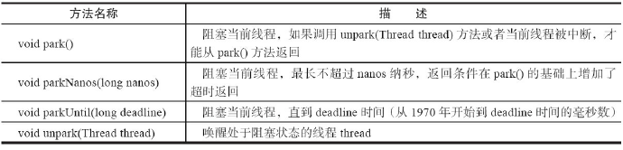
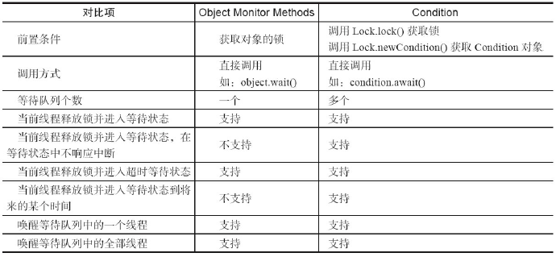

##### 重入锁

​	重入锁ReentrantLock，顾名思义，就是支持重进入的锁，它表示该锁能够支持一个线程对
资源的重复加锁。除此之外，该锁的还支持获取锁时的公平和非公平性选择。

​	ReentrantLock是通过组合自定义同步器来实现锁的获取与释放，以非公平性（默认的）实
现为例

```java
final boolean nonfairTryAcquire(int acquires) {
    final Thread current = Thread.currentThread();
    int c = getState();
    if (c == 0) {
        if (compareAndSetState(0, acquires)) {
            setExclusiveOwnerThread(current);
            return true;
        }
    } else if (current == getExclusiveOwnerThread()) {
        int nextc = c + acquires;
        if (nextc < 0)
            throw new Error("Maximum lock count exceeded");
        setState(nextc);
        return true;
    }
    return false;
}
```

​	该方法增加了再次获取同步状态的处理逻辑：通过判断当前线程是否为获取锁的线程来
决定获取操作是否成功，如果是获取锁的线程再次请求，则将同步状态值进行增加并返回
true，表示获取同步状态成功。

​	成功获取锁的线程再次获取锁，只是增加了同步状态值，这也就要求ReentrantLock在释放
同步状态时减少同步状态值，

```java
protected final boolean tryRelease(int releases) {
    int c = getState() - releases;
    if (Thread.currentThread() != getExclusiveOwnerThread())
        throw new IllegalMonitorStateException();
    boolean free = false;
    if (c == 0) {
        free = true;
        setExclusiveOwnerThread(null);
    }
    setState(c);
    return free;
}
```

​	如果该锁被获取了n次，那么前(n-1)次tryRelease(int releases)方法必须返回false，而只有同
步状态完全释放了，才能返回true。可以看到，该方法将同步状态是否为0作为最终释放的条
件，当同步状态为0时，将占有线程设置为null，并返回true，表示释放成功。

##### 公平与非公平获取锁的区别

​	公平性与否是针对获取锁而言的，如果一个锁是公平的，那么锁的获取顺序就应该符合
请求的绝对时间顺序，也就是FIFO。

​	对于非公平锁，只要CAS设置同步状态成功，则表示当前线程获取了锁，而公平锁则不同。

```java
protected final boolean tryAcquire(int acquires) {
    final Thread current = Thread.currentThread();
    int c = getState();
    if (c == 0) {
        if (!hasQueuedPredecessors() && compareAndSetState(0, acquires)) {
            setExclusiveOwnerThread(current);
            return true;
        }
    } else if (current == getExclusiveOwnerThread()) {
        int nextc = c + acquires;
        if (nextc < 0)
            throw new Error("Maximum lock count exceeded");
        setState(nextc);
        return true;
    }
    return false;
}
```

​	该方法与nonfairTryAcquire(int acquires)比较，唯一不同的位置为判断条件多了
hasQueuedPredecessors()方法，即加入了同步队列中当前节点是否有前驱节点的判断，如果该
方法返回true，则表示有线程比当前线程更早地请求获取锁，因此需要等待前驱线程获取并释
放锁之后才能继续获取锁。

##### 读写锁

​	之前提到锁（如Mutex和ReentrantLock）基本都是排他锁，这些锁在同一时刻只允许一个线
程进行访问，而读写锁在同一时刻可以允许多个读线程访问，但是在写线程访问时，所有的读
线程和其他写线程均被阻塞。读写锁维护了一对锁，一个读锁和一个写锁，通过分离读锁和写
锁，使得并发性相比一般的排他锁有了很大提升。

通过一个缓存示例说明读写锁的使用方式

```java
public class Cache {
    static Map<String, Object> map = new HashMap<String, Object>();
    static ReentrantReadWriteLock rwl = new ReentrantReadWriteLock();
    static Lock r = rwl.readLock();
    static Lock w = rwl.writeLock();
    // 获取一个key对应的value
    public static final Object get(String key) {
        r.lock();
        try {
            return map.get(key);
        } finally {
            r.unlock();
        }
    }
    // 设置key对应的value，并返回旧的value
    public static final Object put(String key, Object value) {
        w.lock();
        try {
            return map.put(key, value);
        } finally {
            w.unlock();
        }
    }
    // 清空所有的内容
    public static final void clear() {
        w.lock();
        try {
            map.clear();
        } finally {
            w.unlock();
        }
    }
}
```

​	上述示例中，Cache组合一个非线程安全的HashMap作为缓存的实现，同时使用读写锁的
读锁和写锁来保证Cache是线程安全的。在读操作get(String key)方法中，需要获取读锁，这使
得并发访问该方法时不会被阻塞。写操作put(String key,Object value)方法和clear()方法，在更新
HashMap时必须提前获取写锁，当获取写锁后，其他线程对于读锁和写锁的获取均被阻塞，而
只有写锁被释放之后，其他读写操作才能继续。Cache使用读写锁提升读操作的并发性，也保
证每次写操作对所有的读写操作的可见性，同时简化了编程方式。

##### LockSupport工具

​	当需要阻塞或唤醒一个线程的时候，都会使用LockSupport工具类来完成相应
工作。LockSupport定义了一组的公共静态方法，这些方法提供了最基本的线程阻塞和唤醒功
能，而LockSupport也成为构建同步组件的基础工具。

​	LockSupport定义了一组以park开头的方法用来阻塞当前线程，以及unpark(Thread thread)
方法来唤醒一个被阻塞的线程。Park有停车的意思，假设线程为车辆，那么park方法代表着停
车，而unpark方法则是指车辆启动离开。



##### Condition接口

​	任意一个Java对象，都拥有一组监视器方法（定义在java.lang.Object上），主要包括wait()、
wait(long timeout)、notify()以及notifyAll()方法，这些方法与synchronized同步关键字配合，可以
实现等待/通知模式。Condition接口也提供了类似Object的监视器方法，与Lock配合可以实现等
待/通知模式，但是这两者在使用方式以及功能特性上还是有差别的。



​	Condition定义了等待/通知两种类型的方法，当前线程调用这些方法时，需要提前获取到
Condition对象关联的锁。Condition对象是由Lock对象（调用Lock对象的newCondition()方法）创
建出来的，换句话说，Condition是依赖Lock对象的。
​	Condition的使用方式比较简单，需要注意在调用方法前获取锁

```java
 Lock lock = new ReentrantLock();
    Condition condition = lock.newCondition();
    public void conditionWait() throws InterruptedException {
        lock.lock();
        try {
            condition.await();
        } finally {
            lock.unlock();
        }
    } public void conditionSignal() throws InterruptedException {
    lock.lock();
    try {
        condition.signal();
    } finally {
        lock.unlock();
    }
}
```