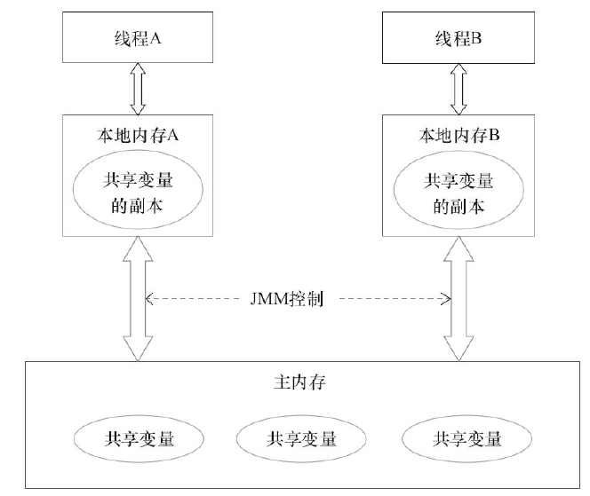
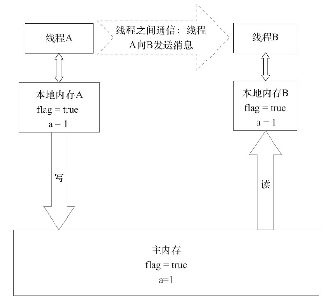
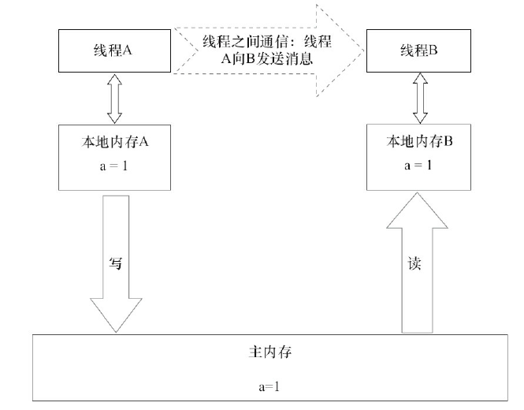
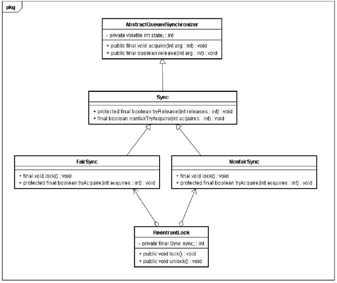

[TOC]

##### 并发编程模型的两个关键问题

**1线程之间如何通信**
线程之间的通信机制有两种：共享内存和消息传递。
在共享内存的并发模型里，线程之间共享程序的公共状态，通过写-读内存中的公共状态进行隐式通信。
在消息传递的并发模型里，线程之间没有公共状态，线程之间必须通过发送消息来显式进行通信。

**2线程之间如何同步**
同步是指程序中用于控制不同线程间操作发生相对顺序的机制。
在共享内存并发模型里，同步是显式进行的。程序员必须显式指定某个方法或某段代码需要在线程之间互斥执行。
在消息传递的并发模型里，由于消息的发送必须在消息的接收之前，因此同步是隐式进行的。

Java的并发采用的是共享内存模型，Java线程之间的通信总是隐式进行，整个通信过程对程序员完全透明。

##### Java内存模型的抽象结构

在Java中，所有实例域、静态域和数组元素都存储在堆内存中，堆内存在线程之间共享。
局部变量（Local Variables），方法定义参数和异常处理器参数（ExceptionHandler Parameters）不会在线程之间共享，它们不会有内存可见性问题，也不受内存模型的影响。

##### java内存模型（JMM)



如果线程A与线程B之间要通信的话，必须要经历下面2个步骤。
1）线程A把本地内存A中更新过的共享变量刷新到主内存中去。
2）线程B到主内存中去读取线程A之前已更新过的共享变量。


##### 重排序对多线程的影响

现在让我们来看看，重排序是否会改变多线程程序的执行结果。请看下面的示例代码。

```JAVA
	class ReorderExample {
		int a = 0;
		boolean flag = false;
		public void writer() {
			a = 1; // 1
			flag = true; // 2
		}
		Public

		void reader() {
			if (flag) { // 3
				int i = a * a; // 4
……
			}
		}
	}
```

flag变量是个标记，用来标识变量a是否已被写入。这里假设有两个线程A和B，A首先执行
writer()方法，随后B线程接着执行reader()方法。线程B在执行操作4时，能否看到线程A在操作
1对共享变量a的写入呢？

flag变量是个标记，用来标识变量a是否已被写入。这里假设有两个线程A和B，A首先执行
writer()方法，随后B线程接着执行reader()方法。线程B在执行操作4时，能否看到线程A在操作
1对共享变量a的写入呢？

**答案是：不一定能看到。**

##### 数据竞争与顺序一致性

JMM对正确同步的多线程程序的内存一致性做了如下保证。
如果程序是正确同步的，程序的执行将具有顺序一致性（Sequentially Consistent）——即程
序的执行结果与该程序在顺序一致性内存模型中的执行结果相同。马上我们就会看到，这对
于程序员来说是一个极强的保证。这里的同步是指广义上的同步，包括对常用同步原语
（synchronized、volatile和final）的正确使用。

下面，对前面的示例程序ReorderExample用锁来同步，看看正确同步的程序如何具有顺序
一致性。
请看下面的示例代码。

```JAVA
下面，对前面的示例程序ReorderExample用锁来同步，看看正确同步的程序如何具有顺序
一致性。
请看下面的示例代码。
	class SynchronizedExample {
		int a = 0;
		boolean flag = false;
		public synchronized void writer() { // 获取锁
			a = 1;
			flag = true;
		} // 释放锁
		public synchronized void reader() { // 获取锁
			if (flag) {
				int i = a;
……
			} // 释放锁
		}
	}
```

##### volatile的内存语义

请看下面使用volatile变量的示例代码。

```java
class VolatileExample {
int a = 0;
volatile boolean flag = false;
public void writer() {
a = 1;　　　　　 // 1
flag = true;　　　 // 2
}
public void reader() {
if (flag) {　　　　// 3
int i = a;　　 // 4
……
}
}
}
```

当写一个volatile变量时，JMM会把该线程对应的本地内存中的共享变量值刷新到主内存。

在读线程B读一个volatile变量后，写线程A在写这个volatile变量之前所有可见的共享变量的值都将立即变得对读线程B可见。




##### 锁的内存语义

当线程释放锁时，JMM会把该线程对应的本地内存中的共享变量刷新到主内存中。以上
面的MonitorExample程序为例，A线程释放锁后，共享数据的状态示意图



当线程获取锁时，JMM会把该线程对应的本地内存置为无效。从而使得被监视器保护的
临界区代码必须从主内存中读取共享变量。

下面对锁释放和锁获取的内存语义做个总结。

- 线程A释放一个锁，实质上是线程A向接下来将要获取这个锁的某个线程发出了（线程A
  对共享变量所做修改的）消息。
- 线程B获取一个锁，实质上是线程B接收了之前某个线程发出的（在释放这个锁之前对共
  享变量所做修改的）消息。
- 线程A释放锁，随后线程B获取这个锁，这个过程实质上是线程A通过主内存向线程B发
  送消息。

##### 锁内存语义的实现

我们借助ReentrantLock的源代码，来分析锁内存语义的具体实现机制。

请看下面的示例代码。

```java
class ReentrantLockExample {
		int a = 0;
		ReentrantLock lock = new ReentrantLock();
		public void writer() {
			lock.lock();　　　　 // 获取锁
			try {
				a++;
			} f　　inally {
				lock.unlock();　　// 释放锁
			}
		}
		public void reader () {
			lock.lock();　　　　 // 获取锁
			try {
				int i = a;
……
			} f　　inally {
				lock.unlock();　 // 释放锁
			}
		}
	}
```

在ReentrantLock中，调用lock()方法获取锁；调用unlock()方法释放锁。
ReentrantLock的实现依赖于Java同步器框架AbstractQueuedSynchronizer（本文简称之为
AQS）。AQS使用一个整型的volatile变量（命名为state）来维护同步状态，马上我们会看到，这
个volatile变量是ReentrantLock内存语义实现的关键。

ReentrantLock的类图



ReentrantLock分为公平锁和非公平锁，我们首先分析公平锁。

使用公平锁时，加锁方法lock()时，加锁方法调用AQS的tryAcquire(int acquires)方法：

```java
protected final boolean tryAcquire(int acquires) {
final Thread current = Thread.currentThread();
int c = getState();　　　　// 获取锁的开始，首先读volatile变量state
if (c == 0) {
if (isFirst(current) &&
compareAndSetState(0, acquires)) {
setExclusiveOwnerThread(current);
return true;
}
}
else if (current == getExclusiveOwnerThread()) {
int nextc = c + acquires;
if (nextc < 0)　　
throw new Error("Maximum lock count exceeded");
setState(nextc);
return true;
}
return false;
}
```

**从上面源代码中我们可以看出，加锁方法首先读volatile变量state。**

在使用公平锁时，解锁方法unlock()时，调用AQS的 tryRelease(int releases)方法

```java
protected final boolean tryRelease(int releases) {
int c = getState() - releases;
if (Thread.currentThread() != getExclusiveOwnerThread())
throw new IllegalMonitorStateException();
boolean free = false;
if (c == 0) {
free = true;
setExclusiveOwnerThread(null);
}
setState(c);　　　　　// 释放锁的最后，写volatile变量state
return free;
}
```

**从上面的源代码可以看出，在释放锁的最后写volatile变量state。**

非公平锁的释放和公平锁完全一样，所以这里仅仅分析非公平锁的获取。使用非公平锁时，加锁方法lock()调用AQS的compareAndSetState(int expect, int update)方法

```java
protected final boolean compareAndSetState(int expect, int update) {
return unsafe.compareAndSwapInt(this, stateOffset, expect, update);
}
```

该方法以原子操作的方式更新state变量，本文把Java的compareAndSet()方法调用简称为
CAS。JDK文档对该方法的说明如下：如果当前状态值等于预期值，则以原子方式将同步状态
设置为给定的更新值。此操作具有volatile读和写的内存语义。

**从本文对ReentrantLock的分析可以看出，锁释放-获取的内存语义的实现至少有下面两种**
**方式。**
1）利用volatile变量的写-读所具有的内存语义。
2）利用CAS所附带的volatile读和volatile写的内存语义。