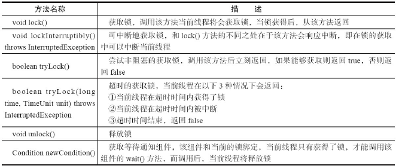
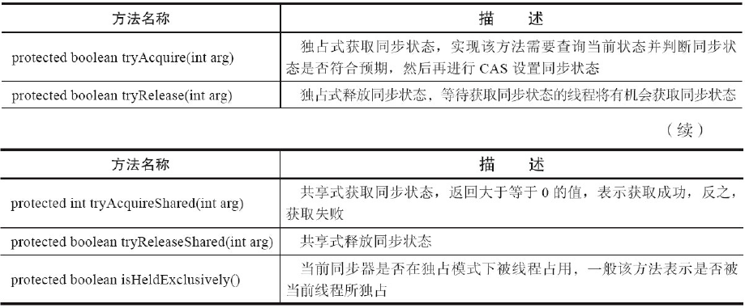
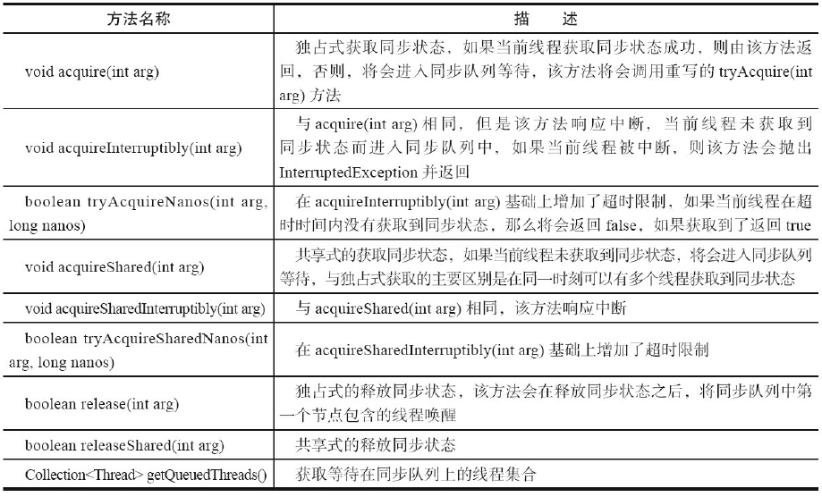

##### Lock接口

​	Java SE 5之后，并发包中新增了Lock接口（以及相关实现类）用来实现锁功能，它提供了与synchronized关键字类似的同步功能，只是在使用时需要显式地获取和释放锁。虽然它缺少了（通过synchronized块或者方法所提供的）隐式获取释放锁的便捷性，但是却拥有了锁获取与释放的可操作性、可中断的获取锁以及超时获取锁等多种synchronized关键字所不具备的同步特性。

Lock使用方式：

```java
Lock lock = new ReentrantLock();
lock.lock();
try {
    } finally {
        lock.unlock();
    }
```

Lock的API



##### 队列同步器

​	队列同步器AbstractQueuedSynchronizer（以下简称同步器），是用来构建锁或者其他同步组
件的基础框架，它使用了一个int成员变量表示同步状态，通过内置的FIFO队列来完成资源获
取线程的排队工作，并发包的作者（Doug Lea）期望它能够成为实现大部分同步需求的基础。

​	同步器的主要使用方式是继承，子类通过继承同步器并实现它的抽象方法来管理同步状
态，在抽象方法的实现过程中免不了要对同步状态进行更改，这时就需要使用同步器提供的3
个方法（getState()、setState(int newState)和compareAndSetState(int expect,int update)）来进行操
作，因为它们能够保证状态的改变是安全的。子类推荐被定义为自定义同步组件的静态内部
类，同步器自身没有实现任何同步接口，它仅仅是定义了若干同步状态获取和释放的方法来
供自定义同步组件使用，同步器既可以支持独占式地获取同步状态，也可以支持共享式地获
取同步状态，这样就可以方便实现不同类型的同步组件（ReentrantLock、
ReentrantReadWriteLock和CountDownLatch等）。

**队列同步器的接口与示例**

同步器的设计是基于模板方法模式的，重写同步器指定的方法时，需要使用同步器提供的如下3个方法来访问或修改同步状态。
·getState()：获取当前同步状态。
·setState(int newState)：设置当前同步状态。
·compareAndSetState(int expect,int update)：使用CAS设置当前状态，该方法能够保证状态
设置的原子性。

同步器可重写的方法：



同步器提供的模板方法：



​	同步器提供的模板方法基本上分为3类：

- 独占式获取与释放同步状态。
- 共享式获取与释放。
- 同步状态和查询同步队列中的等待线程情况。

自定义同步组件将使用同步器提供的模板方法来实现自己的同步语义。

下面通过一个独占锁的示例来深入了解一下同步器的工作原理。

```java
class Mutex implements Lock {
    // 静态内部类，自定义同步器
    private static class Sync extends AbstractQueuedSynchronizer {
        // 是否处于占用状态
        protected boolean isHeldExclusively() {
            return getState() == 1;
        }
        // 当状态为0的时候获取锁
        public boolean tryAcquire(int acquires) {
            if (compareAndSetState(0, 1)) {
                setExclusiveOwnerThread(Thread.currentThread());
                return true;
            }
            return false;
        }
        // 释放锁，将状态设置为0
        protected boolean tryRelease(int releases) {
            if (getState() == 0) throw new
                    IllegalMonitorStateException();
            setExclusiveOwnerThread(null);
            setState(0);
            return true;
        }
        // 返回一个Condition，每个condition都包含了一个condition队列
        Condition newCondition() { return new ConditionObject(); }
    }
    // 仅需要将操作代理到Sync上即可
    private final Sync sync = new Sync();
    public void lock() { sync.acquire(1); }
    public boolean tryLock() { return sync.tryAcquire(1); }
    public void unlock() { sync.release(1); }
    public Condition newCondition() { return sync.newCondition(); }
    public boolean isLocked() { return sync.isHeldExclusively(); }
    public boolean hasQueuedThreads() { return sync.hasQueuedThreads(); }
    public void lockInterruptibly() throws InterruptedException {
        sync.acquireInterruptibly(1);
    }
    public boolean tryLock(long timeout, TimeUnit unit) throws InterruptedException {
        return sync.tryAcquireNanos(1, unit.toNanos(timeout));
    }
}
```