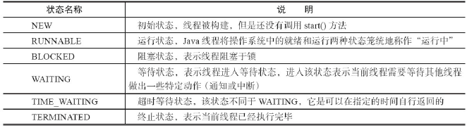
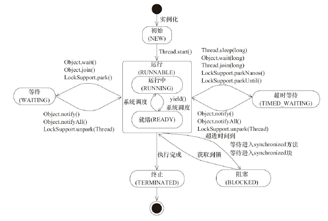
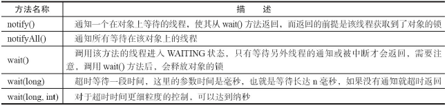
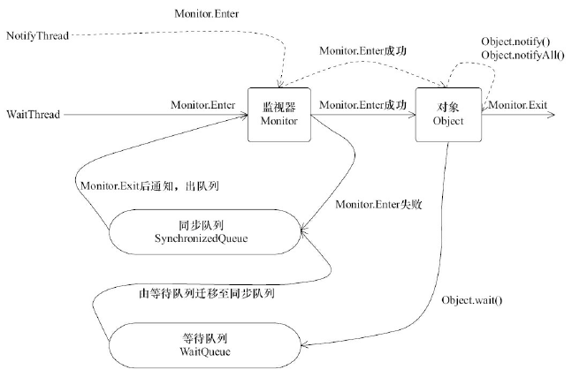

##### 什么是线程

现代操作系统调度的最小单元是线程，也叫轻量级进程（LightWeight Process）。

##### 线程优先级

在Java线程中，通过一个整型成员变量priority来控制优先级，优先级的范围从1~10，在线
程构建的时候可以通过setPriority(int)方法来修改优先级，默认优先级是5，优先级高的线程分
配时间片的数量要多于优先级低的线程。设置线程优先级时，针对频繁阻塞（休眠或者I/O操
作）的线程需要设置较高优先级，而偏重计算（需要较多CPU时间或者偏运算）的线程则设置较
低的优先级，确保处理器不会被独占。

注意，线程优先级不能作为程序正确性的依赖。

##### 线程的状态



下面我们使用jstack工具（可以选择打开终端，键入jstack或者到JDK安装目录的bin目录下
执行命令），尝试查看示例代码运行时的线程信息，更加深入地理解线程状态。

```java
public class ThreadState {
public static void main(String[] args) {
new Thread(new TimeWaiting (), "TimeWaitingThread").start();
new Thread(new Waiting(), "WaitingThread").start();
// 使用两个Blocked线程，一个获取锁成功，另一个被阻塞
new Thread(new Blocked(), "BlockedThread-1").start();
new Thread(new Blocked(), "BlockedThread-2").start();
}
// 该线程不断地进行睡眠
static class TimeWaiting implements Runnable {
@Override
public void run() {
while (true) {
    try {
        TimeUnit.SECONDS.sleep(100);
    } catch (InterruptedException e) {
    }
}
}
}
// 该线程在Waiting.class实例上等待
static class Waiting implements Runnable {
@Override
public void run() {
while (true) {
synchronized (Waiting.class) {
try {
Waiting.class.wait();
} catch (InterruptedException e) {
e.printStackTrace();
}
}
}
}
}
// 该线程在Blocked.class实例上加锁后，不会释放该锁
static class Blocked implements Runnable {
public void run() {
synchronized (Blocked.class) {
while (true) {
    try {
        TimeUnit.SECONDS.sleep(100);
    } catch (InterruptedException e) {
    }
}
}
}
}

}
```

运行该示例，打开终端或者命令提示符，键入“jps”，输出如下。

```cmd
611
935 Jps
929 ThreadState
270
```

可以看到运行示例对应的进程ID是929，接着再键入“jstack 929”（这里的进程ID需要和读
者自己键入jps得出的ID一致），部分输出如下所示。

可以看到运行示例对应的进程ID是929，接着再键入“jstack 929”（这里的进程ID需要和读
者自己键入jps得出的ID一致），部分输出如下所示。

```cmd
// BlockedThread-2线程阻塞在获取Blocked.class示例的锁上
"BlockedThread-2" prio=5 tid=0x00007feacb05d000 nid=0x5d03 waiting for monitor
entry [0x000000010fd58000]
java.lang.Thread.State: BLOCKED (on object monitor)
// BlockedThread-1线程获取到了Blocked.class的锁
"BlockedThread-1" prio=5 tid=0x00007feacb05a000 nid=0x5b03 waiting on condition
[0x000000010fc55000]
java.lang.Thread.State: TIMED_WAITING (sleeping)
// WaitingThread线程在Waiting实例上等待
"WaitingThread" prio=5 tid=0x00007feacb059800 nid=0x5903 in Object.wait()
[0x000000010fb52000]
java.lang.Thread.State: WAITING (on object monitor)
// TimeWaitingThread线程处于超时等待
"TimeWaitingThread" prio=5 tid=0x00007feacb058800 nid=0x5703 waiting on condition
[0x000000010fa4f000]
java.lang.Thread.State: TIMED_WAITING (sleeping)
```




##### Daemon线程

Daemon线程是一种支持型线程，因为它主要被用作程序中后台调度以及支持性工作。这
意味着，当一个Java虚拟机中不存在非Daemon线程的时候，Java虚拟机将会退出。可以通过调
用Thread.setDaemon(true)将线程设置为Daemon线程。
Daemon属性需要在启动线程之前设置，不能在启动线程之后设置。

Daemon线程被用作完成支持性工作，但是在Java虚拟机退出时Daemon线程中的finally块
并不一定会执行，

##### 构造线程

```java
    private void init(ThreadGroup g, Runnable target, String name,long stackSize,
                 AccessControlContext acc) {
      if (name == null) {
         throw new NullPointerException("name cannot be null");
      }
// 当前线程就是该线程的父线程
      Thread parent = currentThread();
      this.group = g;
// 将daemon、priority属性设置为父线程的对应属性
      this.daemon = parent.isDaemon();
      this.priority = parent.getPriority();
      this.name = name.toCharArray();
      this.target = target;
      setPriority(priority);
// 将父线程的InheritableThreadLocal复制过来
      if (parent.inheritableThreadLocals != null)
         this.inheritableThreadLocals=ThreadLocal.createInheritedMap(parent.
               inheritableThreadLocals);
// 分配一个线程ID
      tid = nextThreadID();
   }
```

在上述过程中，一个新构造的线程对象是由其parent线程来进行空间分配的，而child线程
继承了parent是否为Daemon、优先级和加载资源的contextClassLoader以及可继承的
ThreadLocal，同时还会分配一个唯一的ID来标识这个child线程。至此，一个能够运行的线程对
象就初始化好了，在堆内存中等待着运行。

启动线程

线程对象在初始化完成之后，调用start()方法就可以启动这个线程。线程start()方法的含义
是：当前线程（即parent线程）同步告知Java虚拟机，只要线程规划器空闲，应立即启动调用
start()方法的线程。
注意　启动一个线程前，最好为这个线程设置线程名称，因为这样在使用jstack分析程
序或者进行问题排查时，就会给开发人员提供一些提示，自定义的线程最好能够起个名字。

理解中断

中断可以理解为线程的一个标识位属性，它表示一个运行中的线程是否被其他线程进行
了中断操作。中断好比其他线程对该线程打了个招呼，其他线程通过调用该线程的interrupt()
方法对其进行中断操作。
线程通过检查自身是否被中断来进行响应，线程通过方法isInterrupted()来进行判断是否
被中断，也可以调用静态方法Thread.interrupted()对当前线程的中断标识位进行复位。如果该
线程已经处于终结状态，即使该线程被中断过，在调用该线程对象的isInterrupted()时依旧会返
回false。
从Java的API中可以看到，许多声明抛出InterruptedException的方法（例如Thread.sleep(long
millis)方法）这些方法在抛出InterruptedException之前，Java虚拟机会先将该线程的中断标识位
清除，然后抛出InterruptedException，此时调用isInterrupted()方法将会返回false。
在代码清单4-7所示的例子中，首先创建了两个线程，SleepThread和BusyThread，前者不停
地睡眠，后者一直运行，然后对这两个线程分别进行中断操作，观察二者的中断标识位。

```java
public class Interrupted {
      public static void main(String[] args) throws Exception {
// sleepThread不停的尝试睡眠
         Thread sleepThread = new Thread(new SleepRunner(), "SleepThread");
         sleepThread.setDaemon(true);
// busyThread不停的运行
         Thread busyThread = new Thread(new BusyRunner(), "BusyThread");
         busyThread.setDaemon(true);
         sleepThread.start();
         busyThread.start();
// 休眠5秒，让sleepThread和busyThread充分运行
         TimeUnit.SECONDS.sleep(5);
         sleepThread.interrupt();
         busyThread.interrupt();
         System.out.println("SleepThread interrupted is " + sleepThread.isInterrupted());
         System.out.println("BusyThread interrupted is " + busyThread.isInterrupted());
// 防止sleepThread和busyThread立刻退出
         SleepUtils.second(2);
      }
      static class SleepRunner implements Runnable {
         @Override
         public void run() {
            while (true) {
               SleepUtils.second(10);
            }
         }
      }
      static class BusyRunner implements Runnable {
         @Override
         public void run() {
            while (true) {
            }
         }
      }
   }
```

输出如下。
SleepThread interrupted is false
BusyThread interrupted is true
从结果可以看出，抛出InterruptedException的线程SleepThread，其中断标识位被清除了，
而一直忙碌运作的线程BusyThread，中断标识位没有被清除。

过期的suspend()、resume()和stop()

大家对于CD机肯定不会陌生，如果把它播放音乐比作一个线程的运作，那么对音乐播放
做出的暂停、恢复和停止操作对应在线程Thread的API就是suspend()、resume()和stop()。
在代码清单4-8所示的例子中，创建了一个线程PrintThread，它以1秒的频率进行打印，而
主线程对其进行暂停、恢复和停止操作。

```java
 public class Deprecated {
        public static void main(String[] args) throws Exception {
            DateFormat format = new SimpleDateFormat("HH:mm:ss");
            Thread printThread = new Thread(new Runner(), "PrintThread");
            printThread.setDaemon(true);
            printThread.start();
            TimeUnit.SECONDS.sleep(3);
// 将PrintThread进行暂停，输出内容工作停止
            printThread.suspend();
            System.out.println("main suspend PrintThread at " + format.format(new Date()));
            TimeUnit.SECONDS.sleep(3);
// 将PrintThread进行恢复，输出内容继续
            printThread.resume();
            System.out.println("main resume PrintThread at " + format.format(new Date()));
            TimeUnit.SECONDS.sleep(3);
// 将PrintThread进行终止，输出内容停止
            printThread.stop();
            System.out.println("main stop PrintThread at " + format.format(new Date()));
            TimeUnit.SECONDS.sleep(3);
        }
        static class Runner implements Runnable {
            @Override
            public void run() {
                DateFormat format = new SimpleDateFormat("HH:mm:ss");
                while (true) {
                    System.out.println(Thread.currentThread().getName() + " Run at " +
                            format.format(new Date()));
                    SleepUtils.second(1);
                }
            }
        }
    }
```

输出如下（输出内容中的时间与示例执行的具体时间相关）。
PrintThread Run at 17:34:36
PrintThread Run at 17:34:37
PrintThread Run at 17:34:38
main suspend PrintThread at 17:34:39
main resume PrintThread at 17:34:42
PrintThread Run at 17:34:42
PrintThread Run at 17:34:43
PrintThread Run at 17:34:44
main stop PrintThread at 17:34:45
在执行过程中，PrintThread运行了3秒，随后被暂停，3秒后恢复，最后经过3秒被终止。
通过示例的输出可以看到，suspend()、resume()和stop()方法完成了线程的暂停、恢复和终
止工作，而且非常“人性化”。但是这些API是过期的，也就是不建议使用的。
不建议使用的原因主要有：以suspend()方法为例，在调用后，线程不会释放已经占有的资
源（比如锁），而是占有着资源进入睡眠状态，这样容易引发死锁问题。同样，stop()方法在终结
一个线程时不会保证线程的资源正常释放，通常是没有给予线程完成资源释放工作的机会，
因此会导致程序可能工作在不确定状态下。
**注意　正因为suspend()、resume()和stop()方法带来的副作用，这些方法才被标注为不建**
**议使用的过期方法，而暂停和恢复操作可以用后面提到的等待/通知机制来替代。**

##### 安全地终止线程

在4.2.3节中提到的中断状态是线程的一个标识位，而中断操作是一种简便的线程间交互
方式，而这种交互方式最适合用来取消或停止任务。除了中断以外，还可以利用一个boolean变
量来控制是否需要停止任务并终止该线程。
在代码清单4-9所示的例子中，创建了一个线程CountThread，它不断地进行变量累加，而
主线程尝试对其进行中断操作和停止操作。

```java
public class Shutdown {
      public static void main(String[] args) throws Exception {
         Runner one = new Runner();
         Thread countThread = new Thread(one, "CountThread");
         countThread.start();
// 睡眠1秒，main线程对CountThread进行中断，使CountThread能够感知中断而结束
         TimeUnit.SECONDS.sleep(1);
         countThread.interrupt();
         Runner two = new Runner();
         countThread = new Thread(two, "CountThread");
         countThread.start();
// 睡眠1秒，main线程对Runner two进行取消，使CountThread能够感知on为false而结束
         TimeUnit.SECONDS.sleep(1);
         two.cancel();
      }
      private static class Runner implements Runnable {
         private long i;
         private volatile boolean on = true;
         @Override
         public void run() {
            while (on && !Thread.currentThread().isInterrupted()){
               i++;
            }
            System.out.println("Count i = " + i);
         }
         public void cancel() {
            on = false;
         }
      }
   }
```

输出结果如下所示（输出内容可能不同）。
Count i = 543487324
Count i = 540898082
示例在执行过程中，main线程通过中断操作和cancel()方法均可使CountThread得以终止。
这种通过标识位或者中断操作的方式能够使线程在终止时有机会去清理资源，而不是武断地
将线程停止，因此这种终止线程的做法显得更加安全和优雅。

##### 线程间通信

Java支持多个线程同时访问一个对象或者对象的成员变量，由于每个线程可以拥有这个
变量的拷贝（虽然对象以及成员变量分配的内存是在共享内存中的，但是每个执行的线程还是
可以拥有一份拷贝，这样做的目的是加速程序的执行，这是现代多核处理器的一个显著特
性），所以程序在执行过程中，一个线程看到的变量并不一定是最新的。
关键字volatile可以用来修饰字段（成员变量），就是告知程序任何对该变量的访问均需要
从共享内存中获取，而对它的改变必须同步刷新回共享内存，它能保证所有线程对变量访问
的可见性。
举个例子，定义一个表示程序是否运行的成员变量boolean on=true，那么另一个线程可能
对它执行关闭动作（on=false），这里涉及多个线程对变量的访问，因此需要将其定义成为
volatile boolean on＝true，这样其他线程对它进行改变时，可以让所有线程感知到变化，因为所
有对on变量的访问和修改都需要以共享内存为准。但是，过多地使用volatile是不必要的，因为
它会降低程序执行的效率。
关键字synchronized可以修饰方法或者以同步块的形式来进行使用，它主要确保多个线程
在同一个时刻，只能有一个线程处于方法或者同步块中，它保证了线程对变量访问的可见性
和排他性。

##### 等待/通知机制

一个线程修改了一个对象的值，而另一个线程感知到了变化，然后进行相应的操作，整个
过程开始于一个线程，而最终执行又是另一个线程。前者是生产者，后者就是消费者，这种模
式隔离了“做什么”（what）和“怎么做”（How），在功能层面上实现了解耦，体系结构上具备了良
好的伸缩性，但是在Java语言中如何实现类似的功能呢？



等待/通知机制，是指一个线程A调用了对象O的wait()方法进入等待状态，而另一个线程B
调用了对象O的notify()或者notifyAll()方法，线程A收到通知后从对象O的wait()方法返回，进而
执行后续操作。上述两个线程通过对象O来完成交互，而对象上的wait()和notify/notifyAll()的
关系就如同开关信号一样，用来完成等待方和通知方之间的交互工作。

创建了两个线程——WaitThread和NotifyThread，前者检查
flag值是否为false，如果符合要求，进行后续操作，否则在lock上等待，后者在睡眠了一段时间
后对lock进行通知，示例如下所示。

```java
public class WaitNotify {
      static boolean flag = true;
      static Object lock = new Object();
      public static void main(String[] args) throws Exception {
         Thread waitThread = new Thread(new Wait(), "WaitThread");
         waitThread.start();
         TimeUnit.SECONDS.sleep(1);
         Thread notifyThread = new Thread(new Notify(), "NotifyThread");
         notifyThread.start();
      }
      static class Wait implements Runnable {
         public void run() {
// 加锁，拥有lock的Monitor
            synchronized (lock) {
// 当条件不满足时，继续wait，同时释放了lock的锁
               while (flag) {
                  try {
                     System.out.println(Thread.currentThread() + " flag is true. wait
                     @ " + new SimpleDateFormat("HH:mm:ss").format(new Date()));
                     lock.wait();
                  } catch (InterruptedException e) {
                  }
               }
// 条件满足时，完成工作
               System.out.println(Thread.currentThread() + " flag is false. running
               @ " + new SimpleDateFormat("HH:mm:ss").format(new Date()));
            }
         }
      }
      static class Notify implements Runnable {
         public void run() {
// 加锁，拥有lock的Monitor
            synchronized (lock) {
// 获取lock的锁，然后进行通知，通知时不会释放lock的锁，
// 直到当前线程释放了lock后，WaitThread才能从wait方法中返回
               System.out.println(Thread.currentThread() + " hold lock. notify @ " +
                     new SimpleDateFormat("HH:mm:ss").format(new Date()));
               lock.notifyAll();
               flag = false;
               SleepUtils.second(5);
            }
// 再次加锁
            synchronized (lock) {
               System.out.println(Thread.currentThread() + " hold lock again. sleep
               @ " + new SimpleDateFormat("HH:mm:ss").format(new Date()));
               SleepUtils.second(5);
            }
         }
      }
   }
```

输出如下（输出内容可能不同，主要区别在时间上）。
Thread[WaitThread,5,main] flag is true. wait @ 22:23:03
Thread[NotifyThread,5,main] hold lock. notify @ 22:23:04
Thread[NotifyThread,5,main] hold lock again. sleep @ 22:23:09
Thread[WaitThread,5,main] flag is false. running @ 22:23:14
上述第3行和第4行输出的顺序可能会互换，而上述例子主要说明了调用wait()、notify()以
及notifyAll()时需要注意的细节，如下。
1）使用wait()、notify()和notifyAll()时需要先对调用对象加锁。
2）调用wait()方法后，线程状态由RUNNING变为WAITING，并将当前线程放置到对象的
等待队列。
3）notify()或notifyAll()方法调用后，等待线程依旧不会从wait()返回，需要调用notify()或
notifAll()的线程释放锁之后，等待线程才有机会从wait()返回。
4）notify()方法将等待队列中的一个等待线程从等待队列中移到同步队列中，而notifyAll()
方法则是将等待队列中所有的线程全部移到同步队列，被移动的线程状态由WAITING变为
BLOCKED。
5）从wait()方法返回的前提是获得了调用对象的锁。
从上述细节中可以看到，等待/通知机制依托于同步机制，其目的就是确保等待线程从
wait()方法返回时能够感知到通知线程对变量做出的修改。



图描述了上述示例的过程。
图4WaitNotify.java运行过程
在图中，WaitThread首先获取了对象的锁，然后调用对象的wait()方法，从而放弃了锁
并进入了对象的等待队列WaitQueue中，进入等待状态。由于WaitThread释放了对象的锁，
NotifyThread随后获取了对象的锁，并调用对象的notify()方法，将WaitThread从WaitQueue移到
SynchronizedQueue中，此时WaitThread的状态变为阻塞状态。NotifyThread释放了锁之后，
WaitThread再次获取到锁并从wait()方法返回继续执行。

##### 等待/通知的经典范式

该范式分为两部分，分别针对等待方（消费者）和通知方（生产者）。
等待方遵循如下原则。
1）获取对象的锁。
2）如果条件不满足，那么调用对象的wait()方法，被通知后仍要检查条件。
3）条件满足则执行对应的逻辑。
对应的伪代码如下。

```java
synchronized(对象) {
    while(条件不满足) {
    对象.wait();
    }
对应的处理逻辑
}
```

通知方遵循如下原则。
1）获得对象的锁。
2）改变条件。
3）通知所有等待在对象上的线程。
对应的伪代码如下。

```java
synchronized(对象) {
    改变条件
    对象.notifyAll();
}
```

