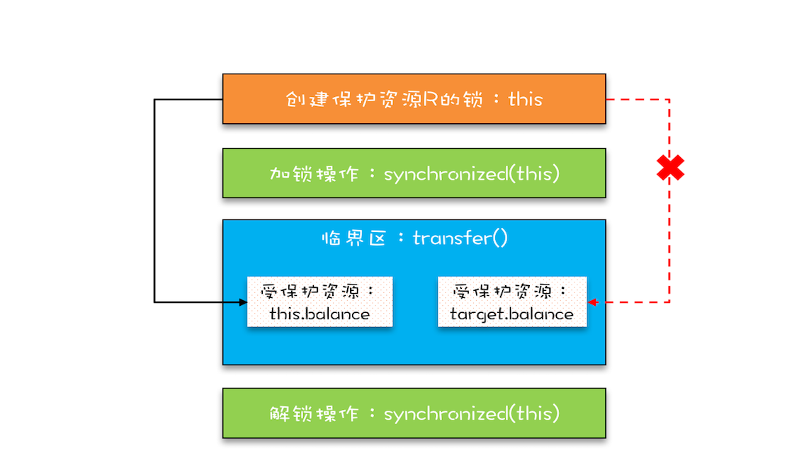

并发编程领域可以抽象成**三个核心问题：分工、同步和互斥**。

### 1. 分工

 Executor、Fork/Join、Future 

生产者 - 消费者、Thread-Per-Message、Worker Thread 模式等都是用来指导你如何分工的

### 2. 同步

Future、 CountDownLatch、CyclicBarrier、Phaser、Exchanger

### 3. 互斥

synchronized、SDK 里的各种 Lock

Thread Local 和 final 关键字，还有一种 Copy-on-write 的模式


互斥锁

受保护资源和锁之间的关联关系是 N:1 的关系**

如何用一把锁保护多个资源？

```java
class Account {
  private int balance;
  // 转账
  synchronized void transfer(
      Account target, int amt){
    if (this.balance > amt) {
      this.balance -= amt;
      target.balance += amt;
    }
  } 
}
```



this 这把锁可以保护自己的余额 this.balance，却保护不了别人的余额 target.balance，就像你不能用自家的锁来保护别人家的资产。