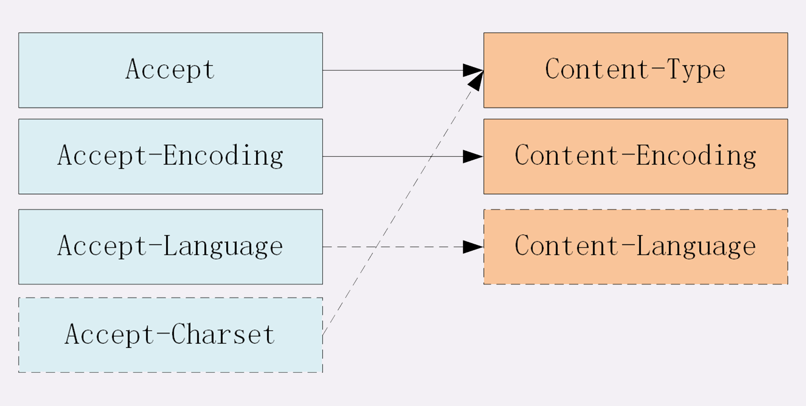

#### 15 | 海纳百川：HTTP的实体数据

可以发送 ASCII 码以外的任意数据，方案的名字叫做“**多用途互联网邮件扩展**”（Multipurpose Internet Mail Extensions），简称为 MIME。

MIME 把数据分成了八大类，每个大类下再细分出多个子类，形式是“type/subtype”的字符串，

1. text：即文本格式的可读数据，我们最熟悉的应该就是 text/html 了，表示超文本文档，此外还有纯文本 text/plain、样式表 text/css 等。
2. image：即图像文件，有 image/gif、image/jpeg、image/png 等。
3. audio/video：音频和视频数据，例如 audio/mpeg、video/mp4 等。
4. application：数据格式不固定，可能是文本也可能是二进制，必须由上层应用程序来解释。常见的有 application/json，application/javascript、application/pdf 等，另外，如果实在是不知道数据是什么类型，像刚才说的“黑盒”，就会是 application/octet-stream，即不透明的二进制数据。

Encoding type 就少了很多，常用的只有下面三种：

1. gzip：GNU zip 压缩格式，也是互联网上最流行的压缩格式；
2. deflate：zlib（deflate）压缩格式，流行程度仅次于 gzip；
3. br：一种专门为 HTTP 优化的新压缩算法（Brotli）。

HTTP 协议为此定义了两个 Accept 请求头字段和两个 Content 实体头字段，用于客户端和服务器进行“**内容协商**”。也就是说，客户端用 Accept 头告诉服务器希望接收什么样的数据，而服务器用 Content 头告诉客户端实际发送了什么样的数据。

Accept: text/html,application/xml,image/webp,image/png

Content-Type: text/html

Content-Type: image/png

**Accept-Encoding**字段标记的是客户端支持的压缩格式，例如上面说的 gzip、deflate 等，同样也可以用“,”列出多个，服务器可以选择其中一种来压缩数据，实际使用的压缩格式放在响应头字段**Content-Encoding**里。

#### 18 | 四通八达：HTTP的重定向和跳转

“**Location**”字段属于响应字段，必须出现在响应报文里。但只有配合 301/302 状态码才有意义，它**标记了服务器要求重定向的 URI**

**301**俗称“永久重定向”（Moved Permanently），意思是原 URI 已经“永久”性地不存在了，今后的所有请求都必须改用新的 URI。

**302**俗称“临时重定向”（“Moved Temporarily”），意思是原 URI 处于“临时维护”状态，新的 URI 是起“顶包”作用的“临时工”。

重定向报文里还可以用REfresh字段，实现延时重定向，例如“Refresh:5,rul=xxx”

告诉浏览器5秒后再跳转。

#### 20 | 生鲜速递：HTTP的缓存控制

**服务器的缓存控制**

- no_store：**不允许缓存**，用于某些变化非常频繁的数据，例如秒杀页面；
- no_cache：它的字面含义容易与 no_store 搞混，实际的意思并不是不允许缓存，而是**可以缓存**，但在使用之前必须要去服务器验证是否过期，是否有最新的版本；
- must-revalidate：又是一个和 no_cache 相似的词，它的意思是如果缓存不过期就可以继续使用，但过期了如果还想用就必须去服务器验证。

**客户端的缓存控制**

条件请求

我们最常用的是“**if-Modified-Since**”和“**If-None-Match**”这两个。需要第一次的响应报文预先提供“**Last-modified**”和“**ETag**”，然后第二次请求时就可以带上缓存里的原值，验证资源是否是最新的。